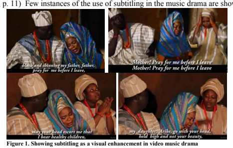
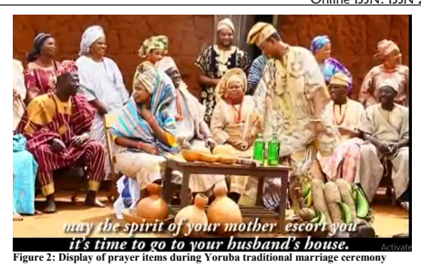
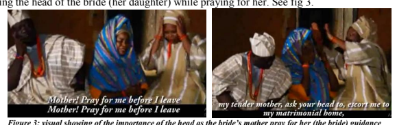
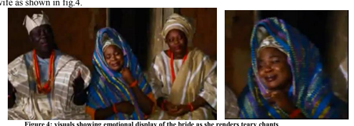

Print ISSN: ISSN 2056-5771(Print)
 Online ISSN: ISSN 2056-578X (Online)
A STUDY OF THE YORUBA TRADITIONAL MARRIAGE AS A RITE OF PASSAGE
Dr Memunat Olayemi Mahmud Department of English Studies, Faculty of Arts, Adekunle Ajasin University, Akungba-Akoko, Ondo State, Nigeria Citation: Memunat Olayemi Mahmud (2022) A Study of the Yoruba Traditional Marriage as a Rite of Passage, International Journal of African Society, Cultures and Traditions, Vol.10, No.1, pp.40-52 ABSTRACT: This study observes marriage as a rite of passage and identifies the symbolic communicative elements deployed in the Yoruba traditional marriage processes to ease the transition of a bride from one status to another. It particularly examines the signification of its linguistic elements as transition vehicle that convey the bride through *the pre liminal, liminal and* post liminal stages of her rite of passage. The study adopts qualitative research technique to critically analyse and interpret the linguistic (lexical/verbal words, phrases, and sentences) and non-linguistics (non-verbal pictorials, facial expressions, emotions) elements in the music drama deployed as semiotics resources in this work from the social and cultural semiotics perspectives. The study concludes that the identified linguistic and non-linguistic elements of the drama music used as data in this work are the Yoruba semiotics resources, which their imports give *physical* and psychological *strength to a bride, in the marriage's rite of passage.* KEY WORD: linguistic/non-linguistic, rite of passage, ritual, semiotics, signification, transition, Yoruba traditional marriage.

## Introduction

There are different commemorative rituals in the African socio cultural settingsto initiate members of the society into different stages of social, cultural, religious, physical and natural transformations. (Kyalo, 2013; Babarinde-Hall, 2018). Arnold van Gennep brought the significance of rituals of transition into limelight in his work, *The rite of passage* where he refers to performances to mark periods of transition of the social status of individual human beings as rite of passage. (Gennep, 1960). The performance of rite of passage is a common phenomenon in the Yoruba socio cultural space. (Akinsipe & Babarinde-Hall, 2018) note that the entire Yoruba people's lives are shrouded in series of rites, especially that of birth, marriage and death. As noted above, rite of passage describes milestones of life, such as birth, maturity, marriage, reproduction and death, which are marked with rituals. Apart from the natural trajectory of the lifespan of human beings, rites of passage is also a social marker to herald transition from one level to another in social, religious, political, etc., stages and events in the lifetime of a person. According to (Gennep, 1960), rite of passage is a social custom used to mark specific moments of life course. He describes it as the celebration of some socio cultural milestones involving social changes such as birth, maturity (a biological change, such as a girl's first menstruation or genital cutting for men), 
40 Print ISSN: ISSN 2056-5771(Print)
 Online ISSN: ISSN 2056-578X (Online)
marriage, reproduction and death, which are marked with rituals. (Cummings & McGarry, 2016, p. 61) describe rite of passage as 'a ritual signifying a person's passage from one identity to the next". (Gennep, 1960) offers tripartite structure of the rite of passage involving three sequential stages/phases: pre liminal (separation), liminal (transition) and post liminal (incorporation). The pre liminal or the separation phase, according to Gennep, is when partakers (the initiates) consciously detach from old status, identity, environment, etc., focusing on the fact that a new status, identity, environment will soon be assumed. (Turner, 1969, p. 80) notes that this phase contains symbolic behaviours signifying the detachment of initiates from 'an earlier fixed point in social structure'. He notes that in between the pre liminal and post-liminal stages, there is the intermediate phase, the liminal zone from the Latin word *limen*, which means 'threshold', where the initiate is separated from the old but, yet to fully integrate to the new status. This is a phase marking the period between the past and the future: the threshold that binds the old with the future, which the initiator has to transit in order to shed the old (past) for the new (future). This stage, (Turner, 1969) describes as the marginal status "between and betwixt" the former status and the future. The third and final stage in the rite of passage, according to Gennep is the post liminal or incorporation, and it involves the integration of the initiate into a new social group. At this last stage, the initiator is fully incorporated into the new life, role and status. These cultural performances and rituals are semiotics markers of the rite of passage, an archetype of the initiate's negotiations of path between old and new social identities. It is on this note that this work looks at marriage, a status-changing marker, as a rite of passage, examining the communicative elements deployed in the Yoruba marriage rituals as semiotics resources in its process. It looks at the import of the communicative signs, which mirror the realities of the marriage institution, and which assists a bride through the pre liminal, liminal and post liminal stages of her rite of passage.

## Significance Of The Study

Marriage as a ritual of the rite of passage cuts across all nations of the world; its celebration differs as the cultural diversities of its performers. In Africa, especially the Yoruba social cultural semiosphere, marriage is regarded as a sacred institution, therefore, solid foundation, based on traditional ethics and values attached to it must be deployed in all the processes of the ritual in other to internalise its values and ethics in the sub consciousness of the initiates. The spate of marriage crisis across the world is alarming, with couples walking in and out of marriage freely. This is largely because the core values of the yore have been eroded through distortions in the processes of marriage rituals in the modern day marriage ceremonies. It is on this note that this work explores and brings to the fore, the Yoruba traditional marriage rite to examine the linguistic and non-linguistic elements used in its processes as semiotics markers of the core Yoruba traditional values, which if eternalised by a bride, will guide and sustain her through and beyond marriage ceremony.

Print ISSN: ISSN 2056-5771(Print)
 Online ISSN: ISSN 2056-578X (Online)

## Aims Of Study

The aim of this study is to observe marriage as a rite of passage, identify the communicative elements in the text used as data in this work as semiotics resources and discuss the signification of the identified semiotics elements as sign carriage of the transitional vehicles of the rite of passage embedded in the Yoruba traditional marriage. 

## Theoretical Framework

This study engages social semiotics as its theoretical framework in the analysis of its data. Social semiotics has enjoyed scholarly attention in social sciences and humanities; its preoccupation being the study of meaning making as a social practice. It looks at the significations of specific human practices or activities in certain social and cultural circumstances that are capable of construing meaning. (Thibault, 1991) notes that social semiotics is concerned with the development of analytical and theoretical frameworks, which can explain meaning making in a social context. (Hodge & Kress, 1988) state that the interest of social semiotics includes making meaning out of the study text, how people design and interpret, and how semiotics systems are shaped by social interest and ideologies. This theoretical framework is used in this study to look at the communicative elements deployed in the Yoruba traditional marriage processes as semiotics signs with social imports.

## Research Methodology

The data used in this work is a Yoruba music drama by Chief Dr. Sulaiman Ayilara Aremu Ajobiewe titled *Asa Igbeyawo*, downloaded from the YouTube. The music drama is considered an adequate text for this work because it provides profound insight into all the processes involved in the Yoruba traditional marriage from courtship, introduction, and engagement to post marriage existence. Though rendered in Yoruba language, it is subtitled in English, which helps in giving the text a universal outlook. The video was watched over a period after which the identified communicative elements - linguistic and non-linguistic - that give significations to the marriage ritual as a rite of passage were transcribed. Also, visuals depicting actions, expressions, emotions, etc. were captured through screenshot and used as illustrations in synergy with the linguistic elements, to further reveal the import of the communicative signs in the Yoruba traditional marriage's rite of passage. In addition to this, available scholarly materials on the Yoruba traditional marriage and my residual experience as a Yoruba woman further give insight to the concept of marriage as a rite of passage using the core Yoruba socio cultural view of marriage and marriage values. This study adopts qualitative research technique to critically analyse and interpret the linguistic (words, phrases, and sentences) and non-linguistics (pictorials, facial expressions, emotions) elements in the music drama deployed as semiotics resources, from social and cultural semiotics perspectives. Even though, the verbal semiotics resources used in the music drama were 

Print ISSN: ISSN 2056-5771(Print)
 Online ISSN: ISSN 2056-578X (Online)
transcribed in Yoruba language, the inclusion of their English subtitles in the analysis provides fuller understanding of the message of the music drama.

## Analysis

The aim of this study is to observe marriage as a rite of passage, identify the communicative elements in the text data as semiotics resources and discuss the signification of the identified semiotics elements as sign carriage of the transitional vehicles of the rite of passage embedded in the Yoruba traditional marriage. These aims and objectives form the basis of the analysis below.

## Marriage As A Rite Of Passage

The Yoruba traditional marriage system fits into Gennep's description of the three phases of the rite of passage, and places marriage, firmly, as a rite of passage; an archetypal of the initiate's transition from one status to another. Marriage is a social contract involving two adults who decide to live together as husband and wife. It is a rite of passage, particularly, for the bride, who, by the singular act of marriage would undergo social and physiological changes. A young woman undergoes the three stages of Gennep's rites of passage in the Yoruba traditional marriage processes through courtship, engagement, wedding and the assumption of full marriage status as a wife, homemaker and mother. The courtship and introduction stages of the Yoruba traditional marriage mark the liminal stage where the young woman becomes conscious of her imminent new identity. This process separates her from being a single, unattached free young woman to a woman in a relationship, betrothed to be married. According to (Kyalo, 2013, p.46), rituals help us individually and communally to make sense of life's transitions, providing some structure to ease movement from the familiar to the unknown. In the Yoruba traditional marriage ritual, the liminal stage is marked with communicative elements depicting counselling, tutelage, prayers, etc., which help the young woman to prepare adequately for her imminent detachment before the final marriage ceremony. 

At the marriage ceremony, the bride experiences the second and the most important phase of the rite of passage. This stage is described by Gennep as the "threshold zone" where the bride has to leave her old identity as a single woman for a new official status as a married woman. This is the liminal stage where she has to cross the threshold of her parents, families and friends to that of her husband and his family. For the bride, it is the most emotional phase of the rite of passage, a point when she has lost her old identity but not fully incorporated into the new one. This is the point at which, according to (Turner, 1967), the initiate is between one status and another. The post liminal or incorporation stage is the consolidation phase, which Gennep describes as the stage when the bride becomes a wife, properly married and faces the reality of marriage and the attendant responsibilities, roles and challenges. In this third phase, the passage is "consummated by the ritual subject" (Turner, 1969, p. 80). The phase starts with the consummation of the marriage and continues in a long journey of pregnancy, motherhood, etc. fully incorporated and ready to take attendant roles as a wife, a mother, a caregiver, etc. This is a learning curve where she has to 

Print ISSN: ISSN 2056-5771(Print)
 Online ISSN: ISSN 2056-578X (Online)
deploy all the experiences and tutelage garnered from the semiotics resources deployed during the marriages processes to sustain and make a success of her new status. The Significations of the **Communicative Elements of the Yoruba Traditional Marriage** Semiotics as a tool of interpretation of social practices places the process of traditional marriage in the Yoruba socio cultural setting as a sign of influence, initiate and change. (Subasinghe, 2012, p.144) notes that signs are the guide of every behaviour and every behaviour can be considered a sign. This shows that a gamut of language in a text can be regarded as sign if it is recognized as something that can influence, initiate and cause changes. (van Leeuwen's, 2005, p.4) description of the whole gamut of communication, verbal or nonverbal, as semiotics resources deplored as sign making elements in social event is apt here, as the import of language is derived from the social context, which lends meaning to its usage. Therefore, language has to be situated in a particular context in order to make it a system of meaning that can effectively interpret a social event. It is, therefore, important to look at the semiotics imports of the elements of communication, both verbal and nonverbal, deployed as signs of the vehicle of transition in the Yoruba traditional marriage, which assist the bride at the preliminal, liminal and post liminal phases of her rite of passage. According to (van Leeuwen, 2005, p. 285), semiotics resources have meaning potentials, based on their past uses, and a set of affordances based on their possible uses, and these will be actualized in concrete social contexts where their use is subject to some form of semiotics regimes. These semiotics resources, which include words, phrases, sentences (used for prayers, admonition, etc.), and the non-verbal elements such as facial expressions, body language, emotions, etc., are meaning making resources with interpretative significance hinged on concrete and recognisable social affordances in the social context in which they are deployed for communication. The social context and shared background knowledge of the semiotics regime deployed in the music drama used as data in this work create synergy of communication among the protagonists, thereby making the internalisation of the interpretative elements mutually effective among them. Linguistic and non-linguistic elements deployed for communication in the Yoruba traditional marriage, as shown in Ajobiewe's music drama, are semiotics resources explicating the belief, values, social tones, and traditional norms of its people. The combination of the linguistic and nonlinguistic elements gives force to the signification of the entire process of meaning making, assisting in the encoding, decoding and simulating adequate responses among all involved in the communicating process with shared social, cultural and linguistic knowledge. The communicative elements deployed in the Yoruba traditional marriage ceremony are, therefore, signs that effectively give import to the intentions of speakers in the communication process. Asa Igbeyawo, the musical drama used as data in this work effectively highlights the signification of the ritual of marriage at the preliminal, liminal and post liminal stages in the Yoruba traditional marriage processes through semiotics resources of its communicative elements as shown below.

Print ISSN: ISSN 2056-5771(Print)
 Online ISSN: ISSN 2056-578X (Online)

## The Pre Liminal Stage

This is the stage where a young woman is prepared as a future wife, mother, homemaker, caregiver, etc. through the marriage processes of courtship and introduction. In the music drama used as data in this work, Ajobiewe deployed linguistics elements with semiotics imports. Each statement identified in the text are massage carrying signs, signifying the core values of the Yoruba institution of marriage as it affects the woman, which adequately prepares her through the marriage's rite of passage. These linguistic elements are interchanges between the parents and their daughter, which facilitates filial understanding and bond that make tutelage, advice and admonition easy, understandable, and divine. At the preliminal stage, the linguistic elements deployed are sign carriage phrases and sentences signifying the core value of discipline and dignity expected of the Yoruba woman. Culturally, obirin alalubarika (a responsible woman) is not expected to engage in an unguarded relationship. She is not expected to mingle freely with her prospective suitor but insist her hands must be properly sought in marriage. According to Ajobiewe in the music drama:
"Obinrin alalubarika, bi okunrin ba baa soro ni'ta, a ni e ka jo de'le wa. A ni ko wa lo mon awon obi mi" **Yoruba** "A responsible lady, when she's approached outside, she'll invite the fellow to come and meet her parents" **English** subtitle The allusion to the *alarina* concept in the music drama shows the importance of courtship in the Yoruba traditional marriage value system. Courtship is a very important stage where the *alarina* (the-go-between man or the mediator) plays significant role in facilitating the relationship between two adults in love relationship. The suitor is not supposed to have free access to her betrothal, except through the *alarina* who facilitates the relationship between them. Stressing the alarina concept, Ajobiewe notes:
"Laye 'josi bi a ba fe fe'yawo, won ma n'lalarena logiri…" **Yoruba** "*In those days when we intend to marry a wife, there was always a mediator".* **English subtitle** "Afi'gba taya ba moju oko tan, ohun lalarena nyeba." **Yoruba** "*It is only when the lady is satisfied with her suitor that the that the mediator leaves the scene* **English subtitle**
The linguistic words and phrases deployed in the data used in this work are very significant in explicating the core traditional values of the Yoruba people about marriage that guide the bride through her rite of passage. They are the Yoruba inherent linguistic concepts needed in marriage process to indoctrinate a woman into the traditional Yoruba moral values of respect of dignity, which expectedly she would pass to her children later in life. The concept of dignity of a woman is further stressed in the music drama by the use of the phrase *nisu loka*, meaning "following through the right process". 

"Wa so fawon obi re pe ki won o wale; ki won wa fe mi nisu loka naa ni" **Yoruba**
"Tell your parents to come and marry me properly **English subtitle**
To marry a woman *nisu loka* (properly) as translated above means the fulfilment of all that is traditionally required by the groom's parents to the parents and family of the bride. In the Yoruba traditional core values precept, marriage is between two families: that of the bride and the groom. 

45 Print ISSN: ISSN 2056-5771(Print)
 Online ISSN: ISSN 2056-578X (Online)
The woman is assumed to be married to her prospective husband once the family of the man visit hers and the two families agree that their children could get married. She is still in her parents' house, though, but betrothed to a man. She has fulfilled the first quality by behaving responsibly, taking the bold step of informing her suitor to bring his parents to her home and do the needful. After the introduction, which is usually a private meeting between the two parents and few selected family members done in the house of the bride to be, the young woman is separated mentally from being an unmarried woman, preparing towards the formal nuptial knot. The separation stage begins here. The woman is betrothed. She is still in her parents' house but she is aware she is no longer a free woman. The signification of the introduction ceremony in the Yoruba traditional marriage process is the mental separation of the bride, representing the pre liminal stage of the rite of passage. The communicative elements at this stage are vehicular carriages that assist the young woman to prepare her mind for the liminal stage of the rite of passage. The import of these communicative elements is further reinforced by the combination of visual and linguistic elements through subtitling. Subtitles are translations of dialogue in a video, which usually appear as text at the base of the screen and give viewers a good insight into the content of a video item. According to (Zanon, 2006, p. 43), a subtitled video provides a triple connection between image, sound in one language and text, normally in another, sound and text being typically linked by translation. Subtitle becomes a good visual device enhancing the meaning of the content of the Yoruba music drama because of the "fleeting nature" of verbal communication. (Mahmud,  The Liminal Stage In the Yoruba traditional setting, the major or official marriage process is the traditional marriage, a covenant stage where the two families come together in the open to seal the love relationship of their children in the presence of friends, families and well-wishers. This is the liminal stage where 

Print ISSN: ISSN 2056-5771(Print)
 Online ISSN: ISSN 2056-578X (Online)
the woman crosses the Rubicon. She takes another status as a married woman ready to leave her parents, friends and family to that of her husband. It is a formal stage with all semiotics elements signifying the liminal stage of the marriage rite of passage. Ajobiewe engages linguistic and visual items in the music drama as signs with cultural significations. (Berger, 2010, p. 3) describes sign as the "unity of word-object known as signifier with a corresponding culturally prescribed content or meaning known as a signified." The linguistic elements deployed as signs at this stage are symbolic words with cultural connotations. The items such as *ogede* (plantain), isu (yam), *orogbo* (bitter cola), obi (kolanut), *ireke* (sugarcane), iyo (salt), *oyin* (honey), etc., used as prayer items in the Yoruba traditional marriage are semiotics signs with word-object unity, relevant as effective transitional vehicles in the rite of passage. They are linguistic elements with peculiar common system of reference that give the Yoruba marriage culture its uniqueness. They have socially and culturally accepted interpretations different from, or in addition to the denotational or literary meaning across the globe. O*gede, isu,* orogbo, obi, ireke, iyo, oyin, etc are signs carriage items with peculiar attributes that give signification to the content and context of the Yoruba traditional marriage ceremony as prayer items. Using Pierce triadic theory of sign, (Ogunkunle, 2013, pp. 1106-7) views the items of prayers in the Yoruba traditional marriage from three perspectives: the quality, the association signs with the object of sign and their cultural implications. He notes that the attributes of the signs used are the particular qualities associated with the signifiers and that are found useful for the joining process in marriage. In Yoruba land, the sign objects are intentionally deployed in marriage and naming ceremonies because of specific relevant qualities and peculiarities deducible from the objects, which make them relevant prayer items for the occasions. Thus, (Danessi, 2004, p.16) affirms that the intent of the form maker, the historical and social contexts in which the representation was made, the purpose for which it was made, are all intertwined in signs interpretation. (Danessi, 2004, p. 17) notes further that the type of representamen used to portray the object also shapes the meaning. Iconically, these items are edibles, but symbolically, they represent fertility, longevity, preventions, sweetness, fruitfulness, etc.; the qualities that make them adequate prayer items, with cultural imports and significations to the marriage ceremony, as items of prayer, most needed by the bride at the liminal stage and beyond. Ajobiewe deploys the combination of linguistic and visual elements to show the importance of prayer as one of the vehicles of transition in the rite of passage showing the sign carrying component of the prayer through visualisation of the prayer items as shown in fig. 2 below:

Print ISSN: ISSN 2056-5771(Print)
 Online ISSN: ISSN 2056-578X (Online)

In the Yoruba socio cultural setting, it is believed that the profit of marriage are the children harvested from it. Importance, is therefore, placed on fruitfulness of marriage through child bearing. *Ogede* (banana) and isu (yam) as used in the music drama are sign nodes of fruitfulness of marriage.

"Ogede ki ngbodo ko ya'gan". **Yoruba** "The banana is never barren" **English Subtitle** "Won a ni isu omo a jina fun yin je" **Yoruba**
"*They'll say yam stands for reaping the benefit of your children"* **English Subtitle**
Marriage is associated with sweetness, and it is the desire of parents that their daughter enjoy the sweetness of marriage. Analogy is drawn between *oyin* (honey) and iyo (salt) as prayer items and their sweetness to pray for the bride to enjoy the sweet savory of married life. 

"Olorun oba je kaye yin o loyin, ko ladun gidi ni" **Yoruba**
"*God will add honey and sweetness to your life"* **English Subtitle** "Kaye yin tun wa lo n'iyo gidi ni" **Yoruba** "May the life be filled with salt" **English Subtitle**
After the prayers, which is very important as a vehicle of transition in the Yoruba marriage rite of passage, the bride is pronounced married. This is the liminal stage, the point where she crosses the Rubicon, and sheds her past status to take a new one. Ajobiewe recounts in the music drama: 
"E ti wa gba'dua, ree. Iwo Iyawo, ki o wa gbera n'le o dide, o dile oko" **Yoruba** "You've now be prayed for. The bride, get up now and proceed to your husband's house" **English Subtitle**
Ajobiewe continues in the music drama to use linguistic items with cultural significance peculiar to the Yoruba socio cultural setting. The concept of ori (head) in the Yoruba socio-cultural belief as shown in the music drama is worthy of note for its semiotics import. The perception of ori in the Yoruba traditional belief goes beyond its physiological categorisation as part of the body. It is 48 Print ISSN: ISSN 2056-5771(Print)
 Online ISSN: ISSN 2056-578X (Online)
seen as the 'source of life and the essence of human personality (Idowu, 1970, pp. 170-75; Abimbola, 1971, pp. 73-89). Ori (head), in the Yoruba socio cultural setting is a culturally conditioned semiotics sign, indicating destiny, luck, personal spirit being, guiding angel, etc. Ori (the Spiritual/inner head, which is the destiny conveyor) is the third of the tripartite conception of a human being in the Yoruba belief: the first and second being *ara* (body) and *emi* (soul). (Hallen & Sodipo, 1986, p. 105). The Yorubas believe that the head directs the course of life of human beings. It is the personal god that is responsible for the security of the bearer (Abimbola, 1976, p. 132; Balogun 2007, p. 119). The bride's head is the guiding angel that will direct her course, keep her marriage and attract luck to her in marriage. (Balogun, 2007, p. 118) echoes (Idowu, 1962) assertion that ori is not only the bearer of destiny but also, the essence of human personality, which rules, control and guides the life and activities of the person. The bride covets the protection and guidance of her mother's head as she proceeds in her matrimonial journey. In the music drama, she says: 
"Ori ni nsinni dele oko, iwa ni nsinni de'po to ga o, iya mi jojolo eni **k'ori** *yin sin mi de'bi ijoko mi"* **Yoruba** 
"It's one's head that goes with her to the husband's house, while one's character takes her to higher level, my tender mother, ask your **head** *to escort me to my matrimonial home"* **English Subtitle**
Ajobiewe lays emphasis on the import of the head as iconic and symbolic elements of communication in the Yoruba traditional marriage through the combination of linguistic and nonlinguistic elements in the music drama. The bride's mother, therefore, appeals to her daughter not to let off her guard but be spiritually connected to her ori (spiritual guardians), which she needs more than her physical look (beauty) to make a success of her marriage. Admonishing her, her mother says:
"Oko mi, Arike, dakun mori lo, ma ma mewa lo" **Yoruba** "*My daughter, Arike, go with your head, held high and not your beauty"* **English Subtitle**
There is synergy of sign usage and interpretation of the lexical items by the protagonists who share mutual cultural and social backgrounds of the linguistic elements; therefore, their usage gives the desired interpretation and draws the appropriate reaction. The head is a guidance, an arbiter, a protector, etc. which the bride needs in the course of her journey. This triggers reaction from her mother who holds her head while praying for her daughter, the bride. In addition, she is seen touching the head of the bride (her daughter) while praying for her. See fig 3.

Print ISSN: ISSN 2056-5771(Print)
 Online ISSN: ISSN 2056-578X (Online)
The liminal stage is the most complex of the three stages of the ritual of rites of passage in marriage. It is a stage of parting, of prayer, and of mixed emotions of fear, nostalgic, expectations and assurances. The bride solicits the much-needed prayers amidst tears, from her parents just before crossing the Rubicon. This is the most emotional aspect of the marriage rite and the emotional vehicle that carries her across the two lines of her old status as a young unmarried woman and a new status as a married woman. She communicates her inner feelings amidst overwhelming tears, which (Raji & Ajadi, 2013, p. 144) describes as *ekun Iyawo* (bridal chant) in the Yoruba traditional wedding arrangement. In social context, signs as objects may mean more than the general interpretation. For instance, tears gives emotions signals such as sadness, horror, bereavement, etc. but it could also be a sign of joy. The bridal chant brings an emotionally induced tears from the woman who feels nostalgic leaving her parents, yet happy and fulfilled becoming a  The Post Liminal Stage As affirmed by Gennep, the liminal stage is a phase between the preliminal and post liminal stages. Ajobiewe dramatically mirrors the post liminal stage in the liminal with semiotics signs reflecting the post liminal stage as the bride crosses the Rubicon and faces reality of life. The linguistic elements that features at this stage are sign carriage modes explicating the core values of the Yorubas about the role of a woman as a wife, mother and caregiver who is expected to be loyal, respectful and persevere. She must accord her husband respect as the head of the family. The brides father admonishes the bride to respect her husband:
"Koo ranti pe oko lolo'wo ori aya" **Yoruba** "*Remember the husband is the head of the wife"* **English Subtitle**
She is advised and warned against promiscuity; she must be loyal to her husband.

"Dakun, du'o na, diedie ni oo maa se foko, mase se oju meji lodo oko." **Yoruba** "Please, respect your husband and shun promiscuity." **English Subtitle**
Perseverance as a virtue in marriage is impressed on the bride as she goes to her matrimonial house. Ajobiewe affirms that it is only through perseverance that a woman enjoys matrimony. He says:
"Bo ba nsowipe, odo'goji odun, ogota odun ti mo ti wa nile oko. Oo mo wipe ninu aforiti naa ni. Yoruba 

Print ISSN: ISSN 2056-5771(Print)
 Online ISSN: ISSN 2056-578X (Online)
"*If she says she has spent forty to sixty years in her husband's house; it is due to her perseverance.* **English Subtitle**
Finally, the bride is given the needed assurance by her friends and family, that indeed, it is a great experience to be married. This is a most needed transition vehicle in the rite of passage to give the bride the needed courage and hope for a brighter and enjoyable matrimonial life.

"Ile oko re dun oya maa lo, iyawo **Yoruba** "Your husband's house is sweet, please, go there: the bride" *English Subtitle*

## Conclusion

The Yoruba traditional marriage rites deploys linguistic elements, aided by nonlinguistic ones such as body language, facial expression, mood, etc. as meaning making process in the Yoruba traditional marriage social context. The central theme of this study is the examination the elements of communication deployed in the Yoruba traditional marriage ritual that are significations of the process of transition of a young woman from spinsterhood to a married woman. The identified communicative elements are well organized to allow ease of meaning making among the interlocutors in the communicative chain. The interlocutors have similar language, expectations, cultural and social definitions which enhance effective communicate and meaning making in the communication process. This gives room for effective encoding and responses by the principal characters: the father, mother, daughter and other participants in the music drama used as data in this work, bringing to bear their mutual knowledge and shared experience in information dissemination and processing. All the elements mentioned above are social resources, which their significations are both perfectly convincing to the participants as language interpretation signs and important ingredients of successful marriage. It is noted that some of the statements draw emotions such as admiration, nostalgic, reminiscence, etc. from the participants as shown in their facial expressions, postures, emotions, etc.

The processes of the Yoruba traditional marriage ritual reveal the belief and value of the Yoruba people about marriage, especially on the preparation of a young woman for marriage. The success or other wise of a woman's marriage tells a lot about the level of home discipline and the Yoruba traditional values she is able to learn from her home; therefore, the various processes of the rite of passage of the Yoruba woman, involving tutelage, admonitions, prayers, encouragement, etc. are to prepare her for marriage. It is noted that the contemporary marriage setting has neglected the traditional processes, which prepare the woman adequately, not only as a woman, but also a well-cultured wife, mother, caregiver and good representative of her family. This work intends to bring to the fore, the significant of the Yoruba traditional marriage ritual as shown in the body of this work as a way of adequately preparing a woman physically and psychologically towards a successful marriage. It is believed that if the traditional ways of communicating values and precepts to the bride during the traditional marriage rituals in the olden days are encouraged and reintroduced into the 51 Print ISSN: ISSN 2056-5771(Print)
 Online ISSN: ISSN 2056-578X (Online)
contemporary marriage ceremony arrangement, it will go a long way in curbing the increasing divorce cases and marriage related crises in the society.

## References

Abimbola, W. (1971). The Yoruba concept of human personality. In: La notion de Personneen Afrique Noire Colloques Internationale de Centre National de la Recherche Scientifique (544): 69–85.

Akinsipe, F. A. & Babarinde-Hall, B. (2018). Dance in the Yoruba family rites of birth, marriage and death. International Journal of Integrative Humanism. 9(1, 2026 - 6286.

Balogun, O. A. (2007). The concepts of Ori and human destiny in traditional Yoruba thought: A 
soft-deterministic interpretation. Nordic Journal of African Studies, 16(1), 116-130.Bayo S. (Producer). (2018). *Asa igbeyawo*. [Video file]. Retrieved from https://www.youtube.com/watch?v=y0zKhII3OK4 . Mp3. 

Berger, A. A. (2010). The object of affection: Semiotics and popular culture. Palgrave Macmillan; USA.

Danessi, M. (2004). Messages, signs and meanings: A basic textbook in semiotics and communication theory. Canadian Scholars Press: Toronto.

Gennep, A. V. (1960). The rites of passage. Translated by M. B. Vizedom and G. B. Caffee. 

Chicago: University of Chicago Press, 1960. (The original edition was published in 1908).

Halliday, M.A K. & Matthiessen, C. (2004). An introduction to functional grammar. London: 
Arnold Hodge, R. & Kress, G. (1988). Social semiotics. Cambridge: Polity Idowu, E.B. (1970). *Olódùmaré: God in Yorùbá belief*. London: Longman publishers Kyalo P. (2013). Initiation rites and rituals in African cosmology. International Journal of Philosophy and Theology. 1(1), ; pp. 34-46 Ogunkunle, O. V. (2013). A semiotic reading of the symbols of Yoruba traditional marriage. 

Theory and Practice in Language Studies. Vol. 3(7), pp. 1103-1109, July 2013. 2013 ACADEMY PUBLISHER. Finland.

Raji, O. W., & Ajadi, R. A. (2013). A Stylistic Analysis of Ekun Iyawo. Research on Humanities and Social Sciences Vol. 3:(9), 143, 149.

Robbins, R. H., Cummings, M., & McGarry, K. A. (2016). Sociocultural Anthropology: A 
Problem-Based Approach. Nelson Education.

Subasinghe, W. The Sociological Value of Semiotics. Kalyani Journal of Humanities and Social Sciences of the University of Kelaniya. XXIX
Thibault, P. J. (1991). Social semiotics as praxis: Text, social meaning making, and Nabokov's Ada. University of Minnesota Press.

Turner, V. W. (1967). The forest of symbols. Ithaca, NY and London: Cornell University Press. Turner, V. W. (1969). The ritual process: Structure and anti-structure. Chicago: Aldine. van Leeuwen, T. (2005). Introduction to social semiotics. London and New York: Routledge. Zanón, N. T. (2006). Using subtitles to enhance foreign language learning. Porta Linguarum: 
revista internacional de didáctica de las lenguas extranjeras, (6), 4.