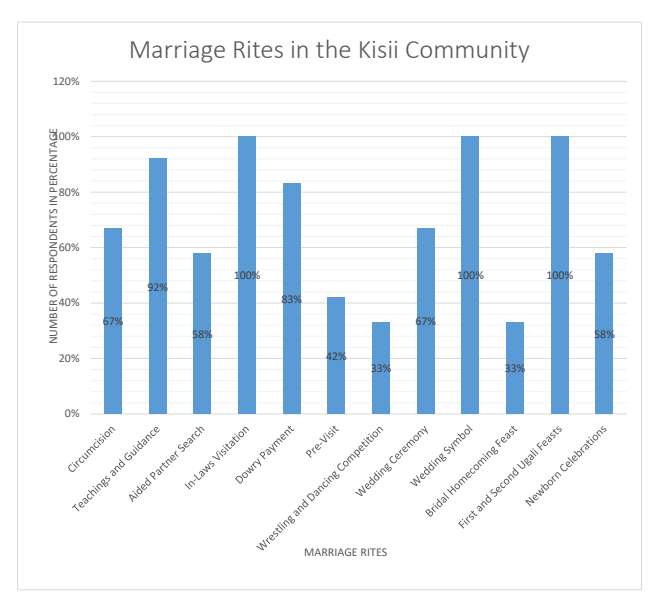

Association for the Promotion of African Studies

# The Role Of African Traditional Marriage Rites On Marital Stability: A Case Of The Abagusii People, Kenya

Esther Kerebi Nyamache
&
Stephen Asatsa, PhD
Department of Counselling Psychology The Catholic University of Eastern Africa DOI: 10.13140/RG.2.2.23939.78889

## Abstract

The major purpose of this study was to explore the role of African traditional marriage rites on marital stability; in a case study of the Abagusii ethnic community from Kisii and Nyamira counties, Kenya. The study was based on the Symbolic Interactionism (SI) theory of Social Psychology and adopted the use of narrative qualitative research methods. The study facilitated the gathering of data of narratives related to culture and the rituals with regard to the marriage of the Abagusii ethnic community. The qualitative study used a focus group of 12 elderly people from the Gusii community who were selected through purposeful and snowball sampling. Research instruments included interview schedules, the data was then analysed using qualitative within the purview of the research questions and the marriage rites themes. Focus group discussions were used to identify issues and interpretations. A discussion guide was used to ask general questions. The qualitative study findings indicated that various Kisii traditional marriage rites were practised to sustain marital stability. These include initiation and mentorship into adulthood, courtship, aided partner search, in-*laws' visitations,* 
introduction ceremonies, payment of bridal wealth, wrestling matches, weddings and post-wedding marriage rituals. Finally, the qualitative study found out that traditional marriage rites are believed to circumvent divorce and contribute to marital stability. 

Marriage sustainability was through celebrations and communal support. The study recommends that there is a need to revive the African traditional marriage practices and marriage therapists can incorporate this perspective during marital counselling sessions.

Keywords: Marriage, marriage rites, marital stability, bridal wealth

## Background

Marital instability has increased tremendously in western developed countries since the mid-1960s. Despite the lack of consistent data, it seems that the same 

Association for the Promotion of African Studies trend has been noted in Iran recently (Vakili et al 2015). Marital instability reveals affective and cognitive states in the company, with related actions, which are foreseen to terminate a relationship (Kreager et al 2014). Meyer Fortes purports that many first unions may be terminated after some time. To capture the flexible character of these marriages Fortes classifies them as 'experimental marriages' (Fortes1949).

Kihombo (2018) asserts that in spite the marital conflicts being a worldwide phenomenon, the United States is the leading country in the world in terms of marital conflicts that lead to divorces. Existing research suggests that different types of violence often coexist: physical IPV is often accompanied by sexual IPV, and is usually accompanied by emotional abuse. For example, in the WHO multi-country study, 23–56% of women who reported ever experiencing physical or sexual IPV had experienced both (3). A comparative analysis of DHS data from 12 Latin American and Caribbean countries found that the majority (61–93%) of women who reported physical IPV in the past 12 months also reported experiencing emotional abuse 
(Bott S. et al. 2012). A study was conducted on how individual characteristics, family backgrounds, homogamous/heterogamous marriages, and dyadic interactions are linked with marital conflict and marital satisfaction among married Chinese participants. Multivariate statistical analyses based on the China General Social Survey 2006 data (CGSS 2006) indicate that marital duration, rural origin, egalitarian decision-making, and frequent dyadic communication decrease marital conflict, whereas personal income, egalitarian gender ideologies, social class standing, and double-earner status elevate marital conflict (Xiaohe Xu and Donna Miller 2017).

Karimi et al (2019) explain that the extracted protective factors associated with marital stability in long-term marriage were classified as interpersonal and intrapersonal. It remains unclear exactly what role culture plays in race-ethnic differences in marital behaviour. Accounting for the traditional culture among Mexican Americans does not explain the earlier age at marriage for Mexican Americans as compared to Whites (Raley et al., 2004). However, Raley et al. (2004) suggest that culture may be significant to ethnic differences in marriage patterns and emphasize the need for future research to focus on specific aspects of culture. We examine several cultural factors, including social support, religion, and attitudes about marriage and gender. According to Kihombo (2018) 

Association for the Promotion of African Studies socialization is one of the factors that are responsible for marriage divorce in Africa and around the globe generally.

Recent evidence has shown that Africa has witnessed a high rate of marital conflict as a result of westernization, globalization, urbanization and industrialization periods triggered by a monetary industrial economy that have affected the extended families that had the responsibility to solve any conflict between the couples (Adeniran, 2015). According to Vida (2013), available 7 information, on Sub-Saharan Africa including Tanzania has depicted an increasing rate of marriage breakdowns, even though statistics on marriage breakdowns in the region are limited and unreliable. This is due to some studies conducted in the area of marital dissolution and the little coverage on registration of marriages and divorces. Though limited, the UN (2006) as cited in Vida (2013) has indicated that more than one-third of women in this region experience marital dissolution before they reach ages forty and sixty in their first marriages. 

A study conducted on South African people in rural KwaZulu-Natal between 2000 and 2006 on marriages, focused on the distribution of marital status by age and sex, purports that some adults are reported as divorced or separated, the proportion not rising above five per cent in any age group. The low rate of divorce in The Africa Centre Demographic Information System (ACDIS) population likely reflects the high proportion of marriages contracted through customary rites. Prior to 1998, marriages contracted under the Customary Marriage Act could be dissolved by a tribal court. However, in reality, this was rarely done given the complexity of the marriage process and attendant payments between families, barriers to litigation by women, and traditional customs that allowed men to take additional wives. A large number of couples continue to embark upon the process of "ilobolo" or become engaged, going on to marry in both traditional and civil ceremonies. There could also be underreporting of divorce, particularly in families whose faith tradition does not permit divorce (Hosegood et al 2006). 

Marital instability is an emerging and increasing phenomenon in Kenyan societies. A study by (Musau et al 2015) examined, the nature of marital instability among women in the rural areas, the major causes, and its impact on the female-headed household livelihoods. The study adopted a cross-sectional case study design and it involved women of the 15-49 age interval years who were separated, divorced or deserted by their husbands. Most of the separated 

Association for the Promotion of African Studies mothers are faced with challenges of achieving and maintaining their livelihood due to financial hardships. Okeno (2012) conducted research in Kenya among the Abagusii community which assessed the influence of Christianity on Kisii traditional marriage with particular reference to bridewealth in Gucha District, Kisii county Kenya. The church on the same note will be able to adopt important aspects from the traditional view of bridewealth of the Abagusii purposely to enrich the payment of bride price in the Christian church. The study found out that both Christian and traditional marriages agree in one way or another. Both share a system of 'bridewealth negotiation, the ceremonies binding the payment of bridewealth, which assists in countering divorce. Further, the respondents on variables agreed that both bride price systems are interlinked. The study, therefore, recommended that there should be a common system of bridewealth in both Christian and traditional marriages and a common form of bridewealth negotiation and terms of payment among all groups. 

In the past, most studies have been conducted worldwide but few studies have been carried out in Africa. More so, other studies have been focusing on other factors that contribute to marital but few studies have focused on culture and especially the contribution of the African traditions on marital stability. Hardly any studies have specifically focused on the role of marriage rites in marital stability within the Abagusii community.

## Methods

The study was conducted in Kisii and Nyamira counties by the members of the Abagusii community. The use of qualitative methods for this study was to facilitate the gathering of narratives and lived experiences related to culture and the rituals of the Abagusii, and more so, with regard to and as manifested in marriage. The use of qualitative methods for this study facilitated the gathering of data of narratives related to culture and the rituals with regard to the marriage of the Abagusii ethnic community. The qualitative study used a focus group of 12 elderly people as a representative group of the Gusii community who were selected through purposeful and snowball sampling. Research instruments included interview schedules, the data was then analysed using qualitative design within the purview of the research questions and the marriage rites themes. Focus group discussions were used to identify issues and interpretations. A discussion guide was used to ask general questions. Results Association for the Promotion of African Studies Questions that were used in facilitating the Focus Group Discussions (FGDs) 
were drawn from the interview guide prepared for the study. The principal aim of these discussions was to explore the marriage rites practised by the Abagusii people and examine the influence of marriage rites on marital stability. The thematic analysis resulted in the exhaustive descriptions of Kisii Marriage rites and the effects on marital stability. The responses from the participants were recorded in video and field notes were captured. Thereafter, the results were coded and significant statements formed at aided in generating categories and themes from the focus group discussions.

Association for the Promotion of African Studies Fig 1 Themes on which marriage rites are significant The African Traditional Marriage Rites Practised by the Abagusii People Initiation and Adulthood The participants reported that one of these customs is the initiation rite. This entailed circumcision and receiving various teachings on the transition into adulthood. Among the Abagusii, no one could get into marriage without being initiated by circumcision. Since marriage was thought of as the most important thing it was believed to be the beginning of life. The bearing of children was regarded as the fruit of marriage. Marriage among the Abagusii is intrinsically connected to initiation. Interviews showed that it was widely believed that circumcision reduces sexual urges in women and would sustain a marriage. In continuing with the practice, the Kisii seek to ensure that their women do not become promiscuous. 

The participant emphasized that the circumcision exercise was highly regarded and more rituals were performed and vow taken that would help in sustaining their marriages later in life. The study established that upholding cultural traditions were the main reason why initiation was practised. Female circumcision was considered an integral part of the Kisii people's way of life and culture as the study found out during the interview. As one respondent pointed out, 
"Boys and girls were circumcised at puberty which symbolised endurance and a rite of passage from childhood to adulthood. Preserving sexual morality was a reason given why female circumcision was undertaken. Circumcision was also important for men since after circumcision they join adulthood and take new roles in the community like fending for the family, offering defence during tribal war and attack from wild animals and cattle rustlers." (Participant 2, focus group discussion, March 2022)
According to Mayer (1953), both boys and girls went through marital counselling on what was expected of them in transition into adulthood and how to handle their relationships once they got married. The pain that they underwent during circumcision without sedation was to train and prepare them to learn to endure as they transit into adulthood. One of the participants had a view that; Association for the Promotion of African Studies
"They were taught various traditions and how to step into adulthood. 

They were taught about sexuality, adult roles, hard work, protection and fending for the family among other roles. They underwent marriage counselling from aunts and uncles, on a commitment to marriage by being faithful, in order to escape curses and harsh punishment including death that resulted from breaking the marital taboos "amasangi". (Participant 1, focus group discussion, March 2022)

## Courtship

The participants reported that the courtship period did not last for a long time because they entirely depended on the information gathered from the gobetween (esigani) This is the time between bride and groom identification and wedding. During this short period, the two main steps entailed partner search and groom and also bride identification and introductions (ekerorano). There were certain rituals that were practised including visitations, introductions, feasting, further spying and investigations of the two families.

A go-between (*esigani*) would be identified by the parents of the boy. The gobetween (*esigani)* may be of either gender and maybe a neighbour or a relative.

He or she is sent by the boy's parents to assist in searching for a suitable girl for marriage. A go-between who could be a distant relative or friend was sent to identify a good, hardworking girl with a good sexual reputation (not sexually promiscuous), not short-tempered and whose parents are not witches (*abarogi*). The go-between is to first give a detailed report to both sides 
(*ogosigana*); this was his first task. (Nyaruri, 2014). The final task of the gobetween was to find out whether the girl has any disfiguring marks on her body which are not visible when dressed, that is, beauty and health check. (Okeno, D. 

2012). One of the respondents pointed out that;
"Emissaries and spying and mediation "Esigani" could try to inquire about bridal virginity test, "ogwekunga" and grooms' sexual ability assessments. They checked if the families were witches or thieves or if it was a lazy girl or if they had scars on their body. The existence of such scars particularly those resulting from burns was sometimes seen as parenting carelessness or lower the bride price." (Participant 4, focus group discussion, March 2022)
In-laws visitations and introduction ceremonies (Ekerorano) were done where a feast that was called 'Ekeri- *boko'* (eating and drinking with in-laws). Usually, this

Association for the Promotion of African Studies was done in the evening followed by much dancing, drinking and festivity. A 
goat and some chicken were slaughtered and served. The participants narrated that,
"The visitors felt more honoured with the goat meat due to its bigger size as compared to chicken. It was taboo for the groom to eat chicken at the in-laws since due to its smaller size, it's believed to be like despise or disrespect to the son-in-law. However again when the chicken was served, it was a test conducted to see if the groom is trained to abhor traditions and taboos since in case, he ate, then the in-law's relationship 
(oboko) may be broken. (Participant 8, focus group discussion, March 2022)

## Bride Wealth

Payment of bride price involves the two groups of elders thatl meet at the groom's home for bride price negotiations known as *"okomanachiombe*" (scrutiny and selection of cattle) which constituted the first important step in the bride price transfer. A participant explained that;
"More animals were given as bride price for girls that were virgins and sometimes if not, the girls were sent back to be married later as second wives. The girl had to report privately to the aunts later if the man was competent in sexuality. Bride price payment was always accompanied by eating and bride price was paid the bride price in instalments for the two families to ensure that they keep standards for the marriage not to break and for bride price debt to be eventually cleared." (Participant 7, focus group discussion, March 2022)
In the process of selection, the alders portrayed a business-like spirit of hard bargaining and arguments between the giving elders and the receiving elders. If the animals offered at the view were accepted, the bride's father declared his final satisfaction. He could not afterwards ask for more. This means that if he was not satisfied with the offered bride's wealth, he rejected the proposal there and then. The element of finality in the agreement was outwardly symbolized by an intensive celebration which took place immediately after acceptance (Obegi, 1920). 

Association for the Promotion of African Studies Post bride price bride's new home pre-visit entailed a test after the bride's arrival on the sexual performance of both the bride and the groom. This was a handle that led to a big trial for the two because the impotence of the groom would cause the bride to break off the marriage. A girl could also be sent away!

"The bride was supposed to be taken to her new home a few days later after bride price payment for orientation. Once she arrived at the groom's home, she was welcomed with lots of feasting and celebrations." (Participant 3, focus group discussion, March 2022)

## Wedding Ceremonies And Rituals

A wrestling match ("enyameni) and the bridegroom's final visit was organized between the men of the girl's party and the groom's men. The *obokano* (harp) is the main musical instrument of the Abagusii people and was played. The wrestling winning team was given a bull for slaughter. The focus group discussion panellists reported that;
"After the prewedding feasts, the bridegroom visits the bride home some days later smartly dressed and highly decorated with, skin wristband 
(ebitwanga), anklets (chinchigiri) and a crown on his head (ekiore and on the following day the two groups meet for a wrestling match "enyameni" and the winning team takes home a whole slaughtered bull.". (Participant 5, focus group discussion, March 2022)
A prewedding ceremony "ekeragerio" precedes the real wedding day and it's a big celebration that is organised at the groom's and brides' homes but on different days. The bride will have gone back to her home to participate in the prewedding ceremony. On this day, a bull is slaughtered and the main aim is to just make merry and give speeches and advice to the bride or groom. The wedding (enyangi) itself was performed by the wedding officiant who acted as a priest, '*omokundekane*' to join the couple.

"Somewhere in the middle of the way, the group of relatives and villagers from the girl home met the other group of bridegrooms' sides and handed over their daughter and went back. When the party reached the boy's home, more rituals are performed" (Participant 11, focus group discussion, March 2022).

Association for the Promotion of African Studies The wedding symbols (ebitwanga, ebitinge,ebete) where the newly wedded were marked by putting on some bracelets and anklets or even rings to show that they are married and they could only be removed in case of death or divorce.

## Post-Wedding Rituals

After the wedding, it meant that the relationship had been cemented. The parent's in-law from the two groups would start calling each other by a special and respectable name, that is, "the nurturer" (korera). The bride and groom also started referring to the parents' in-laws as their own parents, that is, mum and dad (mama and tata). The bridal homecoming feast (kwarigania *omoriakari)* was very significant.

The meal-sharing "ugali" feast was performed where ugali, '*obokima*' is brought with a ready slaughtered goat meat from the bride's home by her sisters, cousins and girlfriends (young maidens carrying on their heads) a few days after the main wedding or customary marriage rites. The main agenda of the visitation was for the young maidens to find out about the welfare of their sister and confirm if their sister arrived safely on the wedding day and if she was being treated well. (Participant 6, focus group discussion, March 2022)
"Within the first week after the bride has come to the bridegroom's home, 'obokima' ugali in a nicely made basket and raw meat is brought by women from the bride's home. The reason for this is to check how their daughter arrived and how she was welcomed. They also took this opportunity to inquire about her husband's 'fitness'. This bringing of ugali and slaughtered goat could be done again later on two or more occasions."
Newborn celebrations *"Ekerero*" were highly regarded if the couple has a child, after a year or so, several rites are performed, beer and food are brought from the girl's home. The boy's home also slaughters a goat and prepares a feast to welcome the newborn. The villager could also offer to work for the new mum and bring various gifts to celebrate the newborn. This occasion is called 'o*gwasimoria omwana*', calling the child by name. (Participant 12, focus group discussion, March 2022)

Association for the Promotion of African Studies
"Newborns were highly celebrated; there were other marital ceremonies that were carried out all along throughout the lifetime of the married couples to ensure the sustainability of the marriage" If the married couples live together for about two years without offspring, people begin to suspect both of them. In most cases, the parents of the boy contact some magicians and traditional healers to treat or to give guidance or advice on the steps to be taken. On the other hand, a close relation of the groom may be identified and then asked to come privately relate sexually with the bride. If it is the man's fault, the girl is allowed to stay and somebody takes the opportunity to give birth with her and the offspring were counted to belong to the wedded husband. However, if the woman is at fault, the man has full responsibility to divorce her!

## Discussions

The analysis supposes the Symbolic interactionists theory that explores the changing meanings attached to family. They argue that shared activities help to build emotional bonds among family members, and that marriage and family relationships are based on negotiated meanings. The interactionist perspective emphasizes that families reinforce and rejuvenate bonds through symbolic mechanism rituals such as family meals and holidays. Marriage breakdown is rare for those who practice traditional marriage rites. According to Musau (2015), Kenya is still faced with the problem of an increase in marital instabilities and there is little information available about the causes of this trend, its effect on the family institution and the effectiveness and appropriateness of the existing policies and programmes in curbing the problem. The research participants also noted that of late, very many marriages are breaking. Yakubu (1998) opined that in marriage, there are lots of stresses, bitterness, failures and successes. Other factors that threaten marital stability include the age of marriage, educational level of spouse, religion, income, type of marriage, fertility status, kind of family background of spouses, communication, culture, etc. The results indicate that since marriage was thought of as the most important thing it was believed to be the beginning of life. The bearing of children was regarded as the fruit of marriage. The most significant finding was that marriage was a community affair and it could only be strengthened through participation in various marriage rites. In 

Association for the Promotion of African Studies line with the expected results, the Kisii community actively engaged in various marriage ceremonies just like all other African communities. This is in line with marriage is a major transforming ceremony in African Religion. It is viewed as a community activity that involves all members, those who are currently physically living in the community, the ancestors and those yet to be born. This point comes out clearly in Mbiti's explanation of the nature of Bahemuka, (1992). The study established that upholding cultural traditions were the main reason why initiation was practised. The participants reported that respect for culture was highly regarded among the Abagusii people, especially in matters of marriage relationships. Contrary to this, within the Americans, the most prominent aspects of couples' relationships linked to marital stability consisted of religion, sexual relationship, commitment, intimacy, and congruence in values and beliefs. In Asian countries, the most prominent factors included communication, religion, children, conflict resolution, emotional issues and love, and in European countries, the key factors included a sexual relationship, commitment, relationship satisfaction, and support from one's mate (Karimi et al 2019). Female circumcision was considered an integral part of the Kisii people's way of life and culture as the study found out during the interview. Male Adulthood At about age twelve, boys have to undergo circumcision in order to become junior warriors. In order for a female member of the Maasai community to be considered socially adult, she has to undergo clitoridectomy (emorata). On the circumcision day, according to Hughes (2006), "her father sacrificed a ram and brought honey-beer, to ensure that she would bear children" (p. 20). Her head is shaved and she wears a special chain of tiny metal discs on her head to show that she is now ready to be a bride. Circumcision is, according to Spencer (1988), the "immediate and most significant step…, which places her in a ritual limbo between girlhood and wifehood (Okiya 2016).

Initiation brings each individual into the maturity of adulthood. It thus ushers one into marriage, itself a rite of passage. Bridewealth as a "legitimation of children" is an essential component of marriage because it has a social and religious value. It is the foundation for which families are built and a communication channel with the ancestors. Magesa brings in the theme of polygyny when he discusses "the value behind different forms of marriage" (Magesa 1997). He concludes his discussion of marriage in the context of kinship by discussing moral maturity in death. "Longevity is a prized aspect of life … it 

Association for the Promotion of African Studies is seen as a consequence and proof of having lived morally" (Magesa 1997). In his discussion of marriage, he clearly illustrates how several themes are manifested in marriage (Magesa 1997). The role of the community includes the ancestors as the senior-most members of the community, family or lineage. When a dead African individual is considered an ancestor, he or she does not cease to be a member of the community, family or lineage of origin. And the role of the ancestors in marriage is underlined within the community, family or lineage of origin of the said individual. The central role of procreation in marriage further underlines the importance of the community because procreation facilitates the growth of the community (Magesa 1997). Based on the findings, the study found out that teachings and guidance, payment of bride price, wedding ceremony and meal sharing feasts were among the most significant rituals for marital stability. bride price was very significant, this is in agreement with Adams and Mburugu (1994) in their work on the Kikuyu in Kenya, who write that bridewealth (another term for bride price) is the primary indicator of marriage, with one respondent saying: 'There was no ceremony, but traditionally I am married because I paid the bride wealth.' With regard to the Sebei of Uganda, anthropologist Goldschmidt (1974) notes that without the transfer of bride price there is no marriage and any children will not belong to the father's lineage. Similar to this, a study conducted by Siwan A., Lori B., and Jean-Philippe P., (2018) where respondents were presented with emotions of frowning and smiling faces to visualize the scale. Based on the respondents' answers, on their self-reported happiness. The findings appear to suggest that a higher bride price is associated with a better marriage, where the wife is happier. The results agree with the existing literature of Conflict Theory by German philosopher and sociologist Karl Marx (1818–1883) who looks at society as a competition for limited resources. Polish-Austrian sociologist Ludwig Gumplowicz (1838–1909) expanded on Marx's ideas by arguing that war and conquest are the basis of civilizations and believed that cultural and ethnic conflicts led to states being identified and defined by a dominant group that had power over other groups (Irving 2007). Consequently, these results built on the existing evidence of this theory that suggests that the results should be taken into account when considering a step-by-step process of how to perform customs of the process of their marriage union. The data contributes a clear understanding of the various marriage rites that existed or still exist within the Abagusii people. On the other hand, it was interesting to note that, unlike conflict theorists that 

Association for the Promotion of African Studies argue that family is not necessarily a group characterized by consensus. It might be held together by constraint or coercion. On the other hand, conflict theorists argue that harmony is not necessary for the continuation of order in the family. 

This means that misunderstanding might even build strong relationships, making them rewarding in the final analysis (Stark (2007).

Unexpected results were a bit contrary is that still within the Kisii community, there were slight differences through which the rites were performed since some could take a longer period than others and in some clans, the series of rituals were intertwined yet within some clans, some rituals were performed in a different way or skipped. However, all the rituals were geared towards a common agenda. However, based on the findings of similar studies, a more plausible explanation is that all the rites practised aimed at a common agenda of stabilizing marriages and ensuring sustainability. Interestingly, the study found out that marriage sustainability was a community affair. This is in agreement with the communitarian aspect of Maasai culture and religion that accords the community a special place in the selection of the bride, proposal for marriage and negotiation of bride wealth. It was indicated by 115/163 (71%) respondents that the community or family members had a major role to investigate the family backgrounds of the partners (Okiya 2016). The generalizability of the research is limited by the fact that a small representative sample size was used to identify the participants for the focus group discussion. Problems encountered during data collection included language barriers that made it difficult to interpret and find the right words to describe some rituals or the exact rite that was involved. Or analyzed. The results presented are a qualitative part of the major research design that's an exploratory sequential design which is likely to contain richer and more comprehensive findings as compared to the first part. In conclusion, the results are valid despite the limitations because the focus group participants were carefully selected from the two counties occupied by the Abagusii community and most of them were over the age of seventy and have a vast knowledge of culture. However, it's important to note that some shortcomings related to the traditional rituals were noted. For instance, if the girl was not a virgin, she was the only one victimised and sent back to her home or married as a second or subsequent wife. Secondly, in the case of barrenness, the woman was despised and sent away but for a man, another man in the clan was identified to sire children for him. Gender imbalance aspect is related to the findings of Vakili et al. ( 2014) showing that 

Association for the Promotion of African Studies overall women were more likely to have dissatisfaction with their marriage and were more likely to complain. It might be related to patriarchy. In a patriarchal society like Iran, power is primarily held by adult men. Males predominate in roles of political leadership, moral authority, social privilege and control of property; and, in the domain of the family, fathers or father-figures hold authority over women and children similar to Thompson, Linda and Alexis J 
Walker (1989) who claim that emotional differences between men and women might be another related factor to marital challenges.

## Conclusion

It should be noted that this study identified fundamental cultural aspects that are still relevant in modern society for marriage stability. Marriage sustainability was a community affair. The two families nurtured it with the support of the clan members. The originality of this study lies in its strength-focused perspective on the deeper investigation into the traditional marriage rites and the impact on marital stability and the fact that its results can be applied to family establishments and for counsellors and therapists to take the initiative of stabilizing marriages. References Adams, B. N., & Mburugu, E. (1994). Kikuyu bridewealth and polygyny today. *Journal of Comparative Family Studies*, 25(2), 159-166. https://doi.org/10.3138/jcfs.25.2.159 Anderson, S., Lori A., Beaman, L., and J., Platteau. (2018). Towards Gender Equity in Development. Edited by Siwan Anderson, Lori A. Beaman, and J. P. (Jean-Philippe) Platteau. 1st Ed. Oxford University Press: Oxford, England.

Bahemuka, J. M. (2006). Social changes and women's attitudes toward marriage in East Africa. *The Will to Arise: Women, Tradition and the* Church in Africa, 119-134.

Bott S. et al. (2012). Violence against women in Latin America and Caribbean: A 
Comparative *Analysis of Population-based Data from 12 countries*. 

Washington DC, OPS 
Fortes, M. (2018). *The Web of Kinship among the Tallensi: the second part of an* analysis of the social structure of a Trans-Volta tribe. 

Association for the Promotion of African Studies Goldsmith, H. H., & Harman, C. (1994). Temperament and attachment: 
Individuals and relationships. *Current Directions in Psychological Science,* 
3(2), 53– 57. https://doi.org/10.1111/1467-8721.ep10769948 Hosegood, V., McGrath, N., & Moultrie, T. (2009). Dispensing with marriage: 
Marital and partnership trends in rural KwaZulu-Natal, South Africa 2000-2006. *Demographic Research*, 20, 279. 

10.4054/DemRes.2009.20.13 Hughes, D., Rodriguez, J., Smith, E. P., Johnson, D. J., Stevenson, H. C., & 
Spicer, P. (2006). Parents' ethnic-racial socialization practices: A review of research and directions for future study. *Developmental Psychology, 42*(5), 747–
770. https://doi.org/10.1037/0012- 1649.42.5.747 Irving, John Scott. 2007. *Fifty Key Sociologists: The Formative Theorists.* New York: Routledge.

Karimi, R., Bakhtiyari, M., & Arani, A. M. (2019). Protective factors of marital stability in long-term marriage globally: a systematic review. *Epidemiology and Health*, 41. 10.4178/epih.e2019023 Kihombo, S. S. (2018). The Problems of Marriage Breakdown on Children Welfare in Dar es Salaam: The Case of Ilala Municipal Council (Doctoral dissertation, The Open University of Tanzania).

Kreager, D. A., Felson, R. B., Warner, C., & Wenger, M. R. (2013). Women's education, marital violence, and divorce: A social exchange perspective. *Journal of Marriage and Family*, 75(3), 565-581. https://doi.org/10.1111/jomf.12018 Magesa, L. (1997). *African Religion: The Moral Traditions of Abundant Life*: 
Maryknoll, New York. 

Mayer, P. (1953). Gusii initiation ceremonies. The Journal of the Royal Anthropological Institute of Great Britain and Ireland, 83(1), 9–36. 

https://doi.org/10.2307/2844151 Musau, J. M., Kisovi, L. M., & Otor, S. C. (2015). Marital instability and its impact on female- headed household livelihoods in Machakos County, Kenya. *International Journal of Humanities and Social* Science, 5(8), 145-153.

Association for the Promotion of African Studies Ogoma, D. E. (2014). Reflection on an African traditional marriage system. *Journal of Social Sciences and Public Affairs*, 4(1), 94-104. 

http://eprints.lmu.edu.ng/1137/1/AFRICAN%20TRADITIONAL
%20MARRIAGE.pdf Okiya, D. O. (2016). The centrality of marriage in African religio-culture with reference to the Maasai of Kajiado County, Kenya. *A PhD Thesis* Kenyatta University.

Raley, K. R., Durden, E. T., & Wildsmith, E. (2004). Understanding Mexican‐
American marriage patterns using a life‐ course approach. Social Science Quarterly, 85(4), 872-890. https://doi.org/10.1111/j.00384941.2004.00249.x Stark, E. (*2007*). Coercive Control: The Entrapment of Women in Personal Life. New York: Oxford University Press Thompson, L., & Walker, A. J. (1989). Gender in families: Women and men in marriage, work, and parenthood. *Journal of Marriage and the Family*, 845871. https://doi.org/10.2307/353201 Vakili, V., Baseri, H., Shaye, Z. A., & Bazzaz, M. M. (2015). Marital instability and its predictors in a representative sample of Mashhadi citizens, Iran, 2014. *Journal of Medicine and Life*, 8(Spec Iss 2), 8.

https://www.ncbi.nlm.nih.gov/pmc/articles/PMC5327718/
Vida, A. (2013). Determinants of divorce in Ghana, 2008. (Unpublished) 
dissertation. University of Ghana regional institute for population studies. Accra, Ghana.

Xu, X., & Miller, D. (2017). Marital instability in post-reform China. 

In *Handbook on the Family and Marriage in China*, 339-357. 10.4337/9781785368196 Yakubu, A. A. (1998). Open problems and conjectures: A discrete competitive system with planting. *Journal of Difference Equations and* Applications, 4(2), 213-214. 

https://doi.org/10.1080/10236199808808137