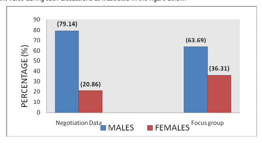

See discussions, stats, and author profiles for this publication at: https://www.researchgate.net/publication/295830872 Gendered Identities in Gikuyu Marriage Negotiation Discursive Domain Article  in  International Journal of Linguistics and Communication · January 2015 DOI: 10.15640/ijlc.v3n2a13 3 authors:

Yakobo Mutiti

Pwani University 12 PUBLICATIONS   6 CITATIONS   

CITATION
1 READS
4,615

International Journal of Linguistics and Communication December 2015, Vol. 3, No. 2, pp. 135-146 ISSN: 2372-479X (Print) 2372-4803 (Online)
Copyright © The Author(s). All Rights Reserved.

Published by American Research Institute for Policy Development DOI: 10.15640/ijlc.v3n2a13 URL: http://dx.doi.org/10.15640/ijlc.v3n2a13

# Gendered Identities In Gikuyu **Marriage Negotiation Discursive Domain**

Kinuthia, Jane Wanjiku1, Wathika, Lucy2 & Yakobo, **J.K.Mutiti**3

## Abstract

The practice of bridal payment has since time immemorial remained an important feature of heterosexual marriages in many human cultural practices. In contemporary Kenyan Law on marriage and divorce, bridal negotiation and payment is regarded as central evidence of the validity of customary marriage and in the establishment of the legality of such union. Gendered identities in this case refer to the social and cultural construction of the femininities and masculinities perspectives which are known to influence and shape the practices of social institutions. This paper focuses on the formal discursive process of negotiating and legalising marriage in the domain of '*Ruracio*' or bride wealth payment amongst the *Agikuyu* of Kenya. Data consisted of five recorded discourses from sampled negotiation sessions and five focus group discussions from Kiambu County, Kenya. The data collected was translated, transcribed and analysed with a view of investigating language use for gendered identities and their implication on society. Guided by principles in discourse historical approach, the study established that language use in this domain defines gender roles, perspectives and identities which are useful in constructing individual and societal identity. It is hoped that these findings will benefit the general public as they interact linguistically. 199 words Keywords: Gendered identities, bride wealth, Gender roles, femininities, masculinities 1. Introduction In anthropological literature, bride price (referred to also as marriage considerations in law) has often been explained in market terms as payment made in exchange for the bride's family's loss of her labour within her kin group. Gift exchange has been an important integral part of marriage rites and ceremonies in African culture. In most, it is the men folk who participate in discussions that determine what, how much and how such a payment is made (Kaye et al, 2005).Among the *Agikuyu,* marriage consideration is necessary to the validity of the marriage and to establish the affiliation or legal control of the issue of the union. The law of Kenya (cap 150, 2008) recognizes the legality of a marriage contracted under the native or custom law. 

This is the kind of marriage that is sealed by payment of bride wealth even if there isn't any other official celebration of the marriage. Marriage negotiation like any other form of negotiation is a social behaviour that is enacted within the domain of language. Every utterance made and every text written within a negotiation is an act with repercussions on the outcome. It is important for negotiators to recognise the power of language and to understand its potentialities as a negotiating instrument (Lickson et. al, 2005). It is against this background that this study interrogates language used in *Gikuyu* marriage negotiations for aspects of gendered identities and their implications on society.

One way of establishing our identity and shaping other people's views of who we are is through our use of language. Language being an important aspect in the construction of individual and social identities can be a powerful means of exercising social control. Being a member of a particular group or community often means adopting the linguistic conventions of that group, not just in relation to words use but also in relation to the way you see them. The way those conventions are defined and maintained is usually "controlled by the group rather than the individual" (Thomas et.al. 2004, p.158). 

Language can be used to construct personal identities. This happens through names, naming practices and rituals together with systems of address. These aspects are central to this study because address systems are culturally determined for example the way they are used to help establish identity within a context. Culture also determines the degree of formality, of intimacy and of relative relationship status of the participants involved in the interaction. Disregard of the rules can lead to some form of disapproval or sanctions or at worst be interpreted as an insult. They are used to express attitudes such as inferiority which can signal refusal to recognize one's status especially when repeatedly used (Thomas, et.al. 2004). The words that speakers choose to address people in are important ways of situating themselves in relation to others such as creating social distance or intimacy, marking difference, condescension or insult, all done through the conventions of the address systems of a language.

According to Wodak (1997), men and women actively choose ways of framing to accomplish specific ends within particular interaction. These choices are drawn in part from sociocultural norms for how men and women are expected to accomplish such actions through talk. Individuals' language choices in interactions invoke these gendered norms and thus perform gendered identities as well. Gendered ways of framing are resources for accomplishing the speaker's purpose. She further argues that these are maintained and (re)created through social practices including language practice. Thus language practice and gendered identities are dynamically linked in interaction. Spade and Valentine (2007) too have argued that as the practice of gender interacts with other social prisms such as ethnicity, age, race and social class, complex and dynamic patterns of meanings are created.. Some of these have been addressed in this research paper.

## 2. Materials And Methods

The study was carried out in Kiambu County, Kenya. This is a predominantly rural county but according to the Institute of Social accountability (Tisa), its urban population is increasing as Nairobi city is rapidly growing. The Agikuyu are the dominant tribe. The county is divided into five administrative regions namely; Githunguri, Kiambaa, Kikuyu, Lari and Limuru. One *Gikuyu* marriage negotiation and a focus group discussion were captured from each of these regions so that the study would capture regional variations and dynamics if any. To gain access to sites and individuals involved in the study, permission was sought from the relevant authorities: The National Commission for Research, Technology and Innovation and the Kiambu county administration. The target population was the *Gikuyu* community particularly those involved in marriage negotiations. Since this is an unspecified population, the sample items for the study were selected deliberately by the researcher.

The study used a purposive sample of five marriage negotiation sessions where each was capturing a different stage of the five key steps of a *Gikuyu* marriage negotiation. Creswell (2007) has observed that a study of this nature intentionally samples a group of people that can best inform the researcher about the research problem under study. In this respect, groups that were undertaking the practice and were willing to allow the researcher to video or tape record the proceedings were identified. The focus groups were constituted by bringing together at least six people who have been spokes persons during such negotiations. The members of each focus group were drawn from the same administrative region. The discussions were recorded and later translated, transcribed and analyzed qualitatively and quantitatively. During analysis, focus groups were labeled as FG with numbers between 1 and 5. The respondents are labeled (F) for females and (M) for males'. Data from the negotiations has respondents labeled as BSPM (bride's spokesman) GSPM (groom's spokesman), BSPW (bride's spokeswoman) and GSPW (groom's spokeswoman

## 3. Results And Discussion

The focus of analysis, interpretation and discussions in this section are on language use and its influences on the concept of gender as reflected through the discursive domain of *Gikuyu* marriage negotiation. 

## 3.1 Gendered Identities 3.1.1 Gender Stereotypes

Gendered identities in this case refer to meanings that arise from the varieties of speech associated with a particular gender such as; dominance versus subjection, attentiveness, gender stereotypes and beliefs regarding masculinity and femininity among others.. Evident in the study is the fact that there are separate and distinctive roles played by men and women during the negotiations. Marriage negotiation ceremonies focus on issues of gender in a prescriptive sense of assigning tasks and in structuring language in such a way that societal values and expectations are communicated and negotiated. 

This refers in a sense to an aspect of oversimplifying and standardizing the way a concept is viewed. In this study, language use demonstrates stereotyping through some terminologies used. For example the term "*kugurwo*" that refers to the action of negotiating for a bride. Generally the word implies that the bride is 'bought' with the groom as the 'buyer'. This usage in a sense (albeit unconsciously) relegates the woman to the substandard position of a commodity that is owned. Consider the following examples; F2…the procedure was followed and I expect that when my daughter is negotiated for '*kugurwo*'::: the same procedure should be followed FG1 F1 ((… when time came for me to sell '*kwendia'* my daughter (meaning having the daughter negotiated for) 
my brothers had to explain that I was paid up for and that the same:: procedure must be followed in my daughter's case)) 
 FG1 In the first example, the speaker uses a prolongation and a raised voice for emphasis while in the second the researcher maintains a direct translation so that the original implication is not lost. From the two examples, it is clear that the society understands negotiation to mean that the woman is the 'commodity' for this bargaining process. 

According to Thomas et.al (2004), there is a perceived link between how we talk about things and how we construe them. For instance in this case, the word '*kugurana'* within the said context, is used in a way that not only alleviates the fear of misrepresentation but also mitigates our responsibility in this kind of a 'buying' process. Thus in such a case, people are able to exploit the links between language use and perceptions. Secondly, the fact that the term cannot be used in a reciprocal relationship shows a situation of power differentiations.

Gender roles seen through the cultural practice that a family should have a spokesman whom they feel will fully represent them and safeguard their interests at the negotiation also signal societal stereotypes. Marriage discourse, which begins at the home of the groom's father, involves appointment of main spokesperson who is a male 
(preferably an uncle) and a female (preferably an aunt) spokesperson to represent women. The appointment of male and female spokespersons is done in the light of clear separation of roles during the negotiations. The main negotiations for bride wealth are led by spokesmen from both sides. Usually, an uncle acts as the spokesperson as illustrated through the excerpt below:
F2: Ehh::: not necessarily an uncle. This is because the relationship amongst members of the family matters. 

There could be an uncle who is not close to the family having negotiations. In such a case, some people opt for a close family friend. Usually, whoever is chosen as a spokesman is briefed on what to say at the negotiation. However, the uncle as a choice spokesman is considered the best since he knows the family and understands how traditionally they carry out such events.

F 1: There is a *Gikuyu* proverb that says "No one is able to shave the back of his *head*." Therefore, traditionally, the Gikuyu believed that it would be wrong to talk "tau tau tau" before the in-laws…
 FG 1 Whoever is chosen as a spokesman is briefed on what to say at the negotiation. The choice is done in line with sociocultural norms that govern how men and women accomplish tasks through talk (Wodak, 1997).The main task in this case is the safeguarding of the family's interests. 

While the bride's spokesman has ideological power since it is from him that the groom's side wants to 'get something', this power is usually resisted through some available set of resources (Foucault ,1977) in this case the power of negotiation, hence the need for an astute negotiator. For example; BSPM: Ok. That's good. Now that we have permission, we go back to the groom's spokesman. I think "the visitor is usually the carrier of news". So what news do you bring to us?

GSPM: I am so grateful for this opportunity and for being accepted in this home. Our main intention is to know G____'s home because we have never come here. We have come willingly, so because we know and can see that you are good people we believe we shall agree:: Do not send us away. The groom's spokesman here uses politeness to not only demonstrate that he recognizes that the bride's spokesman has power but also to indicate that he has intentions of mitigating even in the face of such powers.

The spokesman from the bride's side first explains the traditions regarding bride wealth expectations in that particular family. The explanation too serves to demonstrate the powers that he has over the whole event but even as he does this, he is careful in his choice of words.

BSPM: I know you are guilty of all that but I can't talk with nothing in my hand. You have said you came to report yourself but I know a few steps that you must also fulfill and it all depends on your readiness. If you want to report yourself, start payment of dowry (kiaara) so that I count for you (*kuuna miti*) and you *'kuguraria'* tomorrow, I am ready. It all depends on you…
 **(CASE 2)** This demonstrates that the parties involved understand that language practice and gender identities are usually dynamically linked in interaction (Wodak, 1997) and that they influence and shape meaning and interactions (Foucault, 1977). This probably is the reason why this interaction is in the form of a narrative structure, sometimes punctuated with some dramatics as in the example below: 
BSPM: There is nothing I need to be reminded of. Just give me what you have::: and then we can talk. ((He is given some money)). Let me first take water. ((takes the water as everybody anxiously waits, then continues to talk)). 

Let us go in stages. First, there is the fine for theft::: what you have given is not enough. You cannot show me goats and then you go back and hide them. (referring to the money the groom's spokesman is returning to the pocket. Continues…)).

We now go to the Next step- goats that you brought as a gift for coming to see your bride's home ((he is given some more money which he accepts))…
(CASE 2)
The excerpt indicates some dramatics from the bride's spokesman; takes time to count the money, takes some water, emphasizes his words by use of raised voice, and pauses in between talk, all in an effort to demonstrate that he is the main person and the only one to call the shots. It is for the groom's party to 'read' the underlying meaning and do an appropriate decoding. Their interpretation is what will shape the way the interaction continues.According to the conventions of interactions in the discursive domain under study, parents do not act as spokespersons. In a sense, though the bride's side knows that they have power, they too exercise it cautiously to safeguard future relationships. A participant in one of the discussions intimated that the *Agikuyu* believed that negotiating for your own child may look like you are '*selling her'* which doesn't come out very well. It is ironical that the word used denotes the very meaning that they seem to be safeguarding themselves against. 

F2: The *Gikuyu* also believed that negotiating for your own child may look like you are 'selling her'…
 FG1 Culturally, 'a child belongs to the community'. At negotiation, this communal aspect is enhanced and that is why some of the *'ngoimas'* (goats) asked for are meant for the clan to feast as demonstrated through the excerpt below; M2: A common belief among the *Agikuyu* is that children belong to the clan. The clan therefore must be told that their daughter is getting married. That is why the *'ngoimas'* are slaughtered for them.

 FG 4 Generally, the language and cultural choices made invoke gendered norms and the ways of framing chosen help to accomplish the speakers' purpose (Wodak, 1997). In this case, the purpose is to explain the need for communal participation and how important safeguarding such a relationship is.

Gendered roles in the discursive domain are also defined through the different types of *'maaha'*
(miscellaneous items) asked for by the bride's spokesman and woman.

Women then would be given a chance to ask for their things…an axe,water container, something to tie firewood and a machete… **(FG 2)**
A look at the things women asked for clearly shows that they define their roles such as; they are responsible for the cooking (firewood), fetching water, and cultivating all of which are duties that serve her family. The man on the other hand mainly asked for honey (to prepare beer), and a container for tobacco both of which serves him as an individual.

F1: After this, women are given a chance to ask for their properties called *'maaha' (*miscellaneous items). 

These are items besides the animals such as tobacco, a sword with a sheath and a honey barrel for the father while mother's ask for cultivating knife, big gourd, an axe, leather strap and cooking pot.

F 2: The list of *'maaha'* should be moderate and culturally meaningful.

( Case 5)
Such a social practice demonstrates Wodak's (1997) view that language practice and gendered identities are dynamically linked in interaction and that the choices of framing made which are drawn in part from sociocultural norms accomplish specific tasks within interactions.

Gender identities that are stereotypical are also revealed in advisory roles during the marriage ceremonies among the *Agikuyu.* The bride is advised by the mother, aunt, grandmother or elderly women in the society as seen in the discourse below:
BSPM: Now that we have introduced ourselves I wasn't to ask that you tell us why you and your delegation have visited this home. First of all, I want to ask G_______, who are these people and what are they are doing at your father's home?

G________: ((Doesn't know what to say but is advised by her 'mother')). 

 **(Case 2)** On the other hand, the groom is advised by the father, uncle, grandfather or elderly male member in the community. As observed by Spade and Valentine (2011), the interaction of gender and the social prism of age in this case (where the older are advising the younger) bring out an identity and relationship pattern which demonstrates power differentiation between the older (advisor) and the young (the advised).

The role of the father as the head of the family is clearly indicated through ideological practices such as when a young man wanted to get married, he first informed his father symbolically by brewing beer for him to show that he was a grown up with his own sugarcane farm (Leakey,1977). The father had to give him a go ahead. On the other hand, a girl through the mother had to inform the father that she had received a proposal for marriage. The discourse below demonstrates the important role performed by the fathers. Only by their permission would such ceremonies proceed:
M2: After a relationship that leads to marriage whether it is the bride and groom meeting on their own, introduced by parents or even elopement, negotiations only starts when the bride's father is informed of the intention by another family to start in law relationships with home and he accepts.

M1: Remember that the groom's parents have to send three elders to announce such intentions= M 2: =The groom's father once given an okay starts preparing beer that he will take to his intended in-laws. 

This is taken to the bride's father as a way of introduction and expression of gratitude. 

( FG 4)
BSPM: The best thing would be you come and talk to the parents. You may not need a big delegation. I 
believe we shall agree. Remember that the journey has landmarks that direct one on the right way. You need to come back so that the landmarks are pointed out to you; otherwise you can lose the way.

 **(CASE 1)**
Only the bride's father can give a go ahead for the marriage to take place. He is also a leader in the family as seen from the second discourse (above) where even the spokesman cannot make some decisions but must defer to him. (Leakey, 1977) observes that fathers as heads of families would gather their families before going to pay bride wealth and together they would pray that the animals would get for them a prudent wife. This study too witnessed a similar practice where the father gathered together all those going for the ceremony and led them into prayer as demonstrated by the excerpt below:
((…On the material day, the delegation gathered at the groom's father's home. The groom's father, the groom and the spokespersons held some talks and prepared themselves. The preparation involves putting the "goats" 
(in this case, money) together; furnishing the spokesman with any details he needed to know how to negotiate in their favour and prayer to invoke God's presence…))
(CASE 2)
The fact that this practice continues even today shows that the *Agikuyu* have reverence for their God and recognise that he can influence outcomes of issues.

## 3.1.2 Dominance Versus Subjection

The practice of negotiation brings out identities of dominance which are clearly demonstrated through songs. 

A closer look at the way reception of the groom's party is handled reveals the dominant privileged position of the bride's side .This reflects a prescriptive way of assigning tasks which also brings into focus gendered identities. 

Women play the lead role in ushering in the parties. Before the actual payment of bride wealth, there was the ceremony called "*Kuhanda ithigi*," where the prospective in- laws must first visit the bride's home in a sense "to know where it is." The women are in control at the introductory part of these sessions. The 'knocking of the door' is done using a song and the key players here are women. The groom's relatives led by the women have to request to be allowed in by the use of songs. On the other side, the women from the bride's home respond by teasing their groom counterparts. The bantering through singing continues between the women from the sides until the women from the groom's side give a token through the closed gate so that apparently 'the bride's relatives can look for the keys'. This time, the men from both sides are just standing on the sidelines watching this drama which also serves to demonstrate the side that has power. It is also the women from the bride's side who eventually allows the groom's party to get in after they are satisfied that they have been respectful enough. This is clearly illustrated through the excerpt below:
((…On arrival at the bride's home, ..The bantering through singing continues between the women from the sides until the women from the groom's side gave a token through the closed gate so that apparently 'the bride's relatives can look for the keys.' This time, the men from both sides are just standing on the sidelines watering this drama.The women are in control in this session... 

## (Case 2)

The songs convey honor and appreciation especially for the bride's mother. They also serve to demonstrate that the bride's party has a dominant position. According to Hale (1998), such kind of negotiation techniques are influenced by an understanding of what the terms 'concession' and 'compromise' means for the participants in the discourse. In this case, the songs serve to demonstrate that they value their daughter and shielding her is only meant to pass this message across to the groom's party otherwise they cannot bar her from getting married since it is an obligation. Once the ushering in is concluded by the women and the eating is over, men take over the proceeding stage which entails introduction and payment of bride wealth. Women regain control of the second and the last stage of negotiations in which women in the groom's entourage present their gifts to the bride's family. The stage is led by spokeswomen from both parties and takes a very short time.

The marriage song in the *Agikuyu* community is the monopoly of women. According to Hale (1998), an 

understanding of the creative power of language is important in shaping people's thoughts and contributing to perspectives that underlie the language choice as it influences the thinking and outcome of the negotiation, in this case, the women participating in the singing and the men taking over the discourse. Such participants will have an opportunity to reflect on whether the language choices and use made are manipulative. Another aspect of gendered identity is demonstrated through dominance in terms of talk in this domain. In the data collected for this study, an observation of turn-taking during both the focus group discussions and the negotiation events show that women are not a dominant voice during such discussions as illustrated in the figure below:
The graph above serves to demonstrate the fact that *Gikuyu* marriage negotiation discursive domain is male dominated judging by the turns taken by each gender; an average of 71.5 per cent for the males and 28.5 per cent for the females in the discourse under study. While we could argue that *Gikuyu* marriage negotiations by nature would give the men an upper hand being the key negotiators, one wonders why a similar scenario is reflected in the focus groups yet this is a forum where both men and women have an equal chance of contributing to the discussion. In a sense, an observer feels that women have accepted that this is not their domain and therefore act as just passive participants. A close examination of speech practices is useful to the study in that it provides insights into gender related issues for instance who is dominant in this discursive domain. Such an assumption is however ideological and according to Fairclough (1989), they are usually taken for granted yet, they serve as a means of legitimizing existing social relations through ordinary familiar ways of behaving which take power differences for granted. By illuminating these power differential issues, this study concurs with Fairclough's (1989) view that there is need to increase consciousness of how language contributes to the domination of some people by others.

As Marks and Yardley (2004) have observed, an analysis of both content and context brings out the social relationship between participants, their roles, lives, history and culture. Except during the *'itara'* when the groom's family hosts the bride's family, all the other occasions involve the spokesmen from the two sides engaging in a grueling negotiating process. The discourse between the two is characterised by language use that is aimed at demonstrating who is in control (the bride's spokesman) and therefore shaping the discussion, while the groom's spokesman has to demonstrate humility. The two dominate talk and it is only towards the end when women are given a chance to ask for their things called '*maaha'* which are usually predetermined and obvious. In fact, by the time that the spokesmen are through with their business, there is a sigh of relief from all the people present as though everything has come to an end. This makes one to feel like the women's session is not given enough weight. It is no wonder that their presence in the discourse is a dismal 21 per cent. 

This kind of scenario communicates some insights regarding gender and dominance in this discursive domain in particular how activities in this process influence the socio-cultural products and elements of discourse (Marks & 
Yardley, 2004). 

## 3.1.3 Beliefs Regarding Femininity And Masculinity In The Discursive Domain

These identities arise from societal expectations regarding the woman. This study contends that male superiority or right of authority over women is evident in this discursive domain. This kind of power is believed to be embedded in the bride wealth cultural practice. For instance, during the *'ngurario'* ceremony, a woman is given the 'kiande' meat together with goat's ears. The meanings attached to these discourses indicate clearly what society has prescribed for the woman once bride wealth has been paid for her. This agrees with Wodak and Meyer's (2004) argument that power is exerted through a person's control of the social occasion.

M1: Normally, the *'kiande'* (scapula) is cut only once in a woman's life. That could only suggest that such couples never adhered to this requirement when it was supposed to be done. This has also come as a result of people understanding that a true *Gikuyu* bride is one who has undergone this ceremony…
(FG 4) The emphatic way through which the male respondents use, (shown by the underlined responses in the data), 
shows that this is a view that they strongly hold. This kind of language use reveals how historical dimensions can serve to constitute power and exploitation (Wodak & Meyer, 2004). Such an attitude creates a lot of gender imbalance. Another phenomenon is where Women were required to prove their worth by going to cultivate the man's farm as described by respondents during the focus group discussions in the excerpts below:
F 1: …Something else that used to happen is that after the payment of the required bride wealth, the bride would be told to go and cultivate in one of the groom's farms ((before she is married)). The groom would be hidden somewhere to see how hardworking or lazy his intended wife is. The girl was supposed to cultivate without standing up as this would be interpreted as laziness=
(FG 2)
The fact that the man does not have to go through a similar evaluation demonstrates a situation of power imbalance. The unfairness underlying this is that society assumes that the man has nothing to prove. Since such an approach has historical reverberations, this study contends that there is need for modern society to consider and recognize the power of language and its potentialities within this discursive domain and how the same contributes in shaping people's thoughts (Cohen, 2001).

While in some cases ideologies of gender equivalence are clearly articulated for instance the fact that both males and females have a chance to ask for 'maaha', the value of the items asked for by women in comparison to the men's (who have to ask for the animals as well) shows differentiations. As Spade and Valentine (2011) have observed, gender practices and meanings are a montage of intertwined social divisions and connections that both pull us apart and bring us together. This therefore is an area that needs to be addressed so that the repercussions do not pull the language users in this domain apart as they seek to apply the definitions as provided within the available societal definition particularly in modern society which has redefined some terms and practices within the discursive domain.According to the researcher's observations, in terms of identity, language forms in the discursive domain are structured in such a way that the woman is portrayed as a vulnerable member of society. She first belongs to her father who on getting a number of animals practically hands her over to another man, her husband, as illustrated through the excerpts below:
M1: =After the agreed bride wealth was paid, the groom would come with his friends to visit the bride. They would find she had made porridge which is to be given to his groom referred to as *'mugurani'* (( a term that is used to refer to a buyer of an item)).The groom would be given the porridge to sip by his bride …Bride price however must have been agreed upon and part of it paid up.

M1: ... The ceremony being done in the open made the whole clan aware that the bride is fully paid up for; 
'nimugure.'
 FG 3

## 3.1.4 Women As Passive And Subservient Members Of The Society

The terminologies used; *'mugurani', 'nimugure'* among others clearly depicts some kind of ownership through buying. The fact that the woman shifts ownership after such an exchange more so after hard bargaining seems to accentuate this perspective. Society has ensured that she does not have a say over the children she gives birth to as they virtually belongs with the family that paid bride wealth for her (Leakey, 1977). Bride wealth also makes her assume another identity 'belonging to the man'. The fact that this kind of a societal definition of gender seems not to be contested by the woman (observations from the data collected) can only be understood through an analysis and investigation of the historical background of the social field in which the discursive event is embedded (Wodak & Meyer,2004).

The data collected reveals that the *Agikuyu* community expect women to be passive and subservient is substantial matters in the marriage ceremonies. Men take part in major decision making processes such as determination of the bride price and the discourse on the modalities of payment of the bride wealth as in the excerpts below: 
F 1: Together with what we had mentioned earlier on, there is also the issue of culture which has always been that way. It is also considered as a sign of disrespect for a woman to negotiate for bride wealth. 

 FG1 M1: =When it came to the actual negotiation which involved the goats, women had no place in the matter. 

Their role was cooking for the in laws.

M1: The talks were held in the *'thingira'* (the man's hut)…((The man's hut was not a place for women))…
 FG 3
 
These examples clearly concur with Thomas et.al's (2004) argument that there is a perceived link between how we talk about things and how we construe them. One of the male respondents argue that the bride wealth negotiation table was not a place for women, a position that is reinforced by the cultural practice of holding the talks in a man's hut (women usually visited the place on invitation by the man). According to Katz et. al (1998), language constructions make significant constrains on the interpretation process and context.

Another aspect is where women would be given some beer to go and drink from inside the house because they are not supposed to take it while men watch. Men however, would take theirs in the open (an aspect of power differentials) as seen from the response below:
M 2: The beer brought by the groom's relatives is meant for all; men and women but in separate gourds. The two should also take the same differently. During such occasions women are allowed to drink but must avoid misbehavior. 

FG 4 This shows how society makes different demands on the woman and prescribes what is right or wrong for her. This in a sense makes her look like a vulnerable member of society. In Katz's (1998) view, interpretations of concepts are dependent on culture as well as knowledge for such interpretations. For instance, one wonders whether it is only women who are capable of misbehaving while drank. Furthermore, the emphatic tone used by the respondent (demonstrated by use of the underlining in the excerpt) conveys an extra meaning such as his own opinion regarding this concept. Since he is an elder, it is possible that his opinion could represent many others in society. This concurs with Schiffrin's (1994) argument that language creates and is created by social context such that an individual's actions produce and reproduce knowledge through which his or her conduct and social circumstances are intelligible.

## 3.1.5 Productivity Of The Bride

Productivity of the bride is a quality that *Agikuyu* community values. Before a man decides to marry, he must ascertain that the bride-to-be is industrious. The industriousness of the bride would be determined by the ability to till the land, cultivate and execute domestic chores. After the payment of the required bride wealth, the bride would be told to go and cultivate in one of the groom's farms (before she is married). 

The groom would be hidden somewhere to see how hardworking or lazy his intended wife is. The girl was supposed to cultivate without standing up as this would be interpreted as laziness. In fact "even if anything bit her, she could not stand to check or scratch herself" as observed from the responses below:
F 1: …Something else that used to happen is that after the payment of the required bride wealth, the bride would be told to go and cultivate in one of the groom's farms ((before she is married)). The groom would be hidden somewhere to see how hardworking or lazy his intended wife is. The girl was supposed to cultivate without standing up as this would be interpreted as laziness=
FG 2 When the man determined that they were paying for a hard worker, arrangements for picking her would be made. She would be taken to the groom's mother's hut and put on the girl's bed and her friends on learning this would come and join her for eight days of mourning.

After the girl is married and she happens to be lazy or quarrelsome among the man's relatives will be saying 
"our goats were a waste" or the groom could say, "My goats got lost". A common expression was, "our goats were carried away by the waters as we crossed the river" as reflected by the excerpt below:
M2: After the girl is married and she happens to be lazy, quarrelsome among the man's relatives will be saying "our goats were a waste" or the groom could say, "My goat got lost." A common expression was, "our goats were carried away by the waters as we crossed the river."))
(FG 2)
According to Kanogo (2005),the custom (among others) was used to control women and limit their attempts to determine their marriages while Anderson (2007) contends that bride wealth can be associated with recognition and valuing of a woman's productivity. He further argues that the importance of these relationships had not been empirically tested. This study in addressing this knowledge gap illuminates how the cultural practice constitutes power for the man over the woman for whom he has paid bride wealth and the expectations of society for such a woman. 

Such consciousness as Fairclough (1989) argues is a step towards social emancipation.

## 3.1.6 Right To Ownership Of The Bride Wealth

The right to the bride wealth was predominantly a preserve of the male gender. The bride wealth was paid to the bride's father. The six goats offered to open up the negotiation were called *'ugendi' and* were meant to be distributed to bride's brothers. 

((The bride's father was usually not in a hurry to be paid the few remaining. He however ensured that one of his sons (usually the last born) was given the mandate to ask for the remaining goats should the man die before they have been fully paid particularly if he needed a boost for his own bride wealth payment.))
FG 2 The sisters were not entitled to the bride wealth. Women's right to ownership during the negotiations were limited to tools for household chores as seen below:
F3:. Women then would be allowed a chance to ask for certain things that were almost predetermined;
'ithanwa, mukwa wangu, ndigithu ya mai na ruhio'that is ;an axe a panga, water container and something to tie firewood.=
FG 2 By their nature, those items defined women's duties. Secondly, the father takes care of his sons in terms of property ownership in the event of his death while nothing is mentioned about his daughters. These are some of the common sense assumptions which Fairclough (1989) argues contributes to the domination of some people by others.

## 3.1.7 Bride As A Source Of Wealth And The Price Tag On "Femaleness"

The study established that the bride is treated as a source of wealth and the community attaches a price tag on 
"femaleness". During one of the marriage ceremonies the groom's spokesman started his address by stating that:
GSPM "we have come to apologize for taking someone's 'goat,' and staying with it without reporting" 
 (CASE 1)
In this context, the bride is considered a source of family wealth 'goat'. Living with her husband without fulfillment of this customary requirement for traditional marriage (bride wealth payment) is equated to stealing because her family had not benefited from her. The groom by having not paid the bride wealth makes him equated to a thief. Such an assumption is ideological and as Fairclough (1989) has observed, closely linked to power: in this case for instance, a marriage where bride wealth is not paid is equated to "theft" - a loss to her father and brothers in terms of material property. This study thus concludes that such a gender identity is socio-culturally constructed and serves to define expectations of how men and women behave (Wodak, 1997).

## 3.2.7 Women As Men'S 'Property'

A married woman is considered her husband's 'property'. A woman who had undergone *'kuguraria'* ceremony could not remarry even after a divorce. Even if they separate for whatever reason for a number of years, only her husband has a right to bury her if she dies. *'kuguraria'* meant she belonged to him forever:
M2: This is the true *Gikuyu* wedding where the *'kiande'* scapula is cut…*Gikuyu* bride undergoes the cutting of the scapula ceremony, she is forbidden from remarrying even if the husband were to die. This kind of marriage also does not have divorce.

((Even if she were to differ with her husband, she cannot be sent back to her father's family. She belongs with the husband's family.))… **FG 4**
Children born in such a marriage belonged with the family that paid the bride wealth (Leakey, 1977) this cultural marriage is very different from others (Christian, Hindu, Muslim or Civil) in this perspective. For Kanogo,(2005), such discourses associated with bride wealth represent the cultural struggles over control of marriage and women's position in the family among the *Agikuyu*.

## 3.1.9 Man As The Head In The Marriage

Man is considered as the head in the marriage. This concept is well demonstrated in the '*Kiande'* ceremony where the groom cuts for his bride the shoulder meat of a goat. She was also given 'ears' to signify that she will be a good listener. The cutting also signified that any four legged animal in a home is the man's. That the man is the only one to be slaughtering and the woman can only wait to be given is also another meaning attached to the man cutting for his wife the scapula section of goat meat. The other part of the goat meat given to a bride are the goat's ears signifying that she is going to be a wife who listens to her husband. Listening in this context has also the connotation of obedience that is; the woman is expected to be subject to her husband particularly after he has cut the '*kiande'* for her.

((…cutting his wife the scapula section of goat meat. As the elder leading the ceremony explained, the ceremony of cutting the scapula marks an equivalent of a wedding ring…The other part of the goat meat given to a bride are the goat's ears signifying that she is going to be a wife who listens to her husband…))
CASE 4

## Conclusion

The conclusions in this paper are that gender identities in the Gikuyu bride wealth negotiation discursive domain manifest in the different roles played by male and female during the marriage ceremonies: men are the main negotiators while women have subsidiary roles such as welcoming the parties and creating good rapport Gender identities are also manifested in the advisory role played by men and women. All these clearly demonstrate a clear separation of roles and responsibilities for males and females during marriage negotiations. 

The cultural values and practices among the Agikuyu community define how 'maleness' and 'femaleness' is perceived in the society. Women are expected to be passive and subservient in major decision making processes. For instance, women are not involved in the determination or bargain for the bride price. Women are also secluded from open participation is some traditional events such as taking beer to celebrate successful talks. The society expects a woman to be industrious while the right to ownership of the family wealth is conferred on men. The bride is treated as a source of wealth but the right to own the bride wealth was predominantly a preserve of men. The overriding perception is that male gender is dominant in this society. 

## Acknowledgement

Special thanks go to all our respondents from Kiambu County for their willingness to participate in this research and enabling us to collect the relevant data.

References Anderson, S. (2007).The Economics of Dowry and Brideprice. Journal of Economics Perspectives - *Volume 21, PP.151-174.* Cohen, R. (2001). *Language and Negotiation: A Middle East Lexicon*. Retrieved February 15, 2013. http:// 
www.diplomacy.edu/resources/general/language_and_negotiation-middle-east-lexicon Fairclough, N. (1989). *Language and Power*. London: Longman Group Foucault, M. (1977). Power/ Knowledge. Hermel Hempstead : Wheatsheaf, Harvester. Retrieved from:http://library.queensu.ca/ojs/index.php/surveillance-and- society/article/download/4155/4158.

Foucault, M. (1980) Power/Knowledge: Selected Interviews and Other Writings 1972-1977, edited by Colin Gordon. 

New York: Retrieved from: http://tcr.sagepub.com/content/1/2/173.refs Hale, K. (1998). Negotiation Mediation and the Use of Language Assistants. *Mediation Quarterly*, Vol. 16, No. 2.

Kanogo, T. (2005). *African Womanhood in Colonial Kenya, 1900-1950*.Nairobi, Kenya: East African Educational Publishers.

Katz,A.N.,Raymond,W.G. & Turner,M. (1998). *Figurative Language and thought*. New York, NY: Oxford University press.

Kaye,D. K., Mirembe, F., Ekstrom, A. M., Bantebya, G. ,K., & Johansson, A. (2005). Implications of Bride price on Gender Violence and Health. Journal of African Health Sciences, *Makerere University, Medical School*. 

Laws of Kenya (2008). *The Marriage Act, Chapter 150*. Nairobi, Kenya: National Council for Law Reporting. Leakey, L.S.B. (1977). *The Southern Kikuyu before 1903*, Vol.2. London, England: Academic Press. Lickson, J. D., Charles, P., & Maddux, R.B. (2005). *Negotiation Basics*. Canada: Transcontinental Printing. Marks, D.C and Yardley, L. (2004). *Research Methods for Clinical and Health Psychology*. California, Thousand Oaks: Sage Publications.

Schiffrin D. (1994). *Approaches to Discourse*. Cambridge: Blackwell. Spade, J.Z.& Valentine, C.G. (2011).The Kaleidoscope of Gender (3rd *Ed).* London: Sage Publications.

Thomas, L., Wareing, S., Singh, I., Peccei, J. S., Thornborrow, J. & Jones, J. (2004). Language, Society and Power: An Introduction. London: Routeledge.

Wodak, R. (1997). *Gender and Discourse.* London, England: Sage Publications.

Wodak, R.& Meyer, M. (2004).*Methods in Critical Discourse Analysis*. Thousand Oaks, CA: Sage Publications.