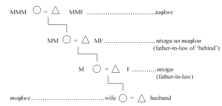
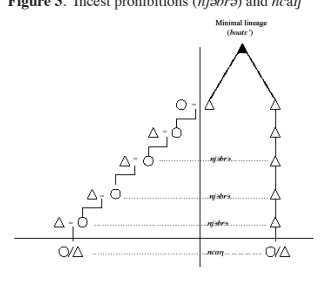
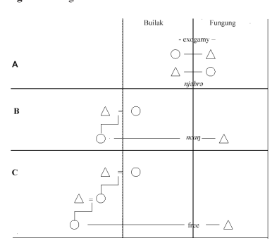

# Chapter 2: Yamba Marriage Systems Spouses And Their Offspring Between Protection And Affliction

## Introduction

Marriage and kinship have sometimes been called the 'traditional heartland' of social anthropology. The study of marriage systems of a tribal society not only brings to light the affinal relationships between the kin of bride and groom and thus the ideological principles of descent but, as E.M.Chilver has pointed out (pers. com.), 'provides clues to much else - such as belief systems and notions of the person.' In the following I would like to take up Chilver's point. What does the study of Yamba marriage forms tell us about their belief systems and notions of the person?

First, I shall describe the Yamba marriage systems. I shall start with exchange marriage, suppressed by the British colonial administration in 1924, and then go on to bridewealth marriage as practised by the Yamba up to the 1960s when the 'marriage shovels' used in the payment of bridewealth became obsolete and were replaced by money. Regional differences, where they exist, - especially between Lower and Upper Yamba - will be pointed out and I shall also mention some new developments which have taken place. I shall next describe some unorthodox marriage practices. From there I shall go on to explain exogamic rules and incest prohibitions, as they are extant in Yamba society. I shall further elaborate on the special relationship which exists between mother's father/brother (MF/B) and daughter's/sister's son (D/ ZS) and examine the role of the bride-giver. Finally I will have something to say on 'completed marriages', i.e. marriages which end in divorce or death.

## 2. Yamba Marriage Systems 2.1. Marriage By Exchange (Kupse)

According to R. Fardon (1985: 79f), the Mbem (Yamba) formed part of the group of peoples extending from the Benue in Nigeria right down to the Bamileke chiefdoms in Cameroon for whom marriage by exchange was the one preferred form of marriage. Documentary evidence from early colonial administrative records supports the existence of this practice among the Yamba (Carpenter 1933: 61, also Migeod 1925: 141), although there is one curious entry in the earliest report by E.G. Hawkesworth (1923). In para. 60 he states that 'the Nsungli custom of exchanging a daughter or son for a wife is never utilised.' Hawkesworth's statement receives unexpected support and

clarification from a statement by F.W. Carpenter when he writes, 'Among the Lus of the MfumteÖmarriage by exchange never took place, as members of the clan made the shovel shaped pieces of iron which were used as currency and for nothing else' (1933: 62). Up till 1933, the Yamba and Mfumte were lumped together as one people and referred to as the 'Kaka'. It was Carpenter who discovered that there were actually two peoples involved, the 'Mbem' (Yamba) and the Mfumte. So Hawkesworth must have got his information in Lus and applied it to the whole area.

Whether the whole of Mfumte did not practise the system of exchange marriage I cannot tell since I don't know the Mfumte area, but my information would support the absence of this system among the Lus people. I was puzzled by the statement of one of my informants, Sam Kobuin of Nkwi quarter of Gom. He told me that they never practised exchange marriage in Nkwi. When I asked him where Nkwi people came from, he said that his father told him that they came from Lus. The reason he gave for the rejection of this system by the people of Nkwi is interesting. He said that exchange marriage is tantamount to marrying your *male*Ngu (mother-in-law, in the extended sense) and that was not 'correct'.

Oral testimony on the practice of exchange marriage is rather confusing. I
have met several people who told me that their grandmothers were married by exchange, but when asked for details they were unable to give clear information. Historically both systems, bridewealth and exchange marriages were practised. Some informants say that exchange marriages were not very common. They insist that bridewealth marriage was the normal practice.

Exchange marriage, according to them was a 'last resort', a kind of substitute which poor family heads with no means of getting bridewealth had to fall back on. One informant used the Pidgin English expression 'how-for-do' marriage to explain the derogatory nature of exchange marriage.

Informants disagree on whether the exchange of women was a 'clean' exchange or whether gifts and services accompanied the exchange. Migeod, who travelled through southern Yamba in 1924, says of the Mbem that 'two men will take each other's sisters in marriage and there was no headmoney' (1925: 141). Carpenter (1933: 61) is not clear on whether there was an exchange of gifts after the wooing when he states, 'Where there was an exchange marriage no presents were given during the wooing'. One of my informants described the former practice of marriage by exchange as follows:
'(Exchange marriage) was the custom of a very long time ago when people did not know about marriage as we know it now... If I see your daughter and I like her, I will go and see you. I will say, 'Yes, this your daughter, I 

like her. Come to my compound and look around. Do you like one of my daughters?' You say, 'Yes, I like this one'. Aha! I go to your compound and you come to my compound. You take some palm wine and bring to me. I take some palm wine and bring to you - till the time has come when your daughter has grown up. Then I take my wife. You will take the girl and give me. When my own daughter has grown up, I will say to you, 'Come, take my daughter!' Then you take her. We are even. I won't cook meat and give you. I need not do anything again. You too, you do not cook meat and give me. You need not do anything again. That is all.' (Monday Kongnjo of Gom, 28 June 1991).

Most informants however say that gifts and services were exchanged. Dan Taku Taabi of Ngang said that 'expenses' (the Pidgin English word for marriage gifts) were given mainly to satisfy the family members. A 'clean' exchange of women left the family members out in the cold. They were deprived of a share in the normal marriage services and gifts, which go with bridewealth marriage. Their ill-feeling and anger was translated into the idiom of witchcraft. Informants were almost unanimous in stating that exchange marriages were prone to attacks of witchcraft.

Another example of the kind of misfortune which could threaten marriage by exchange was given by Monday Kongnjo. It must be remembered that bridewealth and exchange marriages existed side by side and that there was no difference in filiation. Kongnjo's statement implies that two daughters whose mothers were married under the bridewealth system could be exchanged:
'But there was something which could bring problems into this marriage system (of exchange). If the father of the girl has not 'fixed' her mother (i.e., has not finished with his bride-giver as regards festal gifts and bridewealth, H.G.), misfortune would befall the girl. The daughter of a father who has 'fixed' her mother will deliver many children. Her children will fill the house. Your own daughter, because you did not 'fix' her mother fine will deliver children but they will all die. That's when the problem started.' (Interview, 28 June 1991).

Pa Monday addresses here the problem of the equivalence of fecundity, which was expected but in reality seldom attained. Yamba belief puts the blame for this problem on the father of the girl and his neglect of affinal obligations. In the case of bridewealth marriage the bride-giver would be trying to get all the gifts and bridewalth he is owed, even if it meant getting them out of the husband of his daughter's daughter. Anything the father of the girl did not give for her mother as regards marriage gifts and bridewealth he has to pass on to

his own father-in-law when the husband of the girl brings it to him. By exchanging his daughter in marriage this road was effectively blocked. Hence the belief that exchange marriages were wide open to attacks of witchcraft.

It is interesting to note that none of my informants connected the disappearance of the practice of marriage by exchange with its suppression by the British. Rather they credit the demise of its practice to the frequent attacks of witchcraft. Nor did I hear any Yamba lament the passing of exchange marriage.

## 2.2. Bridewealth Marriage (Ywin Ngwe)

Since the suppression of the practice of exchange marriage by the British in 1924, when they applied Nigerian laws in the mandated area, bridewealth marriage (ywin Ngwe, literally 'buy wife') became the main form of marriage among the Yamba. This system which includes both bridewealth and gifts and services was a protracted affair involving several stages.

Bridewealth was paid in so-called 'marriage shovels' (so). Two sizes of shovels existed. The smaller type which was manufactured by both Yamba and Mfumte blacksmiths was the former 'currency' used in the payment of bridewealth. They were replaced in the 1940s by the larger type which were made exclusively by the famous Kwaja (Mfumte) smiths.6 These marriage shovels were flat pieces of iron, the larger type being 67 cm long and 24 cm wide at the widest point and about 3 mm thick. They have a peculiar shape and have sometimes been described as two partly overlapping hoes. Their size and shape make them completely useless for any practical work such as farming. They were prestige goods (nte) and solely used for the payment of bridewealth. After the plebiscite of 1961 when the people of the former British Cameroons were asked to choose between achieving independence by joining the independent Federation of Nigeria or the independent Republic of Cameroon, the marriage shovels became obsolete and were replaced by money. The exchange rate was one shovel to one thousand francs CFA.7 The chief of Mfe, then a member of the West Cameroon House of Chiefs, is widely believed to have initiated the change. As a result, lineage heads all over Yamba (and Mfumte) were stuck with large numbers of shovels now

completely useless except as scrap iron. Walking through Yamba villages one can still see scores of these peculiarly shaped pieces of iron leaning against house walls, rusting up.

Let us now look at the different stages of bridewealth marriage. I base my description mainly on information I have been given in Gom, Nkot, and Ngang for Lower Yamba and in Mfe and Mbem for Upper Yamba. The material refers to the situation as it existed up to the early 1960s when 'fattening' the bride was discontinued and marriage shovels were replaced by money. But I will nevertheless point out some new developments that have taken place. In order not to overburden this chapter I will have to leave out minor and nonessential details.

## 'Carrying Off' The Woman (Bu'´' Nwanwe)

If a young man sees a girl in the market or at the dancing field who takes his fancy he will try to find out who her parents are and where she lives. He will also inquire whether she is free to marry. He will report to his family that he has seen a girl he would like to marry. There will be a family meeting to find out whether there are any exogamic or incest prohibitions which could obstruct a possible marriage. If the road is clear, a 'sister' (njE'gu, a female dependent of the lineage) will be given the task of meeting the girl and presenting her with a small gift. Formerly this would have been in the form of a small quantity of boiled mesocarp of palm nuts wrapped in a leaf, called lE'. The girl will want to know the man to whom she is to be given as wife and if she agrees she will tell her parents. If the parents agree to the match, the mother will cook some food and ask the girl to bring it secretly to the lineage head of her future husband as a sign of their acceptance.

On an agreed day the young people of the lineage will seize the bride at the market or the dancing field and carry her off to the suitor's compound. At the compound there will be rejoicing and everybody joins in the *tajo'* dance.

## 'Fattening' The Bride

The bride will stay about a week in the compound moving about freely. Then a day is set to begin the seclusion of the bride (nisi Nge'). On that day tajo' is danced seriously and the suitor has to provide ruk ncum (palm wine for the drum, i.e. the drummers). Then the bride is confined to her house. She will stay there with an attendant (njE'gu) to keep her company for about three weeks. A specialist (Nga nisi Nge') gives the bride a certain medicine called nd´m Nge'. This is a medicine in powder form which is believed to secure the

bride's love and absolute loyalty to her husband. It is also believed to enhance the fattening of the bride. The bride is not allowed to leave the house or to do any work except basket weaving if she knows how to do it. She will be given nourishing food, especially meat, and palm wine to drink. She bathes daily and is rubbed with bu' (camwood). In Mfe the seclusion was not so strict. The bride could leave the house and walk around the compound. Twice a day she would go with her attendant to the stream to bathe. 

## The Bridal Dance

After about three weeks in seclusion the bride is moved outside (Gom *fike* Nge', Mfe fe Nge'). This is the day of the bridal dance.8 The dance usually starts in the late afternoon. Many people attend the occasion. A lot of food is prepared and a great quantity of palm wine has to be provided by the family of the groom to entertain the guests. The bride's family will be present.

Plantain leaves are spread on the ground all the way from the house of seclusion to the dancing field where the *tajo'* dance is in full swing. The bride, all her body rubbed with camwood, is adorned with numerous strands of coloured beads around her waist and neck, with brass bangles on her ankles and wrists. When she leaves the house attended by a number of girls, a mat (Gom wam, Mfe ku'´) is held over her head as she walks on the plantain leaves. The Nga nisi Nge' sprays palm wine three times on the bride's chest to offset any ill effects which could attack her because of the medicine (nd´m Nge') he had given her at the beginning of her seclusion. The procession moves slowly towards the dancing field stopping frequently. There, after some initial coaxing the bride joins the dance. Her first steps are greeted with cheers and ululations and coins are pressed to her forehead. The bride does not dance with, or rather at, her husband. The groom (*ndugu*) hardly features at all on the day of the bridal dance. A brother-in-law or somebody well known for his dancing skill will be the bride's partner. They will approach each other in the centre of the dancing circle and dance at each other for some time. Then the man will put his arms lightly around the bride so that their breasts touch for a moment before they separate and return to the circle. This will be repeated a number of times. Then the bride returns to her house. The bridal dance continues into the night and starts again the following morning.

The seclusion of the bride with the preceding separation from her people, when she is carried off, and the subsequent coming out of the house of seclusion have all the hallmarks of a rite of passage. The bride emerges as a 'new' woman and is thus not allowed to put her feet on naked ground but must walk on plantain leaves. A mat is held over her head so that people may not see her. She is still shy and uncertain of her new status as a wife. 

The bride's parents and family will be feasted on the occasion of the bridal dance but they play no role in any of the activities. The following morning they return to their place. The bride will stay some more days before the husband takes her back to her mother with gifts of cooked meat and palm wine. 

The mat, which was carried over her head, is part of the marriage payments and is taken by her father.

## Making Public The Marriage (**Sare Gu**)

After some time the father of the bride will tell the suitor to prepare making sare gu, i.e. to officially notify the bride's lineage of the marriage. *Sare* means to make public, to make officially known. This is also the first time when the two families meet as a body and enter into a new relationship. On the day set aside, the suitor and some senior people of his family come with several
'jugs'9 of palm wine to the compound of the bride-giver. The bride-giver will have assembled his own family. The bride is called and asked what the occasion is all about. She will explain that it is about her marriage. Then the lineage head will ask her to remove the stopper of the 'jug' (*co' ntse' ruk*) which has been put in the middle of the room, as a sign that she has agreed to marry the man who brought the palm wine. She will then share the first cup with her husband and also give some to her father and mother to drink who thus indicate their agreement to the marriage. Then the lineage head asks the suitor,
'When you came here with the palm wine what did you hold in your hands?

Bring it!' The groom will give him three marriage shovels. These three shovels, each of which has a special name, have great symbolic meaning. None of my informants volunteered an explanation but I suggest the following: the first shovel is called *so co' ntse' ruk* (shovel remove stopper palm wine). By giving this shovel the groom pays for the bride having agreed to the marriage, i.e., for her consent. The second shovel is *so mbwin* (shovel breast). The husband acquires exclusive sexual rights over his wife. The third shovel is *so f*Ek gu (shovel cutlass marriage). The husband acquires the right in the wife's

domestic services and farm labour. In Mfe, Upper Yamba, five shovels were given, viz. two for *co' ntse' ruk*, one for *mbwin*, and two for fE*k gu*. The names of these shovels are now known only by the older generation.

Nowadays, the groom is asked to pay money instead of shovels. In Lower Yamba he pays three thousand and in Upper Yamba five thousand francs CFA. In addition the groom, in Upper Yamba, is asked to 'full-up mimbo'. After removing the stopper the bride shared out cups of palm wine - one to her husband, one each to her father and her mother, and one for herself. Now the groom is told to refill the 'jug'. He has to pay two thousand francs CFA which is equivalent to the cost of one 'jug' of palm wine.

Finally, the bride-giver tells the groom to give dakwa. *Dakwa* are rolls of groundnut paste mixed with corn flour which are sold at the market. The meaning is this: the family of the bride knows that while courting the girl - and while in seclusion - the suitor and his family must have given her presents which may or may not have been in the form of dakwa. Now they demand a share in these presents. The standard payment is five thousand francs CFA.

Before going on to the next stage, that of gifts and services, I must first digress a little and turn to one major difference which exists in the bridewealth system between Upper and Lower Yamba. In Upper Yamba the actual bridewealth - the shovels - is paid in two or more instalments. The last instalment is not paid until the wife is beyond childbearing age and her first daughter is married and has children. If the payment of bridewealth is completed earlier it is believed that the wife would bear no more children. The wife's childbearing capacity would be arrested. This suggests that contact with her natal compound is essential to her fecundity and the survival of her children (E.M. Chilver, pers. com.). In Lower Yamba, however, the husband will be asked to 'buy the wife' (ywin Ngwe) once he has finished with the gifts and services.

The reason why I discuss this here is that in Upper Yamba the groom is told to pay *mbam lak* (to lock the house) at the end of *sare gu* or soon after. Mbam lak is best explained as a first instalment on the bridewealth. It ensures the right of the husband to the wife's offspring, in other words his rights in genetricem. After this there may be no more payments as regards bridewealth until the wife is beyond childbearing age. But he has to fulfil his other obligations such as services and gifts.

Another peculiarity which concerns Upper Yamba needs mention here. To forestall the danger of mystical sanctions arising from ncim the husband has

to *lam ncim* (to 'cook' ncim). *Ncim* is difficult to translate. Some informants say it means 'oath'. L. Nsangong of Mfe explained it in this way: a woman of compound A gets married to a man of compound B. The woman is maltreated and neglected and returns to her parents. When trying to settle the palaver the two families get into a fight instead and the marriage is broken off completely. The lineage head of compound A swears publicly that never in future will a daughter of his compound marry into compound B. Such an oath could usually be traced back to an eruption of violence between two families. If now, several generations later, a young man of compound B intends to marry a girl from compound A, he will be asked to *lam ncim* in order to avert the mystical danger arising from the past violence between the two compounds. I was told that *lam ncim* is always made together with lam nf´*ssie* (to 'cook the grave', i.e., a ritual to annul the prohibition uttered by an ancestor). This suggests that ncim refers to the actual violence or fight between the two families rather than the oath. *Lam ncim* is made to counteract the effects of violence, which could threaten the spouses and their offspring while lam nf´*ssie* is performed to 'cancel' the oath of the ancestor, which could also be the cause of affliction. Formerly, if there was no memory of violence between the two families *ncim* was not demanded. Another reason for asking the groom to *lam ncim* was, I 
was told, if there had been a case of known fornication between the two families.

Finally, I have to mention one more peculiarity: this concerns all marriages between Mbem, a village in Upper Yamba, and the rest of Yamba. All such marriages involve the payment of ndz´ *dze'* (goat of war). This has historical reasons. Mbem was the most belligerent village in the whole area of Yamba. Intervillage fights were usually conducted with sticks but Mbem fought with spears and cutlasses. People got killed and their heads were taken back to the village as trophies. There the warrior who had killed an enemy had to undergo a cleansing ritual (nzu'r) and was given a red feather (Ngu') to wear on his cap. But the spilling of human blood, even if it had happened a long time ago, still presents great mystical danger to all non-Mbem who want to marry a Mbem. 

Such marriages are believed to be an obvious target for supernatural sanctions. So if a man from Mbem wants to marry a Mfe girl the first thing the bride-giver will ask for is the 'goat of war' which will be used to perform a ritual called dz´p fE, to cancel the supernatural sanction following the spilling of human blood (see Chapter Five).

## 32 Chapter 2. Yamba Marriage Systems Services And Gifts

After completing sare gu the groom now starts to perform services for his inlaws. He will be asked to build a house for his mother-in-law (*ndap* Ngu), harvest palm nuts, and help in the production of palm oil, tap palm wine for his father-in-law, cut firewood, etc. In principle only 'named' services have to be performed by the groom. While working for his in-laws the groom often stays with them. As soon as the wife is pregnant the bride-giver will demand mv´p kop (mv´p means 'fowl', kop 'raffia bush' or 'palm bush'), among other fowls (see Chapter Three), and a calabash of palm wine from the groom which is used in a ritual to 'fix' the raffia or palm bush. The bride-giver will take the fowl and go to the family palm bush. There he will brush the fowl against some of the palm trees or a raffia stand. Then the fowl is killed at the palm bush shrine (mbuk kop; *mbuk* means 'stone') and some of its feathers are strewn on top or stuck in the ground around the stone.

In order to better understand the significance of this ritual we have to appreciate the importance of the kop for the Yamba. It means much more to them than just being the source of palm oil and palm wine. It is seen almost as a mystical entity with a 'personality' of its own. Before a young man of the lineage is allotted his own section of palm bush or raffia stand he is initiated (*nisi kop*) into the laws which have to be observed. I cannot go into details about the different rituals connected with the kop; it suffices to mention one which is performed at the beginning of the tapping season (around mid-September). When a tapper has 'opened' some of his palm trees he may not drink of the new palm wine until he has first 'fixed' his *mbuk kop*. When he has collected the first palm wine he will call some young girls of the lineage
(njE'gu). He gives them a calabash of the newly tapped wine. The girls gather around the *mbuk kop*. They place the fruit of a wild garden egg (Solanum sp.; Gom *ma-ja't*´, Mfe *majara*) on it and smash it. After that they each will take a mouthful of palm wine and spray it three times on the broken *ma-ja't*´ and the stone. Then they drink the rest of the wine. It is only in the evening after this ritual that the tapper will drink the first new palm wine himself.

Now, if one of these girls gets married and becomes pregnant she is no longer allowed to attend this ritual nor to enter the palm bush. Her husband has to give mv´*p kop*. If he does not do so it is believed that the palm trees or raffia bush of the bride-giver will dry up. It is obvious that we are dealing here with the question of fecundity. The young girls play a beneficial role in ensuring a plentiful harvest of palm nuts and palm wine. If one of them gets married and becomes pregnant it is as if she takes part of this fecundity away, as it were, reducing the fecundity of the lineage (for, after all, the child she bears

belongs to a different lineage). The husband has to give mv´*p kop* in order to restore or balance this lost fecundity. When he does, the happy news goes round the lineage: 'NjE'gu has given mv´*p kop.*' The bride-giver's family will be happy for two reasons. Firstly, they know that their njE'gu is pregnant, and secondly, because their kop will be fruitful.

The wife will deliver her first child in her mother's house. Ideally, after the delivery of the first child the husband has to have a ritual performed which is called *ntye muin* (spittle of child). But more often than not, this ritual is postponed till the wife has delivered several children. This ritual is performed, interestingly enough, not for the child but for its mother's mother (MM) and mother's father (MF). The father of the child has to provide a 'jug' of palm wine, a bottle of palm oil, a fowl, some salt, and nowadays five thousand francs CFA, which are given to MM and MF. These gifts are also considered part of the marriage payments.

The officiant cuts a bundle of herbs. One of the herbs, the dominant one, is called maNku'p. It is a fleshy plant with a hollow stem. He takes one of the herbs and scrapes some spittle from the child's mouth. Then he adds it to the rest of the bundle. Now he takes the maNku'p herb and breaks it over the ankles, knees, wrists, and elbows of MM and MF. After that he kills the fowl and cuts it in half. One half he puts in his bag, the other he cuts up into small pieces which he then cooks with some chopped-up herbs (different from the one in the bundle). While cooking the stew he stirs it with a calabash ladle. When the people have eaten the stew the bundle of herbs together with the ladle is fixed above the lintel of the door. I was told that if the ritual is not performed MF and MM will suffer from general weakness of the joints (from carrying around the baby, according to one informant) or they may get diarrhoea.

As an explanation I would tentatively suggest the following. Spittle is a widespread symbol of blessing and well-wishing in the Grassfields. I have once seen an elderly man holding in front of him the child of one of his relatives he had seen for the first time and spitting three times lightly on its chest. 

With the birth of the first child fecundity has passed from MF and MM to the mother of the new child. Through this flow of fecundity away from MM and MF they have been weakened. The spittle of the child is meant to restore their strength. While mv´*p kop* is meant to restore the fecundity of the palm bush, ntye muin restores the strength of the mother's parents. 

When the bride-giver is at last satisfied with the services performed by the groom, the latter, if he has been staying with his in-laws, will now take his 

wife to his own place. But there is no strict rule, as to when the wife takes up virilocal residence. The wife may have gone to live with her husband's people soon after having made sare gu. The wife will still keep in contact with her people. As we have already mentioned, she will deliver her first child in her mother's house. She will visit her people on such occasions as funerals, births, annual dances, sickness, etc. But there are other occasions, too, when a njE'gu is called back to her natal compound. A senior njE'gu, for example, together with the lineage head will initiate a young man of the lineage when he is allotted his own section of the palm bush (*nisi kop*). The njE'gu will be the main officiant in this ritual. Together with the young man she will hold a cup of new palm wine over the mbuk kop. She will make a ritual statement saying, 'May your palm wine flow like water. Let it be white like hail-stones. Let it be sweet like sugar. May nothing spoil your palm wine.' Then she pours palm wine from the cup onto the *mbuk kop* three times. The njE'gu will also show him the herbs which he has to collect and put under the palm bush shrine at the beginning of every tapping season. Other occasions on which a senior njE'gu was called back to her natal compound concerned the cultivation of guineacorn. When the people had finished preparing the farm-plot the njE'gu came to sow the first seeds in a small patch in the centre of the farm. She returned again at the start of the guineacorn harvest. She prepared some medicine which she put in a pot full of water. She then walked around the perimeter of the farm sprinkling the medicated water. After that people started harvesting. Since guineacorn is no longer cultivated these rituals have disappeared too. But those concerning kop are still strictly observed. These rituals suggest that contact of the njE'gu with her natal compound is essential for the fertility of the farm and the palm bush and, by extension, to the fecundity and well-being of the lineage.

After undertaking the required of him services the groom is now expected to feast the bride-giver's family on several occasions. These festal gifts are called 'expenses' in Pidgin English. In Yamba each gift is called lyEm. These marriage gifts can be divided into two categories. The first concerns four annual dances - the number and type of dances may vary from place to place - and are referred to collectively as lyEm Nka' (Nka' means feast). In Gom, for example, lyEm Nka' has to be given for the four cults or dances called so', garu, *cimbi*, and Nka'Ngwu'. For each of these dances the groom has to provide food in the form of cooked meat and palm wine. The meat is cut up and tied up in leaves: so old informants always talk of 'leaf-beef'. In addition a basketful of cooked and mashed cocoyams formed into loaves is given. The standard

amount of food given in Lower Yamba is four 'leaf-beef', two 'jugs', and ten litres of palm wine.

The gifts will be carefully inspected by the lineage head of the bride's family and should they fall short of his expectations the husband has to make up the difference in money. The giving of gifts is always accompanied by much argument and conventualized criticism on the side of the bride-giver's party. 

One informant told me that in one case he and his family prepared so well and had given more than enough so that the bride-givers could find no fault. Everything was correct. Finally, the bride-giver burst out, saying, 'I have come here prepared for war. Is it only one side that wins in war?' In exasperation he added that one 'jug' of palm wine was not quite full - although everybody could see that it was. The bride-receiver's party got the point and paid five hundred francs CFA to 'fill-up' the 'jug'.

Of the gifts one 'leaf-beef' with ten litre of palm wine always goes 'for inside house', i.e., to the father and mother of the bride. The rest goes to the wider family. In Upper Yamba the procedure of giving festal gifts at dances, especially the one for the *so'* dance, is rather more elaborate and complicated and involves gifts in return so that there is a bit of give and take.

The second category of festal gifts is associated with farm work (lyEm go fak). Again there are four occasions when the bride-receiver is expected to bring gifts of food and, in addition, supply farm labour. It must be remembered that guineacorn was the main staple crop in Yamba. Thus three lyEm concerned work in the guineacorn farm and one in the cocoyam farm. The bride-giver would notify his son-in-law of the day he wanted him to come to clear the guineacorn farm. On that day the groom would come with his brothers and friends to clear the farm and also bring the gifts of food and palm wine (lyE*m gha fak*) which were more or less the same as for the dances. In return the bride-receiver's party who came to work on the farm was fed by the bride-giver's family. The second occasion was the sowing of guineacorn (lyEm Ngwi). This was followed some weeks later by weeding the farm (lyEm soso). Finally there was the planting of cocoyams (lyE*m nc*´N).

All these feasting gifts are only given once. The husband who has the support of his family and friends will get through the series quickly. Not so welloff husbands would struggle on for many years. There are cases where the husband had not finished with the gifts when his daughter was already married. In such cases, if the daughter's husband brought a festal gift to the father which the father had not yet given to his own bride-giver, he would call him and pass on the gift to him. He may not keep it. If he were to eat of it he 

would expose himself or his daughter and her offspring to affliction. Although the feasting gifts for annual dances (lyEm Nka') are still given sometimes, marriage services such as building ndap gu, harvesting palm nuts, tapping palm wine, or cutting firewood, etc., are no longer performed. Neither are there any gifts of food and farm labour (lyE*m go fak*) since guineacorn is no longer cultivated. But the bride-givers are not willing to forgo these benefits altogether. In Upper Yamba, the cost of making Nwantap, *ncim*, and mv´*p kop* has increased significantly and these rituals have to be made whether or not there is any reason for making them.

Formerly, the suitor had to make N*wantap* if the bride had been engaged to someone else previously. In such a case the father of the bride had already drunk palm wine brought by the first suitor. If the engagement was broken off for one reason or another, the father could on no account drink the palm wine brought to him by a new suitor in respect of the same girl. This would expose him to supernatural sanctions. The head of the N*wantap* society must perform the rite of 'sprinkling cool water' (t´*m nz*´p) to absolve him from the agreement he had made with the former suitor. The new suitor has to provide a fowl and a calabash of palm wine needed for the ritual. On top of it he has to refund to the former suitor anything given by him to the bride-giver and the bride.

Nowadays, in Upper Yamba the groom is asked to make N*wantap* irrespective of whether the girl had previously been promised to another or not. He has to give six 'jugs' of palm wine, a fowl, and a goat. The additional payment is demanded to make up, in part, for the loss incurred by the bride-giver as regards marriage services and feasting gifts. A similar development can be noticed with *lam ncim* where costs have also risen sharply for the same reason and which is now demanded whether there was any violence between the two families in the past or not.

## 'Buying The Wife' (Ywin Ngwe)

After having completed the bride services and feasting gifts the husband, in Lower Yamba, is now urged to 'buy' his wife. By this time the wife will already have had several children. The bride-receiver will inform the bridegiver and set a date for the transaction. The lineage head of the groom will go to his 'hiding place' and bring out the number of shovels needed which, in Gom, was thirty-three. In Upper Yamba the bridewealth was much higher. In Mfe I was told that eighty shovels were paid for a wife.10 On the set day the groom's party led by the lineage head goes to the bride-giver's compound tak-

ing along the shovels and some 'jugs' of palm wine. One 'jug' called ruk tsam ntE (palm wine - meeting - traditional riches) is taken to the house where the ceremony takes place. The shovels are carefully counted and checked by the lineage head of the bride's family. The groom's lineage head makes a ritual statement to the effect that today they have bought this woman according to the law of their ancestors. He warns any witches that if they harm her and her children N*wantap* would 'sting' them and they would die. Then he places his right foot on the shovels, takes a mouthful of palm wine and sprays it three times over the shovels. The lineage head of the bride's family does the same after having made his own ritual speech. It must be remembered that these lineage heads are also heads of the N*wantap* secret society of their respective lineages.

Since marriage shovels have gone out of use and have been replaced by money only one shovel, carefully kept in the loft of the family 'kitchen', is used. The money (or part of it) is placed on the ground and covered by the shovel. The N*wantap* leaders place their right foot on it and spray palm wine over it.

It will have become clear by now that the lineage head (bride-giver) is the one who takes charge of all marriage transactions. Whenever the suitor comes, alone or with other members of his family, in connection with the marriage and brings palm wine nobody else except the lineage head may remove the stopper of the calabash or 'jug' before they start to drink. The biological father of the bride has no more say in it than other members of the lineage. Should the lineage head go on a journey he will delegate a senior member of the family to act on his behalf. Even if the suitor comes to the house of the biological father of the bride for a social visit and brings palm wine, the latter would take it to the lineage head to forestall any suspicion. If the father removes the stopper by himself and drinks the wine it would be tantamount to challenging the authority of the lineage head.11 The presence of the members of the N*wantap* society brings the marriage under the laws of N*wantap*. One of the main laws concerns the prohibition of 

adultery by the wife. From now on the wife is prohibited under pain of supernatural sanctions to have sexual relations with any man other than her husband. Adultery by the wife (fua', *nforo*) can affect herself, her husband, and her children. The channel through which misfortune passes to husband and children is the food prepared by the unfaithful wife and mother. The husband may have an accident when hunting or working in the farm, or the children may sicken and die. Divination will reveal the transgression. The wife has to confess and must disclose the name of the man with whom she had committed adultery. The adulterer has to give a fowl which is used in the rite of
'sprinkling cool water' (t´*m nz*´p) performed by the head of the N*wantap* society. After that a specialist is called in to *lam fua'* (to 'cook' the transgression of adultery - see Chapter Five). 

But my information, as to the time when this law concerning the adultery of the wife takes effect, is confusing. Some informants insist that it starts from the moment that the bride removes the stopper of the 'jug' (*co' ntse' ruk*) since it is then that the marriage is made public and the groom acquires rights in uxorem. Moreover, the lineage heads of the two families concerned who are also heads of N*wantap*, are present at the ceremony. But other informants are equally insistent that the law comes into effect only when the leaders of the N*wantap* society spray palm wine over the shovels.

The marriage shovels (bridewealth) received for a njE'gu can only be used to acquire a wife for a male dependent of the lineage. Under no circumstances may the bride-giver use them to buy a wife for himself or, if he has not completed the bridewealth payment on the mother of the njE'gu, to finish his debt to his in-laws. If he did so, my informants told me, he would be a 'man of nforo'. It would be the same 'as if he were sleeping with his own daughter (njE'gu)'. An incestuous son forfeits all bridewealth received for his 'sister' (njE'gu) and any share in festal gifts. His own wife will have to be bought with money. In other words, new shovels will have to be bought, and this may take a long time.

If the bride-giver has paid only part of the bridewealth or gifts on the mother and is now paid the full amount on her daughter, he has to pass on the amount he is still owing to his father-in-law. Should more or all of the daughters get married, his father-in-law will receive the difference for each of the daughters (and thus make a nice gain).

Here a word about filiation may be in place. As we have seen, in the bridewealth system of the Yamba the groom acquires rights *in uxorem* at the ceremony called *sare gu*. In Upper Yamba, he also acquires rights in genet-

ricem when he 'locks the house' (*mbam lak*). But at this early stage filiation is not an issue. There is an attitude of 'wait and see'. The matter only comes to a head when a daughter gets married. Since in Upper Yamba the final instalment of bridewealth is only paid when the wife is beyond childbearing age the father-in-law will watch closely what his son-in-law receives in gifts and services on his daughter. Should the son-in-law be given anything which he, his father-in-law has not been given, the son-in-law has to pass it on to him. 

This applies equally to the father-in-law himself and his father-in-law of 
'behind'.

In Lower Yamba the situation is clearer. When the husband buys his wife 
(ywin Ngwe) he acquires rights *in genetricem* and thus all the children belong to him. But even here there are intermediate situations where not all requirements have been met. In such cases the above procedure holds good in Lower Yamba as well.

In general there is broad agreement between all the informants that children of a bridewealth marriage are always affiliated to the bride-receiver's lineage, no matter how incomplete the transactions may have been. The bride-giver will try to get his due, if not from the bride-receiver then from the husband of the bride-receiver's daughter. On the other hand, if no bride-wealth and no gifts are forthcoming the bride-giver may claim a daughter instead. As late as 1936, British administrators were still faced with this problem as the following entry in Newton's Progress Report shows: 'There is an undesirable tendency in the Mbem area for the losing parties in matrimonial causes to hand over children in satisfaction of debts incurred. Thus, when a debtor is unable or unwilling to pay in shovels he will hand over his son or daughter or niece or nephew' (1936: par. 56).

## Tankwe

We come now to the final stage of the bridewealth marriage system of the Yamba called taNkwE (ta means father; NkwE slave). In Mfe this stage is called v´*p nten* (v´p means bone; *nten* traditional riches). TaNkwE concerns the father (F) whose daughter is already married and MMF or his positional successor (Figure 2).

To explain this stage let me start with an example of what may happen. The wife (I) fails to conceive. The husband goes to a diviner to find out the reason. Divination may reveal that the woman does not conceive because taNkwE 'cries' and wants to get his NkwE. The husband reports to F, his nts´gu (II) who in turn will go and see MMF (IV). He explains the situation and asks him

$$\mathrm{IV}$$

Figure 2. TaNkwE
to come and take NkwE. F has to provide a goat, a fowl, a kola nut, and seven marriage shovels (in Mfe it was two). The wings and legs of the fowl are broken while the fowl is still alive and the feathers burnt off. Then the fowl is cut lengthwise into two halves. After the goat has been killed it too is cut lengthwise. Finally the kola nut is broken in two. One half of each is taken by MMF,
the other by F. The breaking of the fowl's limbs is symbolic of the 'breaking' of the alliance or relationship between F and MMF. Up till the making of taNkwE mystical afflictions could affect the wife and her children (I) from the side of MMF (IV). Now this source of them has been eliminated. It also suggests that the limits of exogamic prescriptions have been reached. MMF's lineage is now outside exogamic rules in relation to the lineage of the husband
(I). In Upper Yamba v´*p nt*En is nowadays combined with the payment of the final instalment of bridewealth.

Still, I was not quite satisfied that this was all to be said about taNkwE. The above ritual says nothing about a 'slave' which is clearly referred to in the term for it. Further inquiries revealed that in pre-colonial times taNkwE would claim a daughter of F (II) called moNkwE as a ward to be given away in marriage by him in order to acquire a wife for a dependent either by exchange or through bridewealth. This practice was stopped by the British because it was considered to be akin to slavery.

## Affliction And Moral Order: Conversations In Yambaland 41 2.3. Unorthodox Marriage Forms

Now let us briefly consider some unorthodox marriage forms of the Yamba.

The first is called *ko ka* (take nothing) in Gom and zu' ntE (eat without paying) in Mfe. It is not really considered as marriage but as 'sitting down together', an unauthorised concubinage. As the name implies, no ceremonies and no gifts or services accompany this type of marriage. More often than not it concerns women who, getting on in age (or because of being handicapped)
and unable to get married 'properly', would 'sit down' with a lover. All children born of this union would, of course, be affiliated to the wife's father's lineage. When a daughter of this union gets married the lineage head of the wife's family will take charge of all transactions. If the father was pleased with the man because he was respectful and helpful he may decide to leave him a son, saying, 'You have helped me. You took my daughter. You have "born my cargo'. As there was nobody to back you up I don't want to make you cry. I cannot drive you away like a dog. So I give you this child that he may give you water, that he may help you. This is your profit' (Sam Kobuin).

I was told of another unusual type of marriage called bin by L. Nsangong of Mfe. A man without 'background' goes to live in a compound and makes himself useful there. He gets friendly with a daughter of the family and they live together. After many years when the lineage head sees that the man is unable to make a proper marriage he may decide to 'adopt' him or incorporate him into the lineage. If the man agrees the following ritual is performed. The lineage head assembles his family. He gives a cock to the wife and tells her to take it by its legs and brush it three times over the head of her husband. When she has done this she gives the cock to her husband. Holding it he makes a solemn statement saying that he has now cut all links with his family who have abandoned him and do not care for him. He will remain in this compound. After that he gives back the fowl to the lineage head. The lineage head warns all the members of his family not to discriminate against their new brother because he has taken him now as his own son.

## Incest Prohibitions And Rules Of Exogamy

Roger Moss gave Chilver and Kaberry a version of the flood-myth he was told in Mbem12 which explains the ritual means of avoiding consequences of incest or breaches of the rules of exogamy:

The/A Creator God wandered about to test mankind, taking the form of a goat. Nobody fed it or watered it except a brother and sister. The God decided to destroy the mankind he has created and sent torrential rains which became a flood. But remembering the brother and sister who had fed and watered him in goat-form he took the form of a gecko lizard and warned them to climb high. They were the only survivors and the ancestors of Mbem (E.M. Chilver, pers. com.).

The (unnamed) girl and her brother, Ngwa, followed the lizard and were saved. The couple travelled on until they came to Mbem where they settled. In Mbem they were given divine permission to cohabit. This myth is still reenacted in the rite called ncaN (in Mfe, nsaN in Gom), which is performed to guard a man against any evil that might befall him subsequent to marrying a close relative (Moss n.d.: 24).

Let us now examine the incest prohibitions and rules of exogamy observed by the Yamba. Incest prohibitions, called nj´br´ in Upper Yamba, extend over four generations. Nj´br´ refers to the swelling of the limbs and joints which attacks any person violating this prohibition. Marriage, if attempted, is not possible (Fig. 3). A ritual is performed to absolve the two culprits from the effects of nj´br´. After four generations marriage is still viewed as a 'borderline' case. If marriage is attempted, it is possible but the ritual ncaN has to be performed so that the couple may not suffer from any possible afflictions. In Lower Yamba only one term - nsaN - is used: this includes both nj´br´ and ncaN.

I shall now consider the ncaN ritual which has already been briefly described by Moss (n.d.: 24). It is called dz´p ncaN (nsaN). Dz´p means 'to pound', 'to mash'. It is therefore quite different from *lam ncim*, for example, where lam means 'to cook', 'to boil'. We are dealing here with the symbolism of 'hot' and 'cold'. The breach of incest prohibitions or exogamic rules makes the people concerned 'hot'. The ritual ncaN is meant to 'cool' the 'heat' of this transgression.

If a married couple and their children are plagued with sickness and divination reveals that their troubles are due to the fact that their relationship to one another is too close, a specialist is called in to dz´*p nca*N. He cuts a bundle of special herbs and comes to the house of the couple. There he places a mat on the ground. Husband and wife are told to sleep on the mat side by side facing each other. The man crosses one leg over the legs of the woman. Then they are covered with another mat and the officiant tells the man to simulate intercourse. At this all bystanders rush forward and, each holding a thin long stick, beat the couple singing, 'O ncaN, O ncaN*, O nca*N!' After that the couple is released and they get up. A black goat is brought which the officiant kills by thrusting a sharpened piece of bamboo into its heart. He then takes the bundle of herbs and pounds them into pulp. He adds salt, palm oil, and some drops of the blood of a fowl which is also killed. The husband is now told to hold out his hands crossing them at the wrists. The officiant puts a pinch of pulp on each hand and the wife takes it and eats. Then the wife holds out her hands and the husband eats from her hands. After that each of the people present are given a small quantity to eat. Now the officiant stands up and holding in his hand the small round stone with which he pounded the leaves he makes a ritual statement saying that he has come to dz´*p nca*N for this man and his wife. 

Should somebody dare to spoil it with witchcraft that person will die. Saying this he knocks the stone several times on the ground. Then he touches the forehead of husband and wife with the stone. This done he clambers up to the roof-top of the man's house. He first pins a stick into the thatch right on top, puts some of the pulp-medicine there, and sprays a mouthful of palm wine over it. Finally, he takes a broken earthenware pot and covers the pinnacle of the roof with it. The fact that everybody present (of the lineage) eats of the 
'medicine' shows that, according to Yamba belief, the effects of the transgression can attack any member of the lineage if it is not 'fixed'.

An incestuous relationship within the minimal lineage is also called nj´br´. 

Sexual relations between a man and his full-brother's wife is considered an especially heinous crime. One informant said that in such a case the adulterous wife would have to be sent away. This is a transgression which cannot be 

'fixed'. The same applies to sexual relations between a father and his son's wife. It is firmly believed that the incestuous father would be struck dead. If a son were to sleep with one of his father's wives that would be a very evil thing too, but this transgression could be 'fixed'. 13 Here follow some other examples recounted to me:
- When a man dies the widow can choose the man she wants to be her husband among the male members of the lineage. But once this man has had intercourse with her no other man of the lineage may marry her again should he later decide that he does not want her.

- If a man has had intercourse with the wife of his 'brother' (classificatory) he may not inherit her should the brother die.

- If a man of lineage A marries a woman of lineage B, no other man of lineage A may again marry a woman of lineage B. But a woman of lineage A may still marry into lineage B.

- If a suitor intends to marry a girl, and then the girl dies, he may only marry another girl from the same lineage if he has never had intercourse with the girl who died.

Two or more lineages (*boat*E') of a quarter may be exogamous. In Nkwak quarter of Mfe, for example, the two lineages Builak and Fungung do not intermarry. If a man from Builak attempts to marry a girl from Fungung - or vice versa - it would be nj´br´. Marriage is not possible (Fig. 4, A). The marriage between a Fungung man and the daughter of a woman from Builak
(married outside her lineage, of course) is possible but still considered dangerous. The rite ncaN has to be performed to protect the marriage (Fig. 4, B).

The marriage between the daughter's daughter of a woman from Builak and a man from Fungung is free from danger (Fig. 4, C).

## Mother'S Father/Brother - Daughter'S/Sister'S Son Relationship

The mother's father/brother (MF/B) is called tEŸ'ts´ in Yamba. This term is inclusive. It extends to all male members of the mother's father's lineage. Most often it refers to the lineage head (bride-giver) or his positional successor. A 

Figure 4. Exogamic rules

daughter's or sister's son is called *monj*E'. A daughter of the lineage ('sister') is called njE'gu. When she marries all her sons are referred to as *monj*E' by her father's lineage.

When asked about the relationship between MF/B and D/ZS people like to tell rather exaggerated stories about what a 'wicked' *monj*E' could do in his tEŸ'ts´'s compound, things which in reality never quite happen. One informant told me that a *monj*E' could even take the goat which his tEŸ'ts´ has tied up and was about to kill for a ritual. The MF/B could not prevent him from taking it. He could only beg him to leave him the goat since he needed it for the ritual. If he were to seize it from his *monj*E' by force misfortune would befall his compound. The palms they tapped for palm wine would not 'leak'. They would get only little oil from the palm nuts when producing palm oil. If they reared domestic animals they would not multiply, and so on.

The privileged position of a *monj*E' in his tEŸ'ts´'s compound is due to the beneficial influence he is believed to exert on the mother's kin. But there is also the fear that if they slight him he can be the bringer of misfortune. As my 

informant Sam Kobuin told me, 'They fear you like a chief although you may be a small child.'
Let us examine the relationship between MF/B and D/ZS more closely. A
monjE' is expected to support his MF/B with palm wine whenever he has some 'business' - 'business' in Pidgin English includes many things such as rituals, dances, death celebrations, marriage transactions, family meetings, etc.). Also, any big game a *monj*E' kills must be presented to his tEŸ'ts´ (for details see Chapter Three). If he keeps it to himself his MF/B would 'lock' his hunting efforts. He would be unable to kill another animal. Either he would shoot and miss or he would go hunting and fail to find game.

In Mfe and other villages of Upper Yamba, when there is a death in the MF/
B's family the lineage head will call a *monj*E' to come and perform the closing ritual called kuru bum (*kuru* means to sweep, bum tradition, 'country fashion'). This ritual takes place the day after the death celebration which follows the burial. When the *monj*E' comes he makes a bow (hom) and three arrows (NgiN). Tearing open an old carrying bag and tying it to a makeshift frame he makes a sort of war shield (d´k). The *monj*E' takes the shield with bow and arrows and goes westwards (the side of the dead). Some members of the family follow him. One carries some embers to make a fire, another takes a few twigs of a strongly scented shrub (sEn), and a third holds a small quantity of resin (liN). After having gone about fifty yards the *monj*E' suddenly stops and shouts, 'CaN! *Dze' s*´ v´!' (Run! 'War' is coming!). He turns to run but the people behind him push him forward saying, 'Don't run! Shoot! Shoot!' Then the *monj*E' shoots off an arrow. This happens three times. The third time he breaks the bow while drawing the string to shoot the arrow. He now breaks the bow completely and cuts it into pieces. He makes a fire in which he burns the resin and the scented leaves. After having returned to the compound the monjE' takes a broom and, *pars pro toto*, sweeps a small part of the yard which is littered with dirt from the celebration of the previous day. This done, he takes a razor-blade and shaves the heads of all the members of the mourning family. L. Nsangong, my informant, told me that this rite may only be performed by a *monj*E' of the compound. It is done 'to drive away death'. Death, which is evil and dangerous like war, has disrupted the life of the family. It must be driven away. The shooting of the three arrows accomplishes this. The pollution caused by death envelops the compound like dirt covering the yard.

The compound must be cleansed from this pollution. This is done in a symbolic way by sweeping the yard. The foul stench of death (corpses were formerly tied to a bamboo structure called nt´N in a corner of the yard where they were kept, sometimes for two or more days) must be counteracted by the

sweet fragrance of the burning resin (incense) and the scented leaves. A monjE' of the compound is believed to have the mystical power to do this.

Let me still give another example to illustrate the beneficial role a *monj*E'
plays in his tEŸ'ts´'s compound. If members of a minimal lineage are at loggerheads with each other or have fallen out with the lineage head the latter may call on a *monj*E' to come and 'fix' his *dzok si* (hunting shrine) before the hunting season. If the lineage head were to do it the hunting ritual would be ineffective because of the strife in the family. The *monj*E' acts as officiant at the *dzok si* and performs the rite of 'sharpening the spear', (*kwi ko*N, z´ koN). According to L. Nsangong, the lineage head could also call on a njE'gu to perform the hunting ritual.

But the relationship between MF/B and D/ZS is not just one-sided. The MF/B has a protective role towards his D/ZS. For example, he protects his monjE' against unfair treatment or hostility which he may suffer from the side of his agnates. In former times this was especially the case when the monjE' was challenged to submit to the poison ordeal (Ngu) because of witchcraft accusations. Accusations of witchcraft, especially of the cannibalistic type (ru'm), are invariably directed against agnates and co-residents of the minimal lineage. The death of small children is often believed to be the work of such witches and one or other member of the lineage is accused of having 
'eaten' the child. In such a case, a *monj*E' , if accused, could count on the support and protection of his tEŸ'ts´. His mother's kin would come and accompany their *monj*E' to the place of the ordeal. (In Gom, the place to go was Nkwi). As soon as the *monj*E' has drunk of the poison he would be surrounded by his MF/B's people and, running all the way, they would take him back to his house. The fear was that he would be harmed by hostile members of his family if he were not protected by his MF/B's people (see Chapter Eight).

There are other occasions when a *monj*E' could appeal to his tEŸ'ts´ for help. 

If, for instance, he is accused of a serious theft and he denies the charge, both accuser and accused are challenged to 'lick medicine' (b´N nc´p). The lineage heads of the two litigants and their respective tEŸ'ts´ would each bring their medicine bags (*bam bum cur*). These were knocked against the feet, knees, and chest of both men before they licked the 'medicine'. The one who lied either by accusing the other wrongly or by swearing his innocence falsely would sooner or later fall ill and unless he confessed he would die. A *monj*E'
would feel more secure and better protected by the medicine bag of his tEŸ'ts´
than by that of his own family.

When a *monj*E' dies the family will send his spear and bag to his MF/B to inform him of his death. The family is not allowed to bury him unless his tEŸ'ts´ is present. In former days, the tEŸ'ts´ carried out an autopsy on his monjE'. Should he find no sign of witch substance in the intestines of his monjE' the conclusion was that he was killed by the witchcraft of his own agnates. Fighting would break out and the family would be forced to pay compensation. The tEŸ'ts´ would refuse to bury his *monj*E' until the family paid it (see Chapter Nine).

These examples show clearly that there is an almost mystical interdependence between MF/B and D/ZS. On the one hand we see the MF/B as protector of his D/ZS. But if a *monj*E' is negligent in his duties towards his tEŸ'ts´ he exposes himself to supernatural sanctions. On the other hand we also see the D/ZS in an ambiguous role, enhancing the well-being of his MF/B's kin as well as being an agent of misfortune if he is slighted.

## The Role Of The Bride-Giver

After having described the special relationship which exists between MF/B
and D/ZS we can now go on to examine in more detail the role of the bridegiver. It has already become clear that he is an ambiguous figure, both a protector and the indirect agent of supernatural sanctions.

The bride-giver is believed to be able to influence the fecundity of the spouses in a positive way. As an example we can take the ritual called *tand*´ in Gom and *tindu*'k in Mfe. Let's suppose a husband and his wife are constantly quarrelling. On top of it all, the wife fails to conceive. She reports to her lineage head (bride-giver) who then summons the two to come and see him. The husband will bring a fowl and palm wine. After listening to both sides of the story the bride-giver will try to reconcile them. Neither husband nor wife may eat or drink during this visit to the bride-giver's compound. When they go they may not take anything along. After having settled the palaver the lineage head tells the wife to take her basket and go, impressing on her that she is not to look back till she is out of sight. When she is about to go he takes a pebble and aims it at the small of her back. By hitting her with the pebble it is believed that the eggs of the woman 'locked' in her back by the constant bickering and quarrels with her husband are now released and that she will conceive.

My informant Sam Kobuin told me of another reason for making *tand*´. If a njE'gu, when she is still young, had shown disregard of her family head and caused him to get angry by disobeying him, his anger may 'lock' her womb

when she gets married. Divination will reveal the reason for her sterility and she will be advised to go and 'beg' the family head. He will then publicly 'confess' why he had been angry with his njE'gu. But now since she had come to 'beg' him he has relented and he wants her to have many children. When she leaves he will aim and throw a pebble at her lower back and she must not look back till she is out of sight. The prohibition on not looking back and not taking anything with her suggests that she must cut herself off from her past wayward life in her natal compound leaving behind all her mistakes. 

Now she can start again, with a clean sheet and she will conceive.

It happens quite often, too, that the husband takes refuge with his in-laws if one or more children die while he is resident with his own people and if divination reveals that the death is due to the witchcraft of his agnates. It is believed that the bride-giver can protect the spouses and their children from the witchcraft of the husband's family. (See Chapter Eight for more on this).

On the other hand the bride-giver can be the bringer of affliction which can affect the fecundity of the spouses and the well-being of their offspring. As we have already mentioned, the bride-giver, his failure to fulfil affinal obligations towards his own father-in-law can be indirectly responsible for the sickness or death of his daughter's children. For example, if he were to accept festal gifts brought to him by his son-in-law which he himself has not given to his own father-in-law, the latter's anger would affect his married daughter or her children. On the same principle, the bride-giver should receive no more by way of bridewealth and gifts for her than he gave for her mother. If disregarded, this principle of the equivalence of bridewealth and gifts on mother and daughter can be the cause of affliction.

The mother-in-law too can be the cause of affliction. If she feels slighted or is angered by her son-in-law her anger can cause her daughter to have a miscarriage or else one of the children may sicken and die. In one case I was told of a mother-in-law who was so angered that she publicly swore not to eat any of the gifts brought by her son-in-law to the compound. Later on she forgot about her oath and did eat. Because of her 'mistake' her daughter miscarried and divination 'caught' the mother-in-law as the cause.14 E.M. Chilver calls 

such afflictions caused by an angry mother-in-law (among other causes) 'domestic witchcraft' (1989: 11), in translating the Bali 'witchcraft of the house'.

In this connection one could ask the question: is this now seen as 'positive' or 'negative' witchcraft, i.e., sending a curse or withholding protection?15 From what I know, so far, about witchcraft beliefs among the Yamba this case of the angry mother-in-law would seem to be one of 'negative' witchcraft. By making her anger public she had opened the way for witches to act. In this respect Yamba witchcraft beliefs seem to be similar to those of the Mfumte. V. Baeke recorded one of her informants as saying, 'la parole de ta bouche me désigne aux sorciers' (1984: 158). The angry mother-in-law is withholding her protection which gives the witches an opportunity to act. This holds good for the angry bride-giver too. 

But this ambiguous role of being both the bringer of mystical sanctions and the source of fecundity and well-being of the spouses and their offspring does not stop at the bride-giver. It extends to the father-in-law of 'behind' and to taNkwE. This is best explained by a very interesting ritual called maN*ko muin* (catch children) in Upper Yamba and *mbir*´' in Lower Yamba: it takes place before the burial of a great-grandmother or -grandfather (MMM or MMF). The ritual is carried out if these great-grandparents had many children and their children had many children, and so on.

After the death of a great-grandparent the corpse is tied upright to a bamboo structure (nt´N) in a shady corner of the compound. This was the normal practice everywhere in Yamba when an adult died. When the granddaughters and their husbands have arrived a specialist is called in. He will first stick a white feather in the granddaughters' hair and a red feather (Ngu') in their husbands' hair. (Interestingly the grandsons play no role in this ritual at all). Then they will go to the nearest hill towards the east (the side of the living). Circling the hill they climb to the top. There the officiant will beat a drum and tell the granddaughters, their husbands and children to spread out and catch all the small insects they encounter and bring them back. The insects (mbEn) are collected in a small basket which has a lid to prevent them from escaping. This is done three times before they return to the compound. When they arrive they begin to sing and dance. The song they sing is the same as that which hunters sing when they have killed a leopard (nzu'r). The basket with the insects is opened and hung on the bamboo structure to which the corpse is strapped.

The symbolism of this ritual seems to suggest several things. First of all, the ritual is meant to prevent the great-grandparent from taking fecundity with him/her to the grave. To do this his/her strong power translated into the idiom of the leopard had to be overcome and killed. This is suggested by the red feather (Ngu'), with which a hunter who has killed a leopard is decorated, and the song of the leopard. The living members of the family (going to the east, the side of the living) will now continue to have many children. They will be as many as the insects on the hill. Here we also see how the flow of fecundity emanates from as far back as MMM and MMF.

## Divorce (**Ga'A Gu**)

After having lived and worked among the Yamba for more than fourteen years my impression is that marriage stability is remarkably high. I do not intend to enter here into a discussion about divorce. I shall limit myself to what happens after a divorce has taken place.

If a woman leaves her husband and goes to live with another man and there is no hope of reconciling the two parties, the former husband would usually wait for a while before taking action. Then he would go to his former fatherin-law to ask for all the 'cargo' he has paid for his runaway wife. The fatherin-law will tell his new son-in-law to 'make N*wantap*'. In Lower Yamba this means that he would have to pay the bridewealth, including all gifts and services, to the extent the former husband has done. The father-in-law would expose himself to mystical sanctions were he to drink wine or accept any gifts from the new suitor. Thus the new husband is pressured from two sides: from the former husband who wants to have his 'cargo' refunded and from the father-in-law who wants to benefit from the new alliance. That's why Pa Monday Kongnjo called such a marriage a 'hurry-up marriage'.

On the day when the new husband comes to 'make N*wantap*' he has to refund everything the former husband has given including gifts of food and palm wine. All the children of the divorced wife will be claimed by the former husband. But in doing so the latter will not take everything he is owed. Part of the gifts and part of the bridewealth he will hand over to his former father-inlaw; the amount of the 'cargo' to be paid back to the latter will depend on the number of children which issued from the divorced wife's former marriage.

Even if the first husband had only made *sare gu* and had given nothing afterwards, I was told that he would still claim the children. He would then only receive what he had spent up to and including that stage. A divorce is final. The bride-giver could not claim anything from the marriage of his daughters' daughter by her first husband. If the husband is the cause of divorce by driv-

ing his wife away he forfeits any claim on gifts and bridewealth. But he still keeps the children.

## Widow Inheritance (Gaps´ Nwanwe Nf´)

Marriage in Yamba as elsewhere in Africa is not a matter between two individuals but between two families. This is why one can often hear a man referring to his brother's wife as 'my wife'. At the death of the husband the widow can choose the man she wants to be her husband among the male members of the lineage. After the burial, on the day when the *lam rom* ritual (see Chapter Nine) is performed, all the men sit down in a circle. The lineage head will give the widow a cup and fill it with palm wine. The widow walks along the sitting men. When she reaches the man she has chosen she will stop and offer him the cup of palm wine. If he accepts she will be his wife. As my informants told me, the widow will have met with the man and secured his consent before she is asked to publicly choose her new husband. It goes without saying that the family of the late husband has to continue with the marriage payments which are still outstanding.

When a woman dies before she has delivered a child the bride-giver has to refund whatever the husband has paid so far for the bride. But if she leaves a child behind nothing is paid back. Pa Monday Kongnjo gave the following reason: 'If it is a girl the father will get the "dowry" back when the girl gets married. If it is a boy he will live to "control" the compound'.

## Conclusion.

In this chapter I have presented the marriage systems of the Yamba. I have concentrated mainly on bridewealth marriage since other marriage forms have either been outlawed or are not really considered as marriage. Returning to our original question as to what the study of Yamba marriage forms tell us about their belief systems and notions of the person several things have become clear. Bridewealth marriage establishes an alliance, a network of relationship between the two families which on the wife's side goes back to her MF and MMF. There exists almost a mystical interdependence which is most evident in the special relationship between MF/B and D/ZS. We have seen the protective role the MF/B plays in relation to his D/ZS especially when the latter feels threatened by his own family. On the other hand a D/ZS is believed to have a beneficial influence on the well-being of his MF/B's kin. It has also become clear that the bride-giver is an ambiguous figure. He has a protective role over the bride and her offspring but he can also be the indirect agent of supernatural sanctions which can affect the fecundity and well-being of the

spouses and their children. The anger of the bride-giver because of the failure of the bride-receiver to meet affinal obligations, and the anger of the father-inlaw of 'behind' because the bride-giver himself has failed to meet such obligations can be the cause of afflictions which are always visited on the last link in the chain of relationships - the wife and her children.

Social harmony and good neighbourliness between the two allied families are beneficial to the spouses' well-being and that of their offspring. Conversely, any past or present violence, enmity, or strife are detrimental and must be counteracted by appropriate rituals. Disregard of a prohibition or an oath uttered by an ancestor is likewise a threat to husband, wife, and children. Even the dead are not to be counted out.

Contact of the wife with her natal compound is essential to her fecundity. 

This became most evident in Upper Yamba where premature completion of the bridewealth payment is believed to arrest the child-bearing capacity of the wife. But the flow of fecundity is not just one way. The example of the 'big sister' returning to her natal compound on ritual occasions suggests a departing and returning flow of fecundity. Yamba spouses and their offspring are in a precarious position. They are situated in the centre of a whole network of relationships which can be the source of protection and affliction, of blessing and cursing.