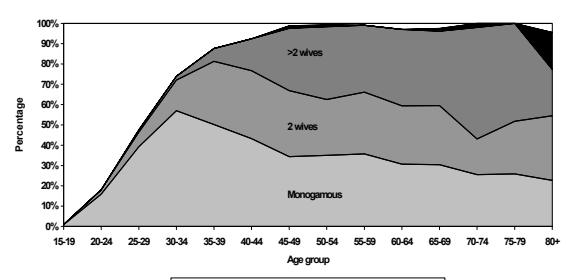

See discussions, stats, and author profiles for this publication at: https://www.researchgate.net/publication/30527471 Maasai Marriage: A Comparative Study of Kenya and Tanzania Article  in  Journal of Comparative Family Studies · June 2006 DOI: 10.3138/jcfs.37.3.399 1 author:

Ernestina Coast The London School of Economics and Political Science 143 PUBLICATIONS   **3,273** CITATIONS   
SEE PROFILE
CITATIONS
20 READS
7,244 Maasai Marriage: 
A comparative study of Kenya and Tanzania Dr Ernestina Coast Lecturer in Population Studies London School of Economics Dept of Social Policy London School of Economics Houghton Street London WC2A 2AE 
e.coast@lse.ac.uk Tel: +44 (0)207 955 6335 Fax: +44 (0)207 955 6833 This study compares and contrasts recent and contemporary nuptiality among Maasai men of Kenya and Tanzania, and represents the first cross-national comparable data set on Maasai marriage. A variety of methodologies are used, including an individual questionnaire (n=2,394 men aged 20 and above), a survey of ethnographic evidence, and participant observation. By comparing nuptiality between Kenyan and Tanzanian Maasai, this study examines marriage among the Maasai in particular and rural sub-Saharan African populations undergoing socio-economic change in general. Maasai men marry later, on average, than the national average in both Kenya and Tanzania, and the age at first marriage appears to be declining. Relative to national levels, polygynous marriages account for a significantly higher proportion of Maasai marriages. Country-level differences in entry into and type of (monogamous or polygynous) marriage are described and explanations sought. The Maasai of Kenya and Tanzania are arguably the best-known pastoralist population in the world, and the current study represents an opportunity to update and review the body of evidence linking pastoralism with polygyny. Linkages between socio-economic divergence and nuptiality are identified, with specific reference to uptake of formal education. Changes in marriage are a "ready barometer" (Goodkind, 1996:718) of change in society. Comparative analyses reveal rising age at first marriage for both men and women (Westoff *et al*, 1994) and a relative decline in the prevalence of *de jure* polygyny (Timaeus and Reynar, 1998), although much heterogeneity remains between and within countries. In sub-Saharan Africa, for example, the median age at marriage has risen from 26.2 years among men now in their late 20s compared with 24.2 years among men now in their early 40s (AGI, 2003). Nuptiality patterns reflect demographic characteristics (including population age-sex composition), economic factors (including both direct costs such as bridewealth and indirect opportunity costs), and socio-cultural influences, and each of these factors is unlikely to operate independently of the others. Demographic studies of nuptiality have tended to focus on women, not least because of the strong association with fertility. For example, the large literature about polygyny is almost entirely centred on the relationship between females in polygynous marriages and the effect on fertilityi. Marriage involves men and women as partners, yet there has been an "empirical neglect of men", with men studied "often as accessories to women rather than as objects of study" (Greene & Biddlecom, 2000: 81) in demography. This study compares and contrasts recent and contemporary nuptiality among Maasaiii men of Kenya and Tanzania, and represents the first cross-national comparable data set on Maasai marriage. By focusing on one ethnic group, this study acknowledges the complex nature of marriage, and its variability between different cultural settings. Indeed, Van de Walle suggests, "nuptiality data are most rich, detailed and useful when they are provided on one particular subpopulation of a country" (1993:xx). Research conducted at individual and household levels is best able to provide valid and reliable answers to questions about the relationship between society and marriage. Traditional views of the Maasai as a purely pastoralist subsistence population, with low levels of integration in regional and national economies have increasingly been revised. In recent decades Maasai have been influenced, amongst other factors, by national governments, formal education provision, occupation diversification and integration within the monetised economy. At the broadest scale, there is socio-economic divergence between Kenyan and Tanzanian Maasai. Maasai in Tanzania continue to live a far more traditional lifestyle, one that is much less interwoven with the processes of modernisation, compared with their Kenya neighbours (Coast, 2002). Levels of education (both male and female) and participation in paid employment are significantly higher in Kenya relative to Tanzania. Reliance upon livestock as the source of subsistence production is much lower in Kenya, 

and these socio-economic differences are reflected in material proxies of wealth, such as possession of a modern (metal-roofed) dwelling (Galaty and Bonte, 1992; Igoe and Brockington, 1999; Fratkin, 2001; Moris 1981; Rutten 1992; Lane 1996, 1998; Brockington, 2002). By comparing nuptiality between Kenyan and Tanzanian Maasai, this study highlights change and continuity in marriage among the Maasai in particular and rural sub-Saharan African populations undergoing socio-economic change in general. This study represents the first cross-national comparable data set on Maasai marriage and the study design therefore broadly resembles that of a natural experiment, a valuable framework for analysis. It is an approach worth pursuing because, to echo the words of Hill and Randall, "Natural experiments in the human sphere are not all that common and the chance to look at the behaviour of the same ethnic group living in different circumstances…is too valuable to waste" (1985:39). Three key research questions are addressed. Firstly, what is the contemporary marriage situation in Kenya and Tanzania for Maasai men, including entry into marriage and type of marriage (monogamous or polygynous)? Secondly, are there significant differences in entry into marriage and the type of marriage between Maasai men in Kenya and Tanzania? Thirdly, is there a relationship between background socioeconomic factors (including education and livelihood) and entry into and type of marriage? The relationship between livelihood and polygyny, with specific reference to pastoralist societies, has been a recurrent theme (for example, Lesthaeghe et al, 1989) in the study of marriage changes in sub- Saharan Africa. The Maasai of Kenya and Tanzania are arguably the best-known pastoralist population in the world (Spear, 1993: 1), and the current study represents an opportunity to update and review the body of information linking pastoralism with polygyny. 

## Data And Methods

A variety of methodologies is used, including a questionnaire, a survey of ethnographic evidence, and participant observation. A single round demographic survey (SRDS) was conducted between October 1997 and May 1998. The absence of complete and up-to-date sampling frames prevented systematic scientific sampling of the population. Study sites were chosen specifically to reflect the range of experience of Maasai, a predominantly rural population. Within each of these study sites, all households were enumerated, with a response rate of 98%. 

The SRDS collected data on 2,394 men aged 20 and above, at three sites using a standardised questionnaire administered at the household level by locally recruited and trained Maasai enumerators. Nuptiality data include current marital status, age at first marriage, and number of wives. Socioeconomic data were based on free-responses to questions about occupation (which were subsequently coded), observations of material goods and housing, and responses to questions about livestock ownership. The survey represents the first cross-border directly comparable set of information on current Maasai marriage patterns. The strength of the survey data presented here is their cross-national comparability and size. The major limitation is the shallowness of information that can be gathered using a survey, and ethnographic and case study evidence are used to complement the quantitative data. The participant observation described in this study is best described as "passive", that is, the researcher is present at the scene of action but does not participate or interact with other people to any great extent. 

## Cultural Context

Marriage is traditionally a process rather than an event for Maasai; the representation of marriage as a process rather than single event has long been recognised in studies of nuptiality in sub-Saharan Africa (Bledsoe and Pison, 1994; Meekers, 1992; Van de Walle, 1968; Ware, 1977). The Maasai have a strong division of responsibilities, roles and labour between age groups and sexes and there are regional variations in both the nature of the life stages and the rituals or customs associated with them. This description will be limited to an overview of the major phases and will not refer to the welldocumented rituals associated with them (Spear and Waller, 1993; Spencer, 1988). Any consideration of Maasai male social roles must place at its core the age set system. This is composed of a group of contemporaries, united by their communal circumcision, which takes place between the ages roughly of 15 and 20 years. Circumcised young men are warriors (sing. *murran*) and are unable to occupy the same house as their fathers. Historically, men who were still *murran* could not marry, as this was seen as the prerogative of elders. In contemporary Kenyan Maasailand, however, this chronological ability to marry appears to be reducing in importance. For example, the author was present at two wedding ceremonies where the groom was a *murran*. Men cease to be murran when the subsequent age set is created, and become junior elders. 

Ideally, a man should marry once he has become an elder. In practical terms, a man can only marry when he is economically secure in order that he can establish an independent household. Economic security is normally defined in terms of livestock, although the diversification of Maasai livelihoods means that livestock is no longer the only measure of a man's economic self-sufficiency. Perhaps the strictest rule relating to marriage partners is that the husband may not be of the same age-set as the wife's father, making the "ideal wife" the daughter of a man who is two age sets older than the prospective husband. Marriage between Maasai and non-Maasai has been widely reported, for example, reference to marriage between Maasai and agriculturists (Kikuyu in Kenya and Chagga in Tanzania) appears frequently (Spear and Waller, 1993), however this study is restricted only to marriages between Maasai. 

## Results And Analyses

The following sections draw upon the quantitative data from the SRDS, supported by case studies highlighting individual agency and societal structure. Where appropriate, evidence from extant ethnographies is incorporated. 

## Current Nuptiality

Table 1 shows the percentage distribution of male respondents aged above 19 years, by marital status. Marriage is almost universal, with 1 per cent of men reporting themselves as never-married above age 70. Because of the high levels of polygyny, especially with increasing age, men are very unlikely to be widowed (although one or more wives may have died). For example, it is only above age 69 that a non-negligible proportion (5.0%) of men is reported as being widowers. Very low levels of marriage instability are reported for men, also because of the influence of polygyny. That is, if a man is polygynously married, and one wife leaves him, he is still reported as being currently married, even though his wife will be reported as separated. Once married, men will probably spend the rest of their lives within a marriage (albeit with a changing wife composition). 

Formal marriage dissolution is very rare among the Maasai. It should be noted that there is no directly translated word in Maaiii for divorce. Only 0.2% of men were reported as divorced or separated in the current study. The reasons for this are threefold. Firstly, the wife's parents may have to pay back all or part of the brideprice. Secondly, given the strong affinal relationship that develops between the two 

families (wife's and husband's), such a break-up has ramifications far greater than the individual couple. This aspect is summarised by Mitzlaff, "As marriage is not seen as a matter between two individuals it cannot be dissolved by these two partners" (1988:148). Thirdly, a wife (unless breastfeeding) is unable to take her children with her permanently, as children belong to the patriline. The divorcing of a wife by a husband has historically been referred to in the ethnographic literature in the cases of sterile women (Hollis, 1910; Jacobs, 1970; Llewelyn-Davis, 1974). Relative to national levels, polygynous marriages account for a significantly higher proportion of Maasai marriages, accounting for 32.4% and 28.7% of all Maasai marriages in Kenya and Tanzania, respectively. In the most recent (1998) Kenyan Demographic and Health Survey (DHS, 1998), 9.8% of all currently married men married men aged 15-54 were in polygynous union, down from 11.6% in 1993. In Tanzania, 15% of currently married men aged 15-59 were reported as being in polygynous unions (DHS, 1996). 

## Age At First Marriage

Direct and indirect estimates of male age at first marriage indicate a higher age at first marriage in Tanzania, relative to Kenya. Table 2 presents selected measures of reported age at first marriage by sex and country for all ever-married men. 

There are significant country-level differences in reported age at first marriage for men. An independent-samples t-test was conducted to compare the means age at first marriage for Kenyan men and Tanzanian men. There was a significant difference (t=-11.934, p = 0.000) in mean age at first marriage for Kenyan men (M = 25.56, SD = 5.97) and Tanzanian men (M = 29.38, SD = 6.76). The magnitude of the differences in the mean was moderately large (eta squared = 0.08). Maasai men marry later, on average, than the national average in both Kenya and Tanzania. Tanzania mainland rural median age at first marriage is 24.7 years (men aged 25-59) (DHS 1996 Table 5.5), and Kenya rural median age at first marriage is 24.8 years (men aged 25-54) (DHS 1998 Table 5.3). 

By examining difference in mean age at reported first marriage for men above 35 yearsiv, it is possible to explore whether there is evidence of changing age at entry into marriage over time. These results suggest that there is a significant difference in age at first marriage across the different age groups. An inspection of the mean ranks for the groups shows that the older age groups have the highest age at first marriage, with the younger group reporting the lowest (Chi2 = 118.3, p=.000, df=9). It is possible, however, that reporting of age at first marriage is affected by the age of the respondent, with older men in all likelihood reporting on events that happened relatively longer ago, introducing the possibility of distortion of reporting. 

## Polygyny

Both the causes and effects of polygyny have been studied extensively, in a variety of sub-Saharan African settings (Romaniuc, 1988; Pison, 1986; Pebley & Mbugua, 1989; Lesthaeghe *et al,* 1988, 1989b; Timaeus and Reynar, 1998). The supports for polygyny have been associated with a variety of "macro-level factors" (Timaeus and Reynar, 1998:146), including: kinship groups that share a common ancestor (especially patrilineal groups); societies where women undertake most of the subsistence agriculture; when a large family provides both labour and physical security; where women engage extensively in trade (Lesthaeghe *et al*, 1989b); in societies with limited social stratification (Clignet, 1970); and, in societies where traditional belief systems rather than formal religion are dominant. Polygyny is widely reported in ethnographic literature on Maasai (Spencer, 1988; Spear and Waller, 1993; Llewellyn-Davies, 1978; Mitzlaff, 1988; Fosbrooke, 1948), however few substantive data exist. Mitzlaff's (1988) data are the only quantified examples of Maasai polygyny from the ethnographic literature. Based on her Tanzanian data (n=217), it is calculated that 52.6% of currently married men were in polygynous marriages and on average there were 2.7 wives per polygynist. Graph 1 shows clearly the influence of age upon entry into a polygynous union. 

## Graph 1 About Here

Up to age 34, most married men are in monogamous unions, with a relatively small percentage of men entering a polygynous union before age 35. Men continue to acquire further wives throughout their married life (Table 3), with the majority of men aged between 70-79 years having more than two wives. It must be noted that any distinction between polygyny and monogamy is potentially misleading, as all polygynous marriages begin as monogamous marriages (Ezeh, 1997; Gage-Brandon, 1992). The description of polygyny for the Maasai is reported here using the schema from Timaeus and Reynar (1998). Overall, levels of polygyny prevalence and intensity vary very little between Kenya and Tanzania (Table 4), and the mean number of wives per polygynously married man (w) is not significantly different between Kenya and Tanzania. Nearly half (46%) of all currently married men are in polygynous unions, and the average number of wives per polygynist is 2.8. It is important to note, however, that significant percentages of men in both Kenya and Tanzania are still in monogamous marriage by the age of 60 (24% and 34%, respectively). 

The influence of polygyny on spousal age difference for existing marriages is clear, ranging from 10 years for first wives to 32 years for wives ranked five and above. The highest reported spousal age difference was 63 years. 

## Socio-Economic Context And Nuptiality

How are socio-economic background factors related to age at entry into, and type of, marriage for Maasai men? Two key socio-economic factors are examined here: education and livelihood. Data on education are based on reported years of formal education (excluding adult education), adjusted for country-level differences in the length of primary education. Direct data on education are relatively straightforward as men are unable to marry while still at school, so a man's retrospectively reported level of education is achieved prior to his marrying. Livelihood data are more complex, and are based on a combination of open-ended responses to the question "What things do you do to earn a living?", allowing for multiple responses that were then coded, and combined with dichotomous responses about livestock ownership. Because the data on livelihoods are cross-sectional, they do not reflect changes in livelihoods that may have occurred since a man married. Thus, it is possible for a man's livelihood to have changed significantly since his entry into marriage. Further, it is possible that some livelihood indicators are dependent upon marriage, for example, the household might have begin to cultivate following the marriage because the wife was skilled at cultivating. It is reasonable to assume, however, that a man who is currently reported as a pastoralist was also a pastoralist at the time of his marriage. Literature on the effect of education and age at first marriage is widespread and unanimous: at the societal level, increased education is associated with an increase in first age at marriage (Caldwell, 1982; McCarthy, 1982; McDonald, 1985; Weinberger, 1987; Lesthaeghe *et al*, 1989; Westoff *et al*, 1994; Stambach, 1996; AGI 2003). For Maasai men in both countries there is a statistically significant relationship between reported age at first marriage and education (Table 5). However, the direction of the relationship is opposite to that expected: men with more education report lower ages at first marriage. 

These results are contrary to the generalised pattern of rising age at marriage with rising levels of education reported elsewhere. Explanations for this counterintuitive relationship and the interaction between education and livelihood diversification are explored further below. Case Study 1 (although undoubtedly unusual) highlights how education can influence male entry into marriage. 

## Case Study 1 About Here

There are, of course, issues with only examining those men who have already married, as this censors those men who have yet to marry. Never-married men are likely to be younger and hence more likely to have been to school than their older counterparts, as participation in education has increased significantly among Maasai in the last few decades (Coast, 2002). It is also important to acknowledge that there is likely to be an interaction between level of formal education and validity of age reporting in completed years. Using a broad dichotomous category of male occupation - pastoralist (including agropastoralist) and non-pastoralist - there is evidence of a statistically significant relationship between age at first marriage and occupation for men in Kenya (Z=-2.2, p=0.029), with (agro)pastoralist men marrying at older ages than non-pastoralist. The relationship between occupation and age at first marriage was not significant for Tanzania. Much has been written about the effect of female education on polygyny (Lesthaeghe *et al*, 1989; Hayase and Liaw, 1997). Given the patriarchal nature of Maasai society and the low levels of female education, it is more instructive to examine levels of polygyny by male education. To quote Basu "analyses [of the education-marriage-fertility relationship].... assume that while there is something special about the educated woman, there is nothing special about the educated man" (1999:269). The prevalence of polygyny decreases sharply with completed primary education in both Kenya and Tanzania (Table 6), a relationship that is statistically significantv. 

What is it about better-educated men that makes them less likely to acquire more than one wife? It is possible that there is a reduction in the level of paternal influence over a man who has been well educated, especially if the father has not been educated. This may make it easier for the man to refuse to marry until he wants to (Case Study 2). 

## Cast Study 2 About Here

For a pastoralist man, more wives mean more children and extended networks of reciprocity. Drought, livestock diseases and raiding are the major causes of livestock loss among pastoralist communities, and larger herd owners are better able to deal with (and survive) such crises. The transfer of bridewealth to the man's in-laws enhances his social network and future security. However, Lesthaeghe *et al* (1989), using a cross-cultural survey based on Murdock's Ethnographic Atlas (1967), argue that a pastoralist society is one in which women are rendered economically unimportant, as men control and organise the means of production, the result of which is reduced levels of polygyny. Table 7 consolidates the literature on the relationship between polygyny and pastoralism in order to re-assess Lesthaeghe *et al's* hypothesis. 

The results summarised in Table 7 suggest no clear relationship between pastoralism and polygyny. The review shows that the importance of polygyny varies greatly both between and within pastoral groups, with evidence pointing towards higher levels of polygyny in east compared with west Africa. 

Roth's (1994) study of the Toposa agropastoralists in Sudan would appear to be the one exception to this pattern. Relative to other pastoralist groups, the levels of polygyny among the Maasai are relatively high (Table 8), and there are no significant country-level differences in the mean number of wives per polygynist by different livelihood. 

However, the prevalence (p) and intensity (w) of polygyny decrease with diversification away from a "pure" pastoralist occupation, in both Kenya and Tanzania. Because the socio-economic, demographic and cultural variables affecting nuptiality are so inter-dependent, the reasons why pastoralist-only households have higher levels of polygyny are complex. For example, there is a clear link between livelihood diversification and levels of education (Coast, 2002); undiversified pastoralist households are less likely to be headed by an educated man. In order to explore in more depth the hypothesis that pastoralism and other contextual factors affect whether a marriage is polygynous or monogamous, logistic regression was used to analyse factors associated with being in a monogamous marriage. Because acquisition of wives continues throughout a man's lifetime, age was controlled for by introducing it as a continuous variable into the regression. The dependent variable in the logistic regression was whether a man was in a monogamous relationship. The results of the logistic regression are shown in Table 9. A range of socio-economic factors is incorporated, including proxies for wealth based on material goods ownership. The model allows for the testing of two hypotheses generated by the ethnographic literature. Firstly, is spousal subfecundityvi an important predictor of a polygynous marriage? Secondly, is the broader multihousehold composition important, namely, is the man head of his own household, or is he still a member of his father's household (and thus still subject to the influence of his father)?

Characteristics that were significantly more likely to be associated with monogamy in both Kenya and Tanzania were the level of male education, and whether the man was head of his own household. Men with at least some education were significantly more likely to be in monogamous relationships than men with no education (Kenya: odds ratio 2.3; Tanzania: odds ratio 2.1). It should be noted that the likelihood of a man being in a monogamous relationship with completed primary education was insignificant in both Kenya and Tanzania, although the direction of the relationship was the same as for men with incomplete primary education. Men who were heads of their own household (rather than members of a household headed by an older or more senior male) were highly (p<0.001) significantly more likely to be in monogamous rather than polygynous relationships, a relationship that was especially strong in Tanzania (Kenya: odds ratio 2.3; Tanzania: odds ratio 6.2). Several variables were significant in only one country. In Tanzania the presence of a subfecund wife significantly (p<.001) decreased the likelihood that a man would be in a monogamous relationship (odds ratio 0.4). Tanzanian men in the lower middle wealth category were significantly more likely to be monogamous (odds ratios 2.6). It is worth noting that while the other two wealth categories were not significant in their association with monogamy, the direction of the odds ratios suggests that the likelihood of monogamy decreases with wealth. Men living in households reporting cultivation were significantly more likely to be in monogamous relationships (odds ratio 2.2). In Kenya, monogamous men were significantly more likely not to own livestock (odds ratio 5.1) and significantly less likely to be living in a traditionally built home (odds ratio 0.6). 

## Discussion

Marriage is a social institution, associated with socio-economic, cultural, and demographic variables at a variety of levels. Issues of kinship, lineage, property ownership and transfer, residence, social and political power, together with social and biological reproduction, are all closely bound up with marriage. However, "the nature and rationale of the mechanisms linking society and marriage are poorly understood" (Van de Walle, 1985:110). This account of Maasai marriage serves to substantiate the ethnographic evidence, demonstrating universality of marriage for men, relatively high levels of polygyny and very low levels of formal divorce. The age at entry into marriage is significantly lower for Kenyan Maasai relative to Tanzanian, although once married there are insignificant differences in the level of polygyny between the two countries. Timaeus and Reynar suggest, "It has become a tradition for papers on polygyny in sub- Saharan Africa to conclude with a statement that the institution is alive and well" (1998:161). Whilst demonstrating the continued importance of polygynous marriages in contemporary Maasai society, this study shows that the likelihood of being in a monogamous marriage rather than a polygynous one was 

significantly associated with several socio-economic characteristics, including education, practice of cultivation, ownership of livestock, and level of wealth. Background socio-demographic factors such as whether a man was the head of his own household or whether there was a wife who was subfecund were also significantly associated with the likelihood of being in a monogamous marriage. The earlier entry into marriage for Kenyan Maasai suggests that traditional constraints on entry into marriage (for example, being a *murran*) are being eroded. This conclusion is reinforced by the results of the logistic regression, which highlights that changing socio-economic factors including the non-ownership of cattle and "modern" housing is significantly associated with being monogamously married. Education is a powerful and frequently used proxy for socio-economic change. The case studies in particular demonstrate that institutions (both cultural and socio-political) can have highly individualised effects on nuptiality behaviour. A similar conclusion is reached by Madhavan and Bledsoe in their study of fertility management in the Gambia, concluding that such an approach "offers a marked departure from the standard demographic notions that institutions allow little or no individual agency in traditional societies" (2001:451). Analyses by education for the Maasai suggest a complex picture, where participation in education for men is associated with a lower age at first marriage combined with a lower propensity to enter a polygynous marriage. The relationship between a lower age at first marriage with increased levels of education is counter to the global trend of more education leading to rising age at entry into marriage. However, when the implications of increased education for livelihoods diversification are examined, the picture becomes clearer. Educated men are much less likely to be wholly concerned with a traditional subsistence agropastoralist lifestyle, and are more likely to diversify socio-economically. A move away from a traditional livelihood represents more than simply how a man supports his household; it also represents a wider move towards "modernisation", and an outlook that is less likely to be governed by considerations of parental control. For example, an educated man is more likely to be head of his own household at a younger age, relative to a non-educated man who is more likely to remain within his father's household even once he is married. The educated man is going to be less influenced by traditional considerations of "correct" behaviour, including the need to acquire many cattle before marrying, and to have more than one wife. Younger and more educated men tend to want to send all of their children to school, not just one or two, an increasingly expensive undertaking. More wives mean greater total numbers of children, reducing the likelihood of them all going to school. The cross-national study of marriage patterns for one ethnic group presented here is a powerful tool for examining the role of influences at a variety of scales on nuptiality. Country-level differences in socioeconomic change are reflected in nuptiality outcomes, although not always in the expected direction. Further socio-economic change among the Maasai is already underway, including rural-urban migration (Homewood *et al*, 2001) and rising levels of formal religion, both factors that are likely to have implications for marriage change in the future. 

| Age group      | n          | Currently married   | Previously married   | Never married   |     |     |      |
|----------------|------------|---------------------|----------------------|-----------------|-----|-----|------|
| Monogamous     | Polygynous | Divorced            | Separated            | Widowed         |     |     |      |
| All men  20-29 | 1004       | 26.7                | 4.9                  | 0               | 0.1 | 0.2 | 68.1 |
| 30-39          | 512        | 53.3                | 27.0                 | 0.4             | 0.2 | 0   | 19.1 |
| 40-49          | 352        | 38.9                | 55.7                 | 0.3             | 0   | 0.6 | 4.5  |
| 50-59          | 246        | 35.4                | 63.4                 | 0               | 0   | 0.4 | 0.8  |
| 60-69          | 180        | 30.6                | 66.1                 | 0               | 0   | 0.6 | 2.8  |
| 70+            | 100        | 25.0                | 69.0                 | 0               | 0   | 5.0 | 1.0  |
| Total          | 2394       | 35.3                | 30.4                 | 0.1             | 0.1 | 0.5 | 33.7 |
| Kenya  20-29   | 479        | 34.9                | 8.4                  | 0               | 0.2 | 0.4 | 56.2 |
| 30-39          | 234        | 51.7                | 35.5                 | 0.9             | 0.4 | 0   | 11.5 |
| 40-49          | 135        | 35.6                | 58.5                 | 0.7             | 0   | 0   | 5.2  |
| 50-59          | 106        | 35.8                | 61.3                 | 0               | 0   | .9  | 1.9  |
| 60-69          | 66         | 22.7                | 69.7                 | 0               | 0   | 1.5 | 6.1  |
| 70+            | 45         | 20.0                | 71.1                 | 0               | 0   | 8.9 | 0    |
| Total          | 1065       | 37.4                | 32.4                 | 0.3             | 0.2 | 0.8 | 29.0 |
| Tanzania 20-29 | 525        | 19.1                | 1.7                  | 0               | 0   | 0   | 79.0 |
| 30-39          | 278        | 54.7                | 19.8                 | 0               | 0   | 0   | 25.5 |
| 40-49          | 217        | 41.0                | 53.9                 | 0               | 0   | 0.9 | 4.1  |
| 50-59          | 140        | 35.0                | 65.0                 | 0               | 0   | 0   | 0    |
| 60-69          | 114        | 35.1                | 64.0                 | 0               | 0   | 0   | 0.9  |
| 70+            | 55         | 29.1                | 67.3                 | 0               | 0   | 1.8 | 1.8  |
| Total          | 1329       | 33.6                | 28.7                 | 0               | 0   | 0.2 | 37.4 |

Table 2: Reported age at first marriage by country, all ever-married Maasai menvii

Mean Medianviii Min. Max. **SMAMix**

 Kenya Tanzania 

25.6 29.4 

24.3 28.2 

13 13 

50 65 

26.7 30.6 

Table 3: Mean number of wives by age group and country, all currently polygynously married men 

Age group All Kenya Tanzania

20-29 2.1 2.1 2.1

30-39 2.2 2.2 2.2 40-49 2.6 2.7 2.6 50-59 3.2 3.1 3.4 60-69 3.1 3.0 3.1 >69 3.5 3.9 3.2

Table 4: Measures of Maasai polygyny, by country.

All Kenya TZ

Prevalence of polygyny (p)* 0.46 0.46 0.46

Intensity of polygyny (w**)**** 2.80 2.72 2.84

Polygyny ratio (M)*** 1.83 1.80 1.85

* Proportion of men in polygynous marriages 

** Average number of wives per polygynist *** Ratio of currently married women to currently married men

Table 5: Education and relationship with age at first marriage, all ever-married men by country. 

Kenya **Tanzania**

Measure of schooling 

- None - Incomplete primary

- Complete primary 

| Kenya                                                                 | Tanzania   |
|-----------------------------------------------------------------------|------------|
| Measure of schooling  - None  - Incomplete primary - Complete primary | 2  =10.7   |
| Chi p=.005 df=2                                                       | 2  = 43.2  |
| Chi p=.000 df=2                                                       |            |

Table 6: Measures of polygyny by education (schooling and languages spoken) and country 

Kenya Tanzania

p No education 

Incomplete primary

Complete primary 

| Kenya                                               | Tanzania         |               |
|-----------------------------------------------------|------------------|---------------|
| p No education  Incomplete primary Complete primary | 0.53  0.52  0.26 |               |
| w No education  Incomplete primary Complete primary | 0.51  0.36  0.25 | 2.9  2.7  2.5 |
| 2.8  2.8  2.3                                       |                  |               |

2.9 2.7 2.5 
* The data refer to all currently married men. One case, of a Tanzanian man with 23 wives was excluded, because of the disproportionate effect of this individual on prevalence and intensity for that particular marriage duration and education group. 

| Table 7: Polygyny levels for sub-Saharan African pastoralist societies*  Author(s) Ethnic group(s) Polygyny levels EAST AFRICA Henin (1969) (Sudan) Blue Nile (n=531)  (nomadic  pastoralist)  Baggara (n=808)  (nomadic  pastoralist)  Gezira (n=856)  (semi-nomadic pastoralist)  Managil (n=741)  (semi-nomadic pastoralist)  % currently married women in polygynous union  19.2%  18.9%  10.6%  5.7%  BorgerhoffMulder (1989) (Kenya)  Kipsigis (n=1,192) (sedentary agropastoralist)  59.7% currently married women in polygynous unions  Brainard (1991) Turkana  (Kenya)  (no sample size given)  "greater proportion of pastoralists and former pastoralists were polygynous than  was true of long-settled ... men" (p119)  Mean number of wives per polygynous pastoralist man estimated at 2.52 BorgerhoffMulder (1992) (Tanzania)  Datoga  "Polygyny is ... prevalent in the community": menopausal and reproductiveaged women were married to men who had married 3.69 and 3.11 wives  (n=399)  respectively" (p.390) Roth (1994) Toposa (Sudan + Kenya)  agropastoralists  (n=444)  Rendille pastoralists  (n=950)  Mean number of wives per married man = 1.136  Mean number of wives per married man = 1.153  Little and Leslie  (1999) (Kenya)  Turkana pastoralists  Mean number of wives per man aged 65+ = 2.4  (n=1,375)  WEST AFRICA  Randall (1984) Gourma Tamasheq 2.2% women report polygynous unions  (Mali)  Delta Tamasheq 3.7% women report polygynous unions  Hampshire  (1998) (Burkina Faso) Fulani "7.6% of currently married men (n=1,765) and 13.5% (n=1,899) of currently  married women being in polygynous unions" (p.251)  * Differences in methodology and calculation between authors prevent any direct comparison of data.   |
|---|

Table 8: Indicators of polygyny, by livelihood, Maasai.* 

Kenya **Tanzania**

p 

Pastoralist 

Diversified pastoralist

Other 

| p                                                                                        |                                                                             |
|------------------------------------------------------------------------------------------|-----------------------------------------------------------------------------|
| Pastoralist  Diversified pastoralist Other  w Pastoralist  Diversified pastoralist Other | 0.52 (n=376) 0.42 (n=283) 0.32 (n=92)  2.9 (n=197)  2.5 (n=119)  2.4 (n=29) |

3.0 (n=90) 2.8 (n=288) 2.0 (n=4) 
* Occupation categories based upon open-ended response by individuals. Diversified pastoralists include all individuals who kept livestock and listed other forms of occupation, including cultivation and entrepreneurial activities.

| currently married men by country.  Indicator     | Kenya                                                                                   | Tanzania                                                              |                       |
|--------------------------------------------------|-----------------------------------------------------------------------------------------|-----------------------------------------------------------------------|-----------------------|
| Age (continuous)                                 | 1.053 (1.038 - 1.067)***                                                                | 1.050 (1.036 - 1.064)***                                              |                       |
| Education  - None (R)  - Incomplete primary      | 2.286 (1.321 - 3.956)**                                                                 | 2.078 (1.339 - 3.225)***                                              |                       |
| -                                                | Complete primary                                                                        | 1.762 (0.852 - 3.643)                                                 | 1.746 (0.907 - 3.360) |
| Cultivation - Non-cultivator (R)  - Cultivator   | 0.993 (0.697 - 1.415)                                                                   | 2.228 (1.317 - 3.770)**                                               |                       |
| Livestock  - Ownership (R) - Non-ownership       | 5.141 (1.047 - 25.247)*                                                                 | 2.149 (0.492 - 9.392)                                                 |                       |
| Household Head  - No (R)  - Yes                  | 2.326 (1.443 - 3.748)***                                                                | 6.214 (2.410 - 16.023)***                                             |                       |
| Roofing - Modern (R)  - Traditional              | 0.645 (0.413 - 1.006)*                                                                  | 1.490 (0.468 - 4.746)                                                 |                       |
| Water supply - Secure (R)  - Insecure            | 0.734 (0.504 - 1.069)                                                                   | 1.109 (0.810 - 1.520)                                                 |                       |
| Wealth -                                         | High (R)                                                                                |                                                                       |                       |
| -                                                | Upper middle                                                                            |                                                                       |                       |
| -                                                | Lower Middle                                                                            |                                                                       |                       |
| -                                                | Low                                                                                     | 3.952 (0.628 - 24.883)  2.561 (1.224 - 5.359)** 1.313 (0.930 - 1.854) |                       |
| Subfecund wife  - No(R)  - Yes                   | 1.735 (0.866 - 3.475) 1.069 (0.609 - 1.878) 1.169 (0.728 - 1.878) 0.715 (0.472 - 1.082) | 0.444 (0.304 - 0.648)*** 0.004*** 0.269                               |                       |
| * p<0.05; ** p < 0.01; ***p < 0.001  Constant R2 | 0.010*** 0.276                                                                          |                                                                       |                       |

Case study 1 Daniel, aged 34, had an elderly father who disagreed vehemently with school attendance by his children. He had been in trouble with the local administrators, for not sending any of his children to school, despite having the financial means to do so. When Daniel was 13, and still attending school, his father arranged a marriage for him. The marriage was to a girl slightly older than Daniel (a very unusual situation). Because no married person can attend school, Daniel's father saw the marriage of Daniel as a way of defying local administrators. Daniel's father resorted to the use of a traditional healer (*laiboni*) in order that the local administrators would not pursue him for his actions. Daniel himself was uninterested in marrying at that age, and became a full-time *murran* for nearly two years. During that time, his new wife stayed with her mother-in-law until Daniel returned permanently to the homestead. It is highly unlikely that Daniel's father would have wanted Daniel to marry at such a young age if it had not been for his desire to remove Daniel from school. Aged 34, Daniel is now a grandfather. 

Case Study 2 Albert is a 31-year-old Maasai man living in Kajiado District (Kenya). He completed secondary school education, and then went on to do a car mechanics apprenticeship in an urban area. His parents had "booked" two Maasai girls for him to marry. He refused to marry either girl, having decided that he wanted to marry Mary, a Maasai woman who had also completed secondary school education. After marrying Mary, Albert was disowned by his family and two of his brothers married the girls his parents had chosen for him. Albert and Mary live in a traditional multi-household homestead, and have two children (aged 5 and 2). Albert stated that he would never have more than one wife because of the costs of educating many children. 

A.G. I. 

2003 "In their own right: addressing the sexual and reproduxctive health needs of men worldwide" Alan Guttmacher Institute Ahmed, J. 

1986. "Polygyny and fertility among the Yoruba of western Nigeria." Journal of Biosocial Science 18: 63-73. 

Antoine, P., & Nanite-Lamio, J. 

1991. More Single Women in African Cities: Pikine, Abidjan and Brazzaville. Population: an English selection, 3, 149-169. 

Basu, A. M. 

1999. Women's education, marriage and fertility in south Asia: Do men really not matter? in Critical perspectives on schooling and fertility in the developing world. C. H. Bledsoe, J. B. Casterline, J. A. Johnson-Kuhn and J. G. Haaga. Washington, National Academy Press: 267286. 

Bean, L. L. and G. P. Mineau 1986. "The polygyny-fertility hypothesis: a re-evaluation." Population Studies 401: 67-82. 

Bledsoe, C., & Pison, G. 

Eds.. 1994. Nuptiality in Sub-Saharan Africa: Contemporary anthropological and demographic perspectives. 

Bledsoe, C. H., Casterline, J. B., Johnson-Kuhn, J. A., & Haaga, J. G. 

Eds.. 1999. Critical perspectives on schooling and fertility in the developing world. Washington: National Academy Press. 

Borgerhoff-Mulder, M. 

1989. Marital status and reproductive performance in Kipsigis women: re-evaluating the polygyny-fertility hypothesis. Population Studies, 432, 285-304. 

Borgerhoff-Mulder, M. 

1992. "Demography of pastoralists: preliminary data on the Datoga of Tanzania." Human Ecology, 204, 383-405. 

Borgerhoff-Mulder, M. 

1994. On polygyny and sex ratio at birth: an evaluation of Whiting's study. Current Anthropology, 355. 

Boyle, P. P., & O'Grada, C. 

1986. Fertility Trends, Excess Mortality, and the Great Irish Famine Demography, 234, 543562 Brainard, J. M. 

1991. Health and development in a rural Kenyan community. New York, Peter Lang. 

Brockington, D. 

2002. Fortress Conservation: the preservation of the Mkomazi Game reserve, Tanzania. James Currey, Oxford Caldwell, J. C. 

1976. The socio-economic explanation of high fertility: papers on the Yoruba society of Nigeria Vol. 1. Canberra: Australian National University.

Caldwell, J. C. 

1982. Theory of fertility decline. New York, Academic Press. 

Clignet, R. 

1970. Many wives, many powers. Evanston: North Western University Press. 

Coast, E. 

2001. Maasai Demography. PhD. University of London. 

Coast, E. 

2002. Maasai socio-economic conditions: cross-border comparison. Human Ecology, 301,79105. 

DHS. 

1993. Kenya Demographic and Health Survey. Calverton, MD: Macro International. 

DHS. 

1996. Tanzania Demographic and Health Survey. Calverton, MD: Macro International. 

DHS. 

1998. Kenya Demographic and Health Survey. Calverton, MD: Macro International. 

Dorjahn, V. R. 

1959. The factor of polygyny in African demography. Continuity and change in African cultures. W. R. Bascom and M. J. Herskovitz. Chicago, Chicago University Press: 87-112. 

Dyson-Hudson, R., & Meekers, D. 

1996. The universality of African marriage reconsidered: evidence from Turkana males. Ethnology, 354, 310-320. 

Enel, C., Pison, G., & Lefebvre, M. 

1994. Migration and marriage change: A case study of Mlomp, a Joola village in southern Senegal. In C. Bledsoe & G. Pison Eds., Nuptiality in sub-Saharan Africa: Contemporary anthropological and demographic perspectives pp. 92-116. Oxford: Clarendon. 

Ezeh, A. C. 

1997. Polygyny and Reproductive Behavior in Sub-Saharan Africa: A Contextual Analysis. Demography, 343, 355-368. 

Fosbrooke, H. A. 

1948. An administrative survey of the Masai social system. Tanganyika notes and Records 26, 1-50. 

Fratkin, E. 

2001. 'East African pastoralism in transition: Maasai, Boran and Rendille Cases.' African Studies Review 44 93., 1-25 Fulton, D., & S. C. Randall. 

1988. Households, women's roles and prestige as factors determining nuptiality and fertility differentials in Mali in J. C. Caldwell et al Micro-approaches to demographic research London: KPI. 

Gage-Brandon, A. J. 

1992. The polygyny-divorce relationship: a case study of Nigeria. Journal of marriage and the family, 542, 285-292. 

Galaty, J.G. & P. Bonte. 

1992. Herders, Warriors and Traders. Pastoralism in Africa. Westview Press Garenne, M., & Walle, E. v. d. 

1998. Polygyny and Fertility Among the Sereer of Senegal. Population Studies, 432, 267-283. 

Goode, W. J. 

1970. World revolution and family patterns. New York: Free Press. 

Goodkind, D. 

1996. State agendas, local sentiments: Vietnamese wedding practices amidst Socialist transformations. Social Forces, 752, 717-742. 

Greene, M E and Biddlecom, A E 

2000 "Absent and Problematic Men: Demographic Accounts of Male Reproductive Roles" in Population and Development Review Vol.26 No.1 pp.81-115 Hajnal, J. 

1953 "Age at Marriage and Proportions Marrying" Population Studies, 72: 111-136. 

Hayase, Y., & Liaw, K. L. 

1997. Factors on polygamy in sub-Saharan Africa: findings based on the Demographic and Health Surveys. Developing Economies, 353, 293-327. 

Hampshire, K. 

1998. Fulani mobility: causes, constraints and consequences of population movement in Northern Burkina Faso. University of London: 352. PhD. 

Henin, R. A. 

1969. Fertility differentials in the Sudan with reference to the nomadic and settled populations. Population Studies 22: 147-164. 

Hill, A. G. and S. Randall 1985. Issues in the study of Sahelian pastoralists and agro-pastoralists. In A. G. Hill Ed. Population, health and nutrition in the Sahel: Issues in the welfare of selected west African communities. London, KPI. 

Hodgson, D. L. 

1999. "Once intrepid warriors": modernity and the production of Maasai masculinities. Ethnology, 382, 121-150. 

Hollis, A. C. 

1910. A note on the Masai system of relationship and other matters connected therewith. Journal of the Royal Anthropological Institute, 251, 473-482. 

Homewood, K. E.F. Lambin, E. Coast, A. Kariuki, I. Kikula, J. Kivelia, M. Said, S. Serneels, M. Thompson 2001. Long term changes in African savanna wildlife and land cover: pastoralists or policies?. Proceedings of the National Academy of Science, 9822, 12544-12549 Hutchinson, J., & Smith, A. D. 

1996. Ethnicity. Oxford: Oxford University Press. 

Isaac, B. L. and Feinberg, W. E. 

1982. "Female fertility and marital form among the Mende of rural upper Bambara chiefdom, Sierra Leone." Human Biology 54: 627-634. 

Igoe, J. and Brockington, D. 

1999. 'Pastoral land tenure and community conservation in East African rangelands: a case study from northeastern Tanzania'. Pastoral Land Tenure Series 11. IIED, London Isiugo-Abanihe, U. C. 

1994. Consequences of bridewealth changes on nuptiality patterns among the Ibo of Nigeria. In C. Bledsoe & G. Pison Eds., Nuptiality in sub-Saharan Africa: Contemporary anthropological and demographic perspectives pp. 74-91. Oxford: Clarendon. 

Jacobs, A. H. 

1970. Maasai marriage and bridewealth. Mila, 11. 

Jacobs, A. H. 

1973 in Molnos, A., Ed. Cultural source materials for population planning in East Africa 4 Vols.. Nairobi, East African Publishing House. 

Kipuri, N. 

1978. Engagement and marriage among the Maasai. Kenya Past and Present, 9, 38-42. 

Kipuri, N. 

1989. Maasai women in transition: class and gender in the transformation of a pastoral society. Temple University. PhD. 

Lane, C. 

1996. Ngorongoro voices: indigenous Maasai give their views on the proposed management plan. Forest trees and people programme. Lantbruks University, Sweden. 

Lane, C. ed. 

1998. Custodians of the Commons: pastoral land tenure in East and West Africa. Earthscan, London Lee, G. R., & Whitbeck, L. B. 

1990. Economic systems and rates of polygyny. Journal of Comparative Family Studies, xxi1, 13-24. 

Lesthaeghe, R., Kaufman, G., & Meekers, D. 

1989. The nuptiality regimes in sub-Saharan Africa. In R. Lesthaeghe Ed., Reproduction and social organisation in sub-Saharan Africa pp. 238-337. Los Angeles: University of California Press. 

Lesthaeghe, R., Kaufman, G., Meekers, D., & Surkyn, J. 

1994. Post-partum abstinence, polygyny and age at marriage: A macro-level analysis of subSaharan societies. In C. Bledsoe & G. Pison Eds., Nuptiality in sub-Saharan Africa: 
Contemporary anthropological and demographic perspectives pp. 25-56. Oxford: Clarendon Press. 

Llewelyn-Davies, M. 

1974. Maasai women. Video. Granada Television. 

Llewelyn-Davies, M. 

1978. Two contexts of solidarity among pastoral Maasai women. In J. Caplan & J. M. Bujra Eds., Women united, women divided: Cross-cultural perspectives on female solidarity pp. 206338. London: Tavistock. 

Little, M. A., & P .W Leslie. 

1999. Turkana herders of the dry savanna: ecology and behavioural response of nomads to an uncertain environment. Oxford: OUP. 

Locoh T. 

1984 Fertility and family in West Africa: contemporary Southern Togo. Fecondite et famille en Afrique de l'Ouest. le Togo meridional contemporain.] Paris: Presses Universitaires de France Madhavan, S., & Bledsoe, C. 

2001. The compound as a locus of fertility management: the case of The Gambia. Culture, Health and Sexuality, 34, 451-468. 

McCarthy, J. 

1982. Differentials in age at first marriage. World Fertility Comparative Surveys 19. 

McDonald, P. 

1985. Social organisation and nuptiality in developing countries. In J. Cleland & J. Hobcraft Eds., Reproductive change in developing countries. Oxford: OUP. 

Meekers, D. 

1992. The Process of Marriage in African Societies: A Multiple Indicator Approach. Population and Development Review, 181, 61-78. 

Mitzlaff, U. v. 

1988. Maasai women: life in a patriarchal society: Field research among the Parakuyo, Tanzania. Munich: Trickster Verlag.

Moris, J. 

1981. 'A case in rural development:the Maasai Range development project.' Pp 99-113 In J.Moris ed. Managing induced rural development. Bloomington, Indiana. International Development Institute Muhsam, H. V. 

1965. "The fertility of polygamous marriages." Population Studies 10: 3-16. 

Murdock, G. P. 

1976. "Ethnographic atlas: a summary." Ethnology 6: 109-234. 

Olusanya, P. O. 

1971. "The problem of multiple causation in population analysis, with particular reference to the polygamy-fertility hypothesis." Sociological review 19: 165-178. 

Pebley, A., & Mbugua, W. 

1989. Polygyny and fertility in sub-Saharan Africa. In R. Lesthaeghe Ed., Reproduction and social organisation in sub-Saharan Africa. Berkeley: University of California Press. 

Pison, G. 

1986. La demographie de la polygamie. Population, 41, 93-122. 

Pitshandenge, I. and A. Ngondo 1982. "De la nuptialite et fecondite des polygames: le case des Yaka de Popokababa Zaire." Annales du Musee Royale de l'Afrique Centrale 109. 

Podlewski, A. 

1975. "Cameroon" in. Population growth and socio-economic change in west Africa. J. C. Caldwell. New York. 

Pool, D. I. 

1968. "Conjugal patterns in Ghana." Canadian Review of Sociology and Anthropology 5: 241253. 

Randall, S. C. 

1984. A comparative demographic study of three Sahelian populations: marriage and childcare as intermediate determinants of fertility and mortality PhD Thesis. University of London. 

Romaniuc, A. 

1988. La polygamie et la parente en Afrique tropicale: le point de vue d'un demographie. Paper presented at the African Population Conference, Dakar. 

Roth, E. A. 

1994. Demographic systems: two east African examples. 

Reynar, S. P. and C. Bouquet 1975. Chad. Population growth and socio-economic change in west Africa. J. C. Caldwell. New York. 

Rutten, M. 

1992. Selling wealth to buy poverty. The process of individualization of land ownership among Maasai pastoralists of Kajiado District. Verlag Breitenbach, Germany Shaikh, K., Aziz, K. M., & Tambashe, O. 

1987. Differentials of fertility between polygynous and monogamous marriages in rural Bangladesh. Journal of Biosocial Science, 19, 49-56. 

Smith, J. E. and P. R. Kunz 1976. "Polygyny and fertility in nineteenth century America." Population Studies 30: 465-480. 

Spear, T. 

1993 "Introduction" in Spear, T. and R. Waller, Eds. 1993. Being Maasai: ethnicity and identity in east Africa. London, James Currey. 

Spear, T., & Waller, R. Eds.. 

1993. Being Maasai: ethnicity and identity in east Africa. London: James Currey. 

Spencer, P. 

1988. The Maasai of Matapato: a study of rituals of rebellion. Manchester: Manchester University Press. 

Spencer, P. 

1993. Becoming Maasai, being in time. Spear, T., & Waller, R. Eds.. 1993. Being Maasai: ethnicity and identity in east Africa. London: James Currey. 

Stambach, A. 

1996. ""Seeded" in the market economy: schooling and social transformations on Mount Kilimanjaro." Anthropology and Education Quarterly 284: 545-567. 

Talle, A. 

1987. Women as heads of houses: the organisation of production and the role of women among pastoral Maasai. Ethnos, 1-2, 50-80. 

Talle, A. 

1995 in Klepp, K. I., P. M. Biswalo, et al., Eds. Young people at risk: fighting AIDS in Northern Tanzania. Oslo, Scandinavian University Press. 

Timaeus, I., & Reynar, A. 

1998. Polygynists and their wives in sub-Saharan Africa: an analysis of five Demographic and Health Surveys. Population Studies, 522, 145-162. 

Ukaegbu, A. O. 

1977. "Fertility of women in polygynous unions in rural Eastern Nigeria." Journal of marriage and the family 39: 397-404. 

Walle, E. Van. d. 

1968. Marriage in African censuses and inquiries. In W. Brass Ed., The demography of tropical Africa pp. 183-238. Princeton, NJ: Princeton University Press. 

Walle, E. Van. d. 

1985. Community-level variables and institutional factors in the study of African nuptiality. In J. B. Casterline Ed., The collection and analysis of community data. Voorburg: International Statistical Institute. 

Walle, E. Van. d. 

1993. Recent trends in marriage ages. In K. A. Foote & K. H. Hill & L. G. Martin Eds., Demographic change in sub-Saharan Africa. Washington: National Academy Press. 

Ware, H. 

1977. Language problems in demographic fieldwork in Africa: the case of the Cameroon Fertility Survey. WFS Scientific Reports, 2. 

Weinberger, M. B. 

1987. "The relationship between women's education and fertility: selected findings from the World Fertility Surveys." International Family Planning Perspectives 312: 35-46. 

Westoff, C. F., Blanc, A. K., & Myblade, L. 

1994. Marriage and entry into parenthood. Demographic and Health Surveys Comparative Studies, 10. 

## Acknowledgements

The data presented here were collected as part of a wider multidisciplinary project "Impacts of land use policy on environment, wildlife, demography and socio-economic indicators in east African savannas: 
the Serengeti Ecological Unit", funded by the European Union Grant No. IC18-CT96-0070. 

Comments on an earlier draft of the paper from Dr Sara Randall are gratefully acknowledged. 

 i Muhsam, 1956; Dorjahn, 1959; Walle, van de 1968; Clignet, 1970; Reynar & Bouquet, 1975; Ukaegbu, 1977; Pitshandenge, 1982; Shaikh *et al*, 1987; Garenne & van de Walle, 1989; Pool, 1968; Olusanya, 1971; Podlewski. 1975; Locoh, 1984; Pebley & Mbugua, 1987; Smith and Kunz, 1976; Isaac and Feinberg, 1982; Ahmed, 1986; Bean & Minneau, 1986; Pison, 1986, Fulton and Randall, 1988; Pebley & Mbugua, 1989 ii Here, Maasai refers to the broadest conceptualisation of " Maasai" as an ethnic group, using Hutchinson and Smith's
(1996) definition of an ethnic group. The debate surrounding "Maasainess" (Spear and Waller, 1993) is noted, and implicit throughout the study. iii Maasai mother tongue iv Chosen because 75% of men are married by age 35 v Kenya **Tanzania**
Measure of schooling 
- None 
- Incomplete primary
- Complete primary 

| Kenya                                                                 | Tanzania   |
|-----------------------------------------------------------------------|------------|
| Measure of schooling  - None  - Incomplete primary - Complete primary | 2  =30.4   |
| Chi p=.000 df=2                                                       | 2  = 43.9  |
| Chi p=.000 df=2                                                       |            |

vi Defined as having a wife with either primary or secondary infertility (after Larsen, 19xx). 

vii Ever-married individuals for whom age at first marriage is recorded. "Do not know age at first marriage" was recorded for 5 cases. viii Calculated by interpolation as the age at which 50% of the single-year group was never-married. ix SMAM (after Hajnal, 1953) = 30+10x[PS(15-20)+...+PS(45-50)]-5x(PS45-50)+PS(50-55)]
 2-[PS(45-50) + PS(50-55)]
Where PS = Proportion of five year age group who have never-married. SMAMs provide a synthetic estimate of the mean age at first marriage, derived from the proportion of each age group not yet married. SMAMs should be interpreted with caution as their estimation necessitates assumptions about nuptiality to be made (no differences in mortality and migration according to marital status, no change in marriage patterns in the recent past). Given the assumptions associated with the calculation of SMAMs and the degree of heaping of reported age at first marriage the interpolated median is the best estimate of current patterns of age at first marriage in this context. It must be remembered that these data are based on the reports of individuals who have already married. Therefore, they are subject to censoring bias, especially for the younger age group. That is, those who have yet to marry will do so on average at an older age than those who have already married. 

The censoring of reported age at first marriage does not affect either the SMAM or the interpolated median, which makes these measures more useful than the reported age at first marriage for younger age groups. 