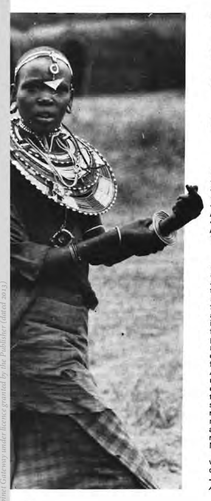
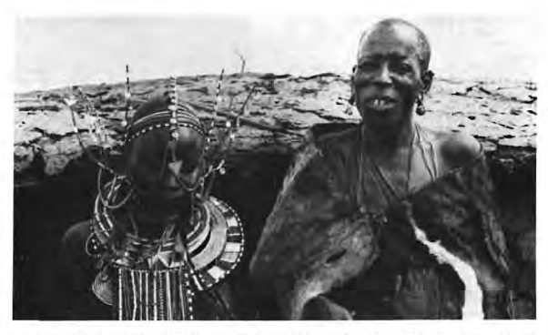
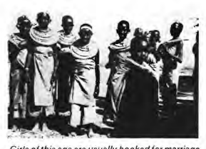
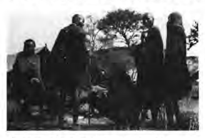

R

ep r o d u c e d by S

a b

 
# Engagement And Marriage Among The Maasai

Naomy Kipury Naomy N. Kipury was born on 24 January 1952. She grew up and received her early education in Kajiado District. She read Education, Literature and Linguistics at the University of Nairobi, from which she graduated in 1975. 

She has a keen interest in the Maasai traditional practices and has collected a substantial amount of oral data of historical and anthropological importance. Miss Kipury is presently working for the Kenya National Archives. 

In most African communities, marriage, as a social contract, is not a one person's affair. It requires the decision, the consent and the blessing of everyone-ranging from the parents, the clan-members and at times members of a whole section. It is also a duty for everyone to marry and although there are a few accepted exceptions as regards women, it is considered a great misfortune and a curse for a man to stay as a bachelor. But, it is popularly believed among the Maasai (I have no statistical evidence to confirm it) that out of every age-set there are seven people whose fate it is to grow old and die unmarried. 

Although the society ridicules and looks down upon them, they are also an object of sympathy especially since they spend many years trying to obtain brides but to no avail. But since they have failed to conform to the required norms of the corporate society, no one is obligated to give them respect accorded to elders. They do not fit into any ritual organization that forms the core of Maasai society. 

It is different with women. There are cases where a father decides to retain one of his daughters at home if he has no sons so she A Maasai girl, old enough to be circumcised. 

38 may beget him sons with a man or men of her choice to be his heirs .. This is because a woman is not entitled to inherit her father's property. 

There are rules, regulations and also taboos governing marriage. These determine the clan and the age of the couple who marry or may not marry. Close relatives are not to marry in Maasai culture; the clans are exogamous, that is, one may not marry a person of his/her clan. To do so a man has to give away a heifer to the father of the bride. 

This is intended to wipe away the "blood" relation that might have existed between the two. However, this fine is only possible if the two are members of the same clan. 

But clans are subdivided and members of the same sub-clan can under no circumstance marry. 

Men of one's father's age-set are also· 
regarded as one's "father", hence no marriage is feasible between them and the younger person. In general everyone knows who is a relative and who is not. When complete strangers meet for the first time they first find-out all the details of each other's kinship. 

Hence, before a man thinks of making an approach for marriage, all the details of the kinship should have been cleared beforehand. 

## Betrothal Procedure

The method of betrothal is more or less the same for all the sections. 

The usual practice is that a given family decides to obtain a bride (from a particular family). Having spotted the girl, the mother of the man who wants to marry and another woman of her clan set off to the girl's home. 

They carry with them either one of three items-a chainl , some butter or cow dung. 

These women may be dressed either casually or ceremonially. On reaching the home, they seek out the girl and pretend to fix he.r ornaments for her and in the case of bringing a chain they slip it on her neck. Otherwise, they smear some butter or cow dung on her abdomen. This act is referred to as Esirata2 and it signifies the picking out of the girl from among many. The marking is usually accom-pa~ied by the sentence. "Talepo inDo . ....... . 

"May you milk those of ........•. " whatever clan the speaker belongs to. If the "marked" girl: is old enough to realise the meaning of the' act she will throw the chain away and wipe off the dung or butter. and some do cry very bitterly. It is then up to the visitors to 1. A long chain attached to other ornments is usually worn by women. A piece of this could be used. 

2. The making of a mark. 

recover the Esiret (marriage token) and take it to the girl's mother to keep. In most cases the girl is too young to realise' the significance of the whole exercise and may excitedly go around showing off the beautiful ornament given her by the visitor, in the case of the chain. 

In cases where there are no daughters who are not "booked", the marking would be done on the stomach of a pregnant woman in hope that she'd bear a daughter. 

If she had a son, a close friendship would be established between the new-born and the would-have-been husband. The two would in most cases exchange cows and call each other Pakiteng3• This is the normal accepted betrothal procedure but there is a very small percentage of people who do not abide by societal rules. I will briefly mention the lot of this minority. 

A man may fall in love with a girl and decide to put her in the family way. It is taboo for an uncircumcised girl to get pregnant, hence many people shun marrying such a girl. 

With families who take the "crime" most seriously the girl is disowned as an outcast. 

She is taken to the bush at dusk and tied onto a tree with a bull and left to be eaten by wild animals. Whoever may want to claim the girl may take her as an adopted person and her name would never again be associated with her original family. The minority of these men who decide to obtain brides in such fashion are the ones who stand very narrow chances of obtaining brides of their choice through the normal procedures. 

But even so, it is not always a guarantee that they will marry the girl. Some families who are more lenient in their view toward pregnancy before circumcision may decide to stop the man from marrying the girl, and instead look for another suitor for the girl. Others may decide to fine the man a numb~r of cows before they allow him to marry their daughter. In general Entaapai4 is despised and she remains an object of scorn throughout her life. 

There are some cases where a circumcised girl would elope with a man she loves. 

She may either be brought back and married to someone else or she may be allowed to stay on while the marriage formalities are conducted in the usual way. When a woman refuses to marry the person chosen for her. 

she is often beaten by her brothers and clan members in an attempt to force her into 3. The one with whom we exchanged cows-the giving could either be reciprocal or one-sided. 

4. A girl who gets pregnant before circumcision. 

marriage. Some women comply after the 

beating but others remain obstinate. There was a case of a woman who would only marry an ugly man chosen for her if her eyes were plucked out to prevent her from seeing his ugly face. Her father prevented her from being whipped and instead allowed her to marry a "handsome" man of her choice. 

Individual cases exist and they are treated differently, other than by following a set of rules and regulations. It is also important to note that it is a great dishonour to the father for his daughter to refuse to marry a man he chose for her. The girl is considered disesrpectful to her father if she turns down his proposal of a suitor. 

Once the betrothal "mark" has been made it is followed soon after by the arrival of the groom's parents to declare their intention formally. The boy's mother and her lady escort set off to the bride's home dressed in ceremonial cloaks. With them they carry honey and milk. This honey is refered to as Esiret enkoshoke (the mark of the stomach) on account of its close association with the act of "marking" the girl's stomach just a little earlier. The women also hold bamboo staffs IIartati 5 and apply a lot of fat on their bodies. The mouth of the calabash containing the honey is sewn with sisal and Enkoti (a small gourd) used as 5. Used in many rituals as a symbol of peace. 

The wedding day. Both the man and the woman are dressed up for the wedding. 

Note the difference between their ages. 

Photograph: Cheryl Sonnichsen. 

a lid, instead of a sewn leather strap with a flat piece of gourd on top. I n cases where honey is not available in large amounts, sugar is put in the calabash and a little honey added. 

The honey is eaten by all the women of that village and it is a way of alerting them that one of their daughters is being sought for marriage. If the marriage does not go through successfully, this honey is the one item that is never refunded to the groom's family. 

When this is completed the Enkiroret 6 is brought in the same ceremonial style by the same women. The marriage proposal will be brought up for discussion and the man 
(usually his father and clan members) is informed whether his request is favourable or not. The latest honey is brewed to be drunk during the discussion. The girl is initiated around the ages of between 13-18 years. If the talks are promising the spouse takes some tobacco for the women, some sheets for the close relatives of the bride, and a blanket for his father-in-law. Some may also carry some more sugar for brewing beer. The tobacco is spread on a hide the 6.. The beer that opens up talks. 

next day for all the women to take and chew. A 
day is then set for the bride 'to be married off.. . In normal circumstances the groom IS 
expected to bring fiVe items as presents once he is promised the bride. A heifer (enkiteng) 
goes to his father-in-law to enable them to call each other Pakiteng. An ewe (enker) 
that goes to his mother-in-law necessitates the name Paker', since in-laws are not permitted to 'call each other by name. He also brings a bullock and a cow with a calf. 

The last three are not designated to any particular person but I would think they are symbolic of a state of procreation. Since to the Maasai procreation is the idea behind marriage, a man and a woman are expected to come together in order to bring forth children. A bull, and cow with a calf could be a polite way of announcing societal expectations to the new couple. The animals that are given should all be of the same colour. 

The heifer and the ewe are brought before marriage takes place but the rest can be brought later on. ' 
When all the wedding deliberations have been completed it remains for the bride to be "led away" in ceremony. 

## The Wedding Ceremony

There are two ways in which the wedding is conducted. There is a casual kind of wedding, Errotianarrot08 which is simple with little emphasis on the ceremonial procedures. Then there is a formal wedding Erikoroto too nkishu9 where all the rules and regulations pertaining to marriage are strictly adhered to. A woman may be married casually but unless she goes through the procedure of formalising her marriage she is not entitled to perform any ritual, like circumcision, on her children. I will relate the procedure followed in the formal wedding since it is the more important of the two. 

Three days before the scheduled day for the wedding the bridegroom arrives with three other people; a woman, a little girl and his best-man. He also brings with him twd fat rams and honey for brewing beer to be : drunk while the final deliberations are going on. Besides their daily attire the two men wear black beads on their necks. They mu~t also put on ceremonial cloaks and ~arry staffs The woman is also dressed ceremOnially, but the little girl is only smartly dressed since she is not entitled to a ceremonial cloak or staff. However, they all apply a lot of fat on their bodies. 

On arrival at the bride's home, the animals are put into an enclosure inside the village and after a while they are driven out into the fields for grazing. Then they are brought back with the rest of the cows to the village. The next morning one of the two rams is slaugptared; it is referred to as O/barnet'O because it is on that evening that the bride's hair is shaven off. That same evening the wedding ram Orikoret 11 is slaughtered. The meat of both rams has to be eaten and finished the same day. 

Some fat from the second ram is stored in a container (0/ku/et)12 for the bride to carry to her new home. All the fathers of the girl who include clan members, uncles and men of her father's age-set get together with the bride and groom. They advise them on the possible penalties for their conduct and to honour their marriage. This takes place while the beer is being drunk. They are then both blessed and left to retire for the night. 

Early in the morning on the wedding day, the bride is dressed up by the women in readiness to leave her home. Among the ornaments she wears are four leather rings, IIkerretil3, two made from the' two rams that were brought by the groom and the other two from rams slaughtered for her before circumcision. These rings are put on her fingers. On her back she carries one calabash of fresh milk and another of fresh milk mixed with blood, a mixture known as /nkipot. Among her ornaments are four wooden dolls, three representing girls and one representing a boy. 

These are hung suspended on a string on her neck. The girl dolls have their legs covered with wire up to the knees· and also on their necks, while the boy doll has the wire only on one leg. This wire was brought by the groom. 

The dolls are carved out of very hard wood of a tree called O/timigomi and it is renowned for its durability----obviously to wish the bride a long, healthy life with children. She also wears a string of black (dark blue) beads 
(Enkononkoi) which her younger sister slips on her neck as she comes out of the house. 

/surutia 14 (wire-coils) are another kind of ornament the bride has to have. On her waist she ties two belts of thin leather and her leather shoes are put on her feet so that the 10. The one for the shaving. 

11. The ram for the leading away of the bride during the wedding. 

12. Used as container for fat. 

13. Signify peace and harmony and act as a kind of charm to protect against danger. 

14. Two round copper or iron coils worn mainly by women but also worn by men in cenain rituals. 

Girls of this age are usually booked for marriage. 

A group of young men warming themselves by a fire. One of them has on a calfskin worn by men in many rituals, including wedding ceremonies. 

left shoe goes to the right foot and vice versa. 

The bride weeps bitterly mainly because she is obviously sad to leave her home and relatives, but also particularly because she is expected to weep-otherwise she would be laughed at and teased that she loves to get married. 

When the bride and the procession are ready to leave, the bride is taken to the main gate of the home (kishomi) 15 for the final blessing. Two elders, one holding a calabash of milk and the other of honey beer, confer the blessing. Each of these gourds is covered with green grass, signifying fertility. The grass is dipped into the liquids and sprinkled on the bride's face, feet and body. 

This act is performed simultaneously with utterances of blessings such as:-
Taa paming'ori May you be popular Tanapa olgilata May you take care of your linyi clan. 

Tanapa minyi 0 May you look after your ng'utunyi mother and father. 

15. Gate for a kraal ; each family has its own gate. 

Mikitalala oriong' May your back grow wide. 

Mikinosa olgilata Mayall your clan and your linyi pooki section feed on you. 

olosho linyi . .. (aanyayie endaa) 
(literal translation) 
Green grass is stuck on her waist and on her shoes. The bride then leaves for her new home with four "strangers." She receives no escort from her people and her mother is not even supposed to see her leave. She should be in doors. Once she starts off on her wedding journey the bride is not supposed to look back. 

The rest of the procession goes before the bride who customarily has to walk very slowly in case she appears anxious to take and be taken by the new husband. The duty of the best-man is to "sweep the way" for the bride who is not to jump over the smallest plant along the path. The best-man has to car~y her across a river or a gulley and over any big obstacle on the way. Being good friends and probably cian-membllrs, the best-man usually gives the groom a cpw and brews honey beer for him after the wedding and invites him to his home to drink it. They remain life-long friends. 

On the way, whoever sees the wedding procession goes to tease the brid~, sometif!1es very bitterly. She is told that she IS the ugh.est woman on earth; that she stole everything she is carrying on her back; that she must be a glutton, etc. This teasing is meant to show the bride that marriage has a lot to reckon with. From getting angry it is hoped that she develops a determination to endure the problems of married life. . . On arrival at her new home she IS given cold fresh milk and a small girl comes to sit on her lap. The bride does not comply with any request, like "come in", "sit down", e~c. 

without obtaining a present from the family members. Everyone comes to welcome the new wife and to promise her presents, usually of cows, sheep and goats. 

She stays for two days. On the third day she cleans her body traditionally by rubbing on ochre and gives out some of the ornaments and items she had carried, e.g. the dolls. 

She is given cows by her husband and shown the ones she was promised by all the other family members. It is on this day that she is given a new name (usually the name of her husband's age-set). It is also on the third day that she is permitted to sleep with her husband for the first time. She becomes a full member of her new home with all the rights and responsibilities. No divorce is permissible after such formalized weddings. 

 by      by the   
42 