# Maasai Tribe- Kenya

By Maddie, Kyra, and Julia 

# Introduction To This Culture

- The Maasai tribe can be found mainly in Kenya, but some groups live in 

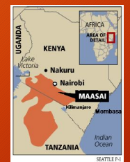

northern Tanzania 
- The groups values have changed over time, especially with the influence of modern technology from the countries and societies around them 
- Kenya is becoming more developed with time, but the Maasai tribe tries to maintain its traditions without conforming to the outside influences

# Fashion/ Clothing

- The clothing changes a little depending on age, gender and location. 

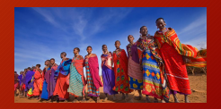

- In the 1960's they switched from animal skin to cotton cloth for their clothing. 

- The wraps used are called Shuka which is an african blanket that is wrapped around the body and over the shoulders. 

- One piece clothing is called Kanga. - Those who live near the cost typically wear Kikoi. A Kikoi is a loose fitting piece of material that is wrapped around the lower body that comes in different colours and patterns. 

# Fashion /Clothing

- Red is a very prominent colour that is used for clothing as it represents 

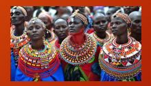

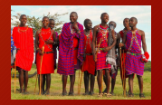

power. They also use black, blue, checkered and multicoloured designs. 

- Young men wear black for a short period of time after their circumcision. - Some people still dye their own cloth. - Beads are also very important as the women make jewelry with them and it creates work for the women.

- Different coloured beads have different meanings. 

- Blue means water. 

- White means peace. 

- The beads used to be made out of clay but they currently use glass beads. - Jewelry is very important in courtship. 

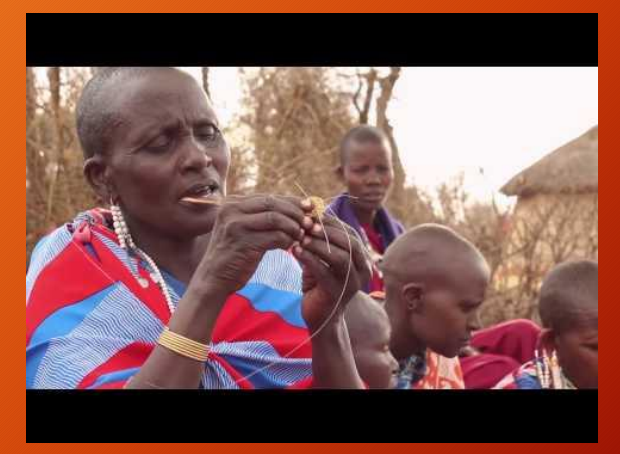

# Maasai People Vs. Fashion Companies

- Companies have been know to exploit the Maasai's Culture. 

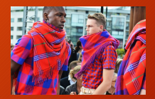

- Specifically the fashion industry. - An example of this is Louis Vuitton in 2012. - Louis Vuitton used inspiration from the shuka to design hats, shirts, scarves. - The main problem is that the Maasai people get nothing from what is sold. - As a result of this they made a group called the Maasai Intellectual Property Initiative (MIPI) 
- It is used to fight companies that exploit the Maasai's culture. 

- Research shows that the Maasai's people should be given money from 80 companies. 

# Gender Roles- Women

- Lately, women have been given a bigger role dealing with livestock. 

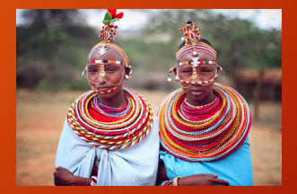

- To make more money women are taking on more roles. - Women are seen as not having power and not being important. - Young women are taught to build houses, make jewlery, cook and clean. - They are taught these things by their mothers. - Women are typically very close with their children, especially with their sons. 

# Gender Role- Men

- Warriors are very important in their culture. 

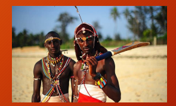

- Young boys are taught from a very young age how to be a man and warrior. - The main role is of a warrior is to protect animals and their families. - Young boys must learn customs/ traditions, laws that he will need as an elder. 

- The Maasai society is still largely male dominated. - Men make the decisions for his family.

- Older men are responsible for making community decisions. 

# Ceremonies/Traditions

Male

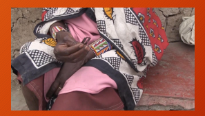

Enkipaata (senior boy ceremony)
- A boy's first initiation (14-16)
- The night before initiation, the boys must sleep outside - At dawn boys run to the homestead and dress themselves in loose clothing - They must dance for the remainder of the day Emuratta (circumcision)
- This ceremony is performed shortly after puberty 
- Boys are pressured into being circumcised - Family members are known to threaten the boy so he feels more compelled to go through with it
- No anesthesia is used, the boys are forbidden from showing pain Eunoto Ceremony (senior's warrior initiation)
- Undergoing this initiation allows the men to marry 

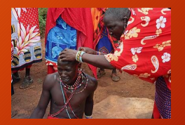

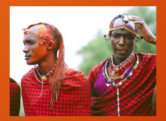

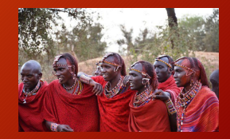 - Every graduate is required to have his ochre dyed hair cut by their mothers - 3 leaders are chosen to represent the age set (Olotuno, Olaiguanani Lenkashe, Oloboru Enkeene)
- The 1st must take responsibility for the good and the bad deeds of his age set 
- The 2nd is honoured with a specially chosen female cow - The 3rd is honoured with a knotted leather strap - He will untie the strap to release the warriors from their isolation 

## Female

Enkang oo-nkin (meat ceremony)
- This is a ceremony specifically for the warrior's wives 
- This ceremony is conducted to prove that the wives have not engaged in an illegal sexual affair with someone from a younger age set
- If a woman is found guilty, she will be disrespected by her entire age set Female Circumcision
- Until circumcision, girls have sexual freedom

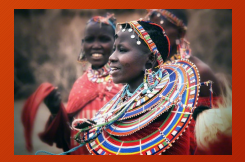 - The circumcision is performed when the girl is 15 by a female elder
- The women try to marry immediately after their circumcision (even that day)

# Family Traditions

- The Massai tribe is divided into two groups: "Orok Kiteng" and "Oodo Mongi"

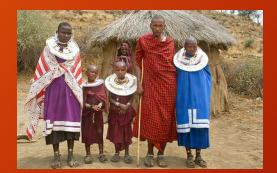

- Smaller families and clans broken up in these two groups followed by patrilineal descent 
- The father has absolute control over a family except for the interference of elders
- The children join the fathers subclan and the women is still apart of her subclan
- Members of the same clan often occupy neighbouring houses - The close relationship is because every descendent has a common tribal ancestor

# Marriage Traditions

- https://www.youtube.com/watch?v=Kq_cptHufTQ

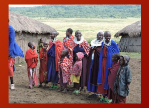

- Marriage is arranged by the father without consulting the mother or daughter
- Male elders arrange marriage based on profitable cattle - Most marriages are polygynous - the men have several wives - Can have as many wives as he can afford - ideally has about 6 wives - Husbands want lots of kids to carry on his lineage
- Women are given cattle in exchange for children
- Women are not allowed to divorce husbands - Women are not allowed to remarry
- https://wn.com/maasai_tribe_arranged_marriage_views_tribal_wives_bbc

# Music And Dance

- Dances are simple, structured and performed for special occasions
- Generally don't use musical instruments - The beads they wear make a jingling sound when they jump and women sometimes wear bells for added accompaniment
- Often call and response songs - The Maasai will perform their dances for tourists/foreigners to educate them - Their songs often consist of rhythms provided by a group of vocalists, while the song leader (olarynyani) will sing the melody
- The call and response songs (Nambas) are often made up of nonsense phrases 
- Sometimes the dances occur around the houses and involve flirting
- https://www.youtube.com/watch?v=C0aRuHqvBwQ

# Food Meat

- Cattle is very important in the lives of the Maasai

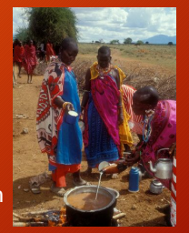 - After the cow is eaten their bones will be used as utensils - Boiled beef and goat are their main sources of meat - Raw beef may also be consumed - Men cannot eat meat that has been touched by a woman or an uncircumcised boy Drinks
- Animal blood is drunk on special occasions ( circumcision, after giving birth etc. )
- Honey is used to make mead, but only the elders are permitted to drink it - Milk is a part of every meal - People drink both fresh and curdled milk - The maasai people will also occasionally mix blood and milk to drink

# The Importance Of Blood

- It is considered cruel to kill a cow only for its blood 

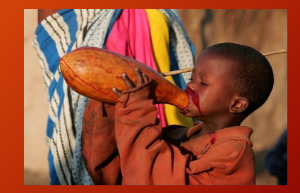

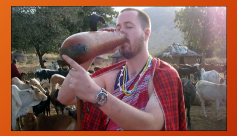

- A cow's jugular artery is nicked which allows the blood to be drawn instead - Since salt is forbidden, blood is their primary source of sodium - Drinking blood can also be tried by tourists

## Work Cited

Administrator. "Maasai Music And Dancing." *Kenya Safari*. N.p., n.d. Web. 26 Mar. 2017. 

<http://www.maasai.co.ke/music-and-dancing>.

Bloom, Rishana. "The Maasai Tribe-Rituals." The Maasai Tribe-Rituals.Bronx Theatre High school, n.d. Web 03 Mar. 2017. 

<http://www.culturequest.us/maasaitribe/rituals.htm>.

"The Challenge of Being a Maasai Woman." *The Challenge of Being a Maasai Woman | Inter Press Service*. N.p., n.d. Web. 26 Mar. 

2017. <http://www.ipsnews.net/2013/05/the-challenge-of-being-a-maasai-woman/>.

"Family Structure and Kinship." *Family Structure and Kinship*. Tangient LLC, n.d. Web. 26 Mar. 2017. 

<https://gcanthmaasai.wikispaces.com/Family+Structure+and+Kinship>.

"Gender Roles Change in Maasai Society." *Oman Tribune*. N.p., 27 July 2016. Web. 26 Mar. 2017. 

<http://omantribune.com/details/5135/>.

Jeane. "Maasai Customs and Traditions." All Things Kenyan. N.p., 27 Dec. 2015. Web. 02 Mar. 2017. 

<http://allthingskenyan.com/countries/kenya/masai-customs-and-traditions>.

"Maasai." *Junior Worldmark Encyclopedia of World Cultures*. Encyclopedia.com, n.d. Web. 26 Mar. 2017. 

<http://www.encyclopedia.com/social-sciences-and-law/anthropology-and-archaeology/people/maasai>.

"Maasai." Maasai- Introduction, location, language, folklore, religion, major holidays, rites of passage. N.p., n.d. Web. 23 Feb. 

2017 <http://www.everyculture.com/wc/Tajikistan-to-zimbabwe/maasai.html>.

"Maasai." *Maasai - New World Encyclopedia*. N.p., n.d. Web. 26 Mar. 2017. 

<http://www.newworldencyclopedia.org/entry/Maasai>.

Works Cited Con't
"Maasai - Marriage and Family." *Countries and Their Cultures*. Advameg Inc., 2017. Web. 26 Mar. 2017. 

<http://www.everyculture.com/Africa-Middle-East/Maasai-Marriage-and-Family.html>.

"Maasai People, Kenya." Maasai People, Kenya. N.p., n.d. Web. 23 Feb. 2017. <http://www.maasai-association.org/maasai.html>. Maasai Tribe: Arranged Marriage Views. Prod. Dionne Braham. Perf. Massai Girls.*World News*. BBC, 30 Jan. 2009. Web. 26 Mar. 

2017. <https://wn.com/maasai_tribe_arranged_marriage_views_tribal_wives_bbc>.

"Maasai Tribe (Masai) People of Kenya - History and Culture." *Maasai Tribe (Masai) People of Kenya - History and Culture*. N.p., 
n.d. Web. 26 Mar. 2017. <http://www.kenya-information-guide.com/maasai-tribe.html>.

"Maasai." *Yaden Africa - African Clothing | African Jewelry | African Artwork*. N.p., n.d. Web. 26 Mar. 2017. 

<http://yaden-africa.com/the-culture/tribes/maasai>.

Safaris, Thomson. "Growing Up Up Up! The Maasai." *Thomson Safaris*. Wineland-Thomson Adventures, Inc., 31 Mar. 2014. Web. 26 Mar. 2017. <http://www.thomsonsafaris.com/blog/maasai-jumping-ceremony/>.

Safaris, Thomson. "Traditional Maasai food: Blood and Milk." Thomson Safaris. Wineland-Thomson Adventures, Inc., 03 Feb. 2015. 

Web. 02 Mar. 2017. <http://www.thomsonfaris.com/blog/traditional-maasai-diet-blood-milke/>.

"The Life of a Maasai Woman." *Maasai Girls Education Fund*. Maasai Girls Education Fund., n.d. Web. 26 Mar. 2017. 

<http://maasaigirlseducation.org/the-need/the-life-of-a-maasai-woman/>.

Young, Sarah. "Maasai People of East Africa Fighting against Cultural Appropriation by Luxury Fashion Labels."*The Independent*. 

Independent Digital News and Media, 07 Feb. 2017. Web. 26 Mar. 2017. <http://www.independent.co.uk/life-style/fashion/maasai-people-cultural-appropriation-luxury-fashion-retailers-louis-vuitton-ea st-africa-intellectual-a7553701.html>.