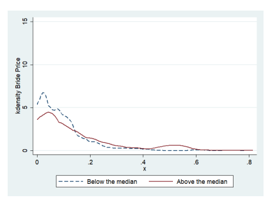
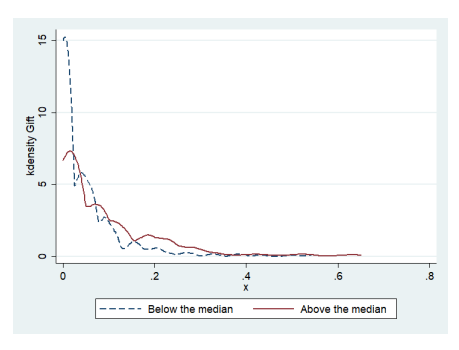

# Marriage Payments And Wife'S Welfare: All You Need Is Love.

Rozenn Hotte and Sylvie Lambert ∗
May 18, 2020

## Abstract

Bride price is essential to marriage in West Africa and particularly in Senegal where, according to our data, transfers to the family of the bride characterize about 85% of marriages.

The relationship between the bride price and the well-being of the wife in her household has scarcely been studied in West Africa. Furthermore, the simultaneous existence of other marriage payments, flowing in different directions between the stakeholders is also largely ignored. To assess the significance of these marital transfers for women's well-being in Senegal, we use a unique survey that enquires separately about the different marriage payments.

We highlight the strength of the link between what is given to the bride herself and her welfare, contrary to the looseness of the relation with what is given to the family.

JEL Classification: J12, J16, 055 Keywords: Bride-Price, Marriage, Women, Senegal.

## 1 Introduction

In Senegal, marriage is nearly universal for women, and the social pressure to be married is extremely strong. Marriage and motherhood are important components of their social status and an essential part of their lives. Therefore, their welfare within marriage is a crucial aspect of women's well-being. Marital payments are pervasive in this country, bride price being the most important. According to our data, 85% of marriages that occurred between 1996 and 2006 involved a bride price. Bride prices exist in other contexts, as it is for example the main form of marital payments in rural China, Thailand, Sub-Saharan African and Middle-Eastern countries (Anderson, 2007), but this common denomination hides major contextual variations in this practice.

There is an on-going debate on the link between bride price and married women welfare.

In 2004, the International Conference on Bride Price, organized by MIFUMI, a women's rights NGO, in Kampala, Uganda, took a clear stands against it. This conference concluded by a resolution stating that the practice of bride price should be banned, as this was akin to the purchasing of women who therefore loose all agency on their fertility and sexuality (Wendo (2004)). An contrary assessment suggests that, since the bride price is paid when the wife has a positive value, it could reflect her bargaining power in her household and hence influence positively her access to household resources and her children outcomes.1 In this paper, we set out to elucidate the relationship between marital payments and married women welfare in the case of Senegal. It this context, several payments take place at the time of marriage, flowing in different directions between the stakeholders. We address the question of whether any of these payments is correlated to wives' welfare and propose a conceptual framework to understand the mechanisms at play.

Bride price is a transfer from the family of the groom to the family of the bride2. It has been studied in social sciences in particular through its ceremonial function, mostly by the anthropological literature (Drucker (1965), Kressel (1977)). It characterizes marriage markets where the search for a spouse is done by the groom's side, the groom and his kin trying to find the most desirable match. In marriage markets where dowries prevail, the search is conducted by the bride's side. The literature has devised models to explain the existence of such payment.

The bride price is seen as a compensation for the bride's parents, facing the loss of their daughter who represents an asset, or as a compensation for the bride herself (Becker, 1991). The role of women in agricultural labor-intensive societies is often put forward to explain the prevalence of bride-price over dowries in those societies, where it amounts to a payment for the transfer of the woman's workforce and the rights to her fertility from her parents' to her husband's household (Bell (2008), Boserup et al. (2013), Falen (2011)).

There are a number of reasons why bride price could affect the wellbeing of women in their marriage. The idea that bride price disenfranchises women is echoed in the economic literature, in particular about Uganda, by papers stressing the negative impact of bride price on women's independence and household decision making role (Kaye et al., 2005). Gaspart and Platteau (2010) stress another channel for a potential negative impact of the bride price on wives' welfare. In the context they study (the River Valley in Senegal), the bride price might have to be returned in case the woman leaves the relationship early in the marriage. The strategic model they develop implies that high bride price increases the groom's incentives to push his wife to ask for divorce, potentially using violence to this end. In the recent economic literature, Corno and Voena (2016) and Corno et al. (2016) have shown, using data on several countries of Africa, that the probability to have an early marriage is higher in case of negative shocks on family income, among societies that practice bride prices. Early marriage could be a way for families to smooth consumption, thanks in part to the receipt of the bride price.

Bride price might even at times be used as a proxy for bargaining power, because it is viewed as a substantial amount earned by the woman, which can participate to her empowerment or because it reflects her positive value for the husband (Doss (2013)). On the contrary, in the beckerian model, dowries would be negatively correlated with wives' welfare, as they exist when the value of the wives is negative. Consistent with this view, Mbaye and Wagner (2017) find that higher bride-price reduces fertility pressure in rural areas of Senegal. In a different setting, Mansoor (2018) also finds that higher bride price increases the probability of modern contraception use, interpreted as a sign of a higher bargaining power. In addition, Ashraf et al. (2014) show in Indonesia and Zambia, that construction of schools have increased the education of girls belonging to ethnic groups practicing high bride-price. Parents' strategic decision regarding their daughters marriage aiming at affecting timing or amount of bride-price can therefore have positive as well as negative impacts. Finally, in the context of the DRC,
Lowes and Nunn (2016) show no systematic link between the amount of bride prices and earlier marriage or higher fertility.

Dowry and bride-price can be contrasted by the identity of the recipient of the transfer. The dowry can be seen as a pre-mortem inheritance and a way for parents to transmit inheritance to their daughter in a context of patrilocality (Goody and Tambiah, 1973), while bride price goes to the parents of the bride. Chan and Zhang (1999) suggest therefore that only the dowry and not the bride price should impact intra-household allocation of resources: they highlight implicitly the fact that the dowry being retained by the wife, contrary to the bride price, it does not enter her utility in the same way.

In total, how bride-price relates to the bride's wellbeing is still an open question and might well depend on the context.

In Senegal, bride price is the main marriage payment. Formally given by the groom and the groom's family to the bride's parents, it is the most systematic payment, but other transfers between the various parties are also commonly observed. Two important components of these transfers concern the bride herself. She receives a transfer from her husband, that will be hereafter referred to as *le cadeau* (i.e. the gift), as it is called in French, and she brings in the household a certain amount of resources, akin to a wedding trousseau (*le bagage*). It can therefore be expected that these marriage payments could relate differently to the wife's welfare, so that considering each of them separately seems necessary.

Marriage payments have rarely been analyzed in their full complexity, at least by economists.

Indeed, although a significant literature on dowries and bride prices exists, the fact that marriages give often rise to several simultaneous payments (this is for example true also in Pakistan or Bangladesh, as presented by Ambrus et al. (2010)) is scarcely ever taken into account. This paper fills part of this gap.

In this paper, we use various proxies for the wife's wellbeing, ranging from individual consumption to fertility pressure. We assess the links between the diverse marriage payments and those outcomes. This is made possible thanks to the use of original data from the survey
"Pauvret´e et Structure familiale" (thereafter, PSF), collected in Senegal in 2006 (de Vreyer et al., 2008). These data are particularly well suited for our objective, because they provide detailed information on transfers at the time of marriage, for every unbroken marriages: the bride price, the *cadeau* and the *bagage* are precisely recorded. They provide also information on consumption at disaggregated within-household level, allowing in particular to distinguish the consumption accruing to the wife from that of her husband.

This paper allows to dig deeper into the question of the link between marriages payments and intra-household resources allocation. To the best of our knowledge, our work is one of the first to detail the different transfers occurring at marriage and to show that they relate differently to wife's welfare. We nevertheless cannot claim to uncover causal links, as we have no source of exogenous variations for the amounts paid3. We develop a conceptual framework conform to anthropological knowledge and qualitative evidence that articulates a model of the determinants of marriage payments to the wife's welfare outcomes and serves as a guide to interpret the empirical findings. Empirically, results show that the bride price does not seem to correlate with the wife's access to household resources, nor with most other measures of wellbeing we have, contrary to the *cadeau* received from the husband. Results point at unobservable characteristics explaining both the existence and level of the *cadeau* and the relative consumption of the wife in the household (and more generally the wife's wellbeing), but uncorrelated to the bride price itself. The model suggests to interpret these unobservable variables as the value the husband attaches to his wife (or his love for her), that he signaled through the value of the cadeau.

Section 2 of the paper presents the context and the conceptual framework. Section 3 describes the data. Section 4 highlights the determinants of the diverse marital payments. Section 5 analyses how those payments relate to women wellbeing, and offers an interpretation of those results. Section 6 presents the robustness checks. Finally, section 7 concludes.

## 2 Marriage Payments In Senegal 2.1 Bride-Price, Cadeau And Bagage

Bride prices are present in most marriages in Senegal. They are transfers in kind or cash given by the family of the groom or the groom himself to the family of the bride. The bride price is given before the marriage. Although the marriage might have been arranged very early on, the payment of the bride-price is the signal allowing for the wife to join her husband's household and actually start a marital life. Its amount is negotiated between both couples of parents, largely on the basis of local norms. A large part of the bride price is spent in the wedding ceremony, for meals and clothing. The size of the wedding ceremony matters for families as, according to qualitative interviews, it is a way for the family of the bride to establish or comfort its social status. The wedding ceremony is notably an occasion for many gifts to be exchanged with all the guests. Thus, the part of the bride price that is not spent on ceremonial expenses is redistributed by the bride's mother to people deemed to deserve it, because they have played a role in the childhood of the bride or because they contribute to the ceremony. Nothing of the bride price is retained for future consumption. The guests (even if they didn't receive money from the bride's mother) also make a small monetary contribution (called *ndawtal*). The counterpart of this contribution will take place when they will themselves organize a ceremony. Wedding is therefore an essential occasion to strengthen the family social network, that could be mobilized again later, in particular for future marriages of the siblings. See Buggenhagen (2012) for a description of this gift/counter-gift dynamics and its role in maintaining an active social network.

Hence, even though bride's families receive a bride price, in the Senegalese context, it does not imply a real windfall earning at the occasion of their daughters' wedding. A long-term effect through the network may exist but the direct income shock caused by bride price is probably very limited. In some rare cases, a little part of the bride price could be given to the bride, but it is often spent for her ceremonial outfit. If bride prices have an effect on the parental network, it might percolate to the bride at some point, in a context where family is the natural insurance network and where transfers between generations are extremely common (La Ferrara (2010),
Fafchamps and Quisumbing (2007)). Hence, bride price could still affect the well-being of the wife, but to a lesser extent than the one of her parents. This is consistent with the argument made by Chan and Zhang (1999).

The *cadeau* is given specifically by the husband to the bride. Traditionally, jewelry was offered, which constituted a precautionary saving that was retained by the wife and could be used in case of divorce or widowhood. It therefore played a similar role to the dower found in other Muslim countries. Nowadays, qualitative interviews suggest that it consists more in some conspicuous consumption goods such as smartphones or radios, as well as some money, at least in urban settings. It might therefore have lost its long term protective role. The *cadeau* is not mandatory to get married, contrary to the bride price. In fact, it is present in less than two thirds of the marriages we observe. As it is optional, controlling for the husband's wealth, it could represent a fairly accurate signal of the value the husband attaches to marrying this particular woman, and this is clearly the way many women interpret it4. Moreover, the *cadeau* is also often one of the first occasions to show commitment or involvement and for the husband to demonstrate that he values the individualized relationship.

The money of the *cadeau* can be used to partly cover for the cost of the *bagage*, which is the trousseau the wife brings into her new household. The wife's family also contributes to it. There is a lot of individual variation in the share of the *bagage* covered by the bride's own relatives and that covered thanks to the husband's contribution. This *bagage* takes the form of kitchen utensils, dishes and other housewares, as well as sometimes bedroom furnishing. It is essential in ensuring the wife's well-being in her new household: borrowing kitchen utensils from other women in the house is frowned upon. The content of the *bagage* remains the property of the bride alone. Because it often comes in large part from the bride's own family, its presence and level may well reflect the strength of the support she can expect from her kin group. In this sense, it might correlate with her outside options and affect her bargaining power within marriage.

Beyond the bride price, the *cadeau* and the *bagage*, a transfer in kind is sometimes made from the family of the bride to the family of the groom, mainly in the form of clothing for the wedding ceremony.

In case of divorce, in principle, the *cadeau* and the *bagage* remain the property of the bride.

Bride price is supposed to be paid back if the divorce is initiated by the woman and happens very early after the wedding. In practice, throughout the interviews we conducted in Senegal with divorced women, we never met anyone who had to reimburse the bride price, but we also observed that, when women initiate the divorce, it often means that they leave the house with hardly anything, leaving most of the *bagage* behind5.

The Senegalese data used in this paper reveal that, in the sample of women whose first marriage occurred in the 10 years preceding the survey (between 1996 and 2006), bride prices were given in 85% of the cases, *cadeau* received in 62% of them and the wife brought a *bagage* in 57% of those marriages (table 1). Amounts are also quite large as the mean bride price at first marriage is 125 000 (constant 2005) CFA francs (212 $) and the mean *cadeau* is 71 000 (2005) CFA francs (122 $), while the value of the *bagage* reaches on average 52 000 (2005) CFA francs (89 $) (table 2)
6. In one third of all marriages, the 3 types of transfers existed simultaneously
(table A2 in the appendix7.). The sum of bride price and *cadeau* represents more than two thirds of the mean yearly consumption per capita in the country. Of note is the fact that bride price amounts are in principle regulated by the February 1967 law on ceremonial expenses and limited to 3000 CFA francs. This amount, that is much below observed levels, has not been adjusted since enactment of the law. 8 The simultaneous presence of these different transfers at marriage has never been studied. It echoes some work trying to understand simultaneous dowry and bride price (Bangladesh and Taiwan), but mainly in contexts of slow transition from one system to another. Here, the nature of those transfers differs in a deep way, and understanding their respective drivers and how they relate to married women welfare would shed light on this understudied aspect of the marital institution in Senegal.

N Mean SD

| Positive Bride-Price   | 638   | 0.85   | 0.36   |
|------------------------|-------|--------|--------|
| Positive cadeau        | 638   | 0.62   | 0.49   |
| Positive bagage        | 638   | 0.57   | 0.50   |

Note: Sample: Women married between 1996 to 2006, observed in their first marriage.

Source: PSF 2006.

Note: Sample: Women married between 1996 to 2006, observed in their first marriage.

Source: PSF 2006.

| N                                                        | Mean   | SD     | Min    | Max   |        |
|----------------------------------------------------------|--------|--------|--------|-------|--------|
| Bride-Price (1000 FCFA 2005)                             | 638    | 124.50 | 139.56 | 0.00  | 813.67 |
| Cadeau (1000 FCFA 2005)                                  | 638    | 71.04  | 102.78 | 0.00  | 650.83 |
| Bagage (1000 FCFA 2005)                                  | 638    | 52.15  | 74.19  | 0.00  | 497.84 |
| Share of the cadeau in total payment to the bride's side | 610    | 0.35   | 0.35   | 0.00  | 1.00   |
| Bride-Price (1000 FCFA 2005), excluding zeros            | 541    | 146.82 | 140.32 | 3.23  | 813.67 |
| Cadeau (1000 FCFA 2005), excluding zeros                 | 395    | 114.74 | 109.78 | 3.23  | 650.83 |
| Bagage (1000 FCFA 2005), excluding zeros                 | 360    | 92.41  | 77.68  | 5.42  | 497.84 |

## 2.2 Conceptual Framework.

In order to clarify potential mechanisms at play, we present here a simple model that articulates the determinants of the payments and the way they might correlate with the wife's wellbeing in her marital household9.

For marriages to take place, both families need to agree. The groom's kin discuss with the parents of the bride they have identified as a suitable match. The potential groom also has some say. Women who have never been married before have much less decision power than anyone else about the marriage itself. They nevertheless have a choice in terms on how they will behave with their husband during their future marital life. Both families and the groom talk over the bride-price, that should be sufficient for the bride's family to hold a wedding ceremony impressive enough to keep up with their social standing. What is appropriate is very much a matter of social norms prescribing what is expected from each family given their social status and the relation they already have with the future in-laws. It might also reflect the local marriage market. Besides, the groom has to decide whether to make a gift to his future wife and how much. The *cadeau* is a way for the groom to signal the fact that he actually aspires to this match. It might reassure the wife about the way he will behave with her in the future, by implicitly committing to provide her the required financial support10. The main objective of such a signal is to ensure the reciprocal wife's involvement in the marriage, meaning transfers (financial as well as emotional) toward her husband in future marital life. In fact, as in any repeated game, cooperating at the beginning of marriage helps ensuring cooperation in subsequent periods. The incentive to respect the commitment implied by the gift is ensured by the risk that a disappointed wife might ask for divorce (a very common occurrence in Senegal:
in 2006, more than 13% of women older than 30 have divorced at least once, with divorce rates peaking between 2 and 5 years into the marriage as established by Lambert et al. (2018)).

The model below is designed to represent this situation with the simplifying assumption that the groom is the unique decision maker when it comes to both bride-price and *cadeau*, the position of other parties entering into play through minimum requirement constraints.

First, the groom (or his family) offers to pay a bride price BP. For this amount to be accepted and the marriage to be allowed, it cannot be below the one customarily determined by BP = BP(zw, zh*, m, sn*), where individual characteristics of both husband and wife are denoted by (zh, zw), m stands for the marriage market conditions favorable to men (gender imbalance for example) and sn the social norms that apply to a particular marriage (due to the ethnic affiliation, regional practices, families social standing...). zw could encompass for example age and education level of the bride. zh could represent husband's occupation (for instance whether this occupation goes hand in hand with a stable income). In the Senegalese context, where the bride-price results from negotiations at the family level and, as explained above, is relied upon by the bride's family to be able to organize a party that reinforce their social standing, we can expect it to be heavily constrained by existing norms (sn).

The amount of *cadeau* Ca is chosen once the bride price has been fixed11. Parents of the bride may have had a higher decision-making power than the bride herself in the initial acceptance. Nevertheless, the level of goodwill with which the bride enters the marriage might matter to the groom, as it will determine the level of harmony and mutual emotional transfers in the couple. The more he attaches importance to marrying this particular bride, the more he will be willing to ensure her good will. The *cadeau* is a signal sent to the bride once the match is decided and independently of the bargaining that occurs between the parents,used to convey the groom's inclination appropriately. Is also signals a commitment by the husband to offer financial support to his wife over the course of their marriage. This is not innocuous as a husband failing to meet this obligation despite initial commitment would face the risk of being punished by his wife, through lower transfers or even divorce. Men differ in their signaling cost as it would be less costly for a more loving husband to send such a signal.

We introduce a measure of the degree of premarital knowledge between the spouses. The potential bride directly observes the intensity of the interest of the groom towards her (denoted I, for involvement with the bride) with probability π. π could be empirically proxied by the link between both families in-law: being from the same ethnic group or the same family would increase π. With probability (1-π), the bride does not know the groom's attachment and can only form expectations about it thanks to the *cadeau*. We assume that the bride needs to be induced to expect a certain level of care and involvement from her husband, (denoted Iw), to send positive emotional and financial transfers. The necessary *cadeau* for her expectation to reach this threshold is an increasing function of the characteristics of the husband (zh). It is denoted Caw(zh). Below this amount, no cooperation will be obtained in marriage. The expectation of the groom's quality induced by the *cadeau* is therefore supposed to be an increasing function q(Ca − Caw(zh)) where q(0) = 0, q 0 > 0, q" < 0. In other words, the bride's anticipation of the future involvement of the groom increases with the level of *cadeau* Ca, and is positive only if Ca exceeds the minimum amount she expects considering the characteristics of the husband. If really interested in this marriage, the groom seeks to send a signal that would exceed his expectation of the bride's threshold, as failing to meet the wife's anticipations would prevent him from reaping the utility gain associated with having an harmonious couple with the woman he actually cares for.

As noted above, men can differ in their interest in conciliating the bride. In our model, it means that men can differ in their signaling cost c, which is mostly an emotional cost. We suppose that c varies between 0 and 1. We assume moreover that the cost of signaling can be formalized as a decreasing function of two different factors: a component related to the observable characteristics of the wife (zw) and a less tangible (unobservable) component of attraction or love (l). The less the groom is in love with this woman, the more it costs him to give a *cadeau*. The utility associated with the emotional benefit of marrying this particular woman and having an harmonious marital life is denoted v(1 − c), where v is strictly increasing and concave. It can only be enjoyed if the signal sent leads the bride to expect a level of care that exceeds Iw, the involvement she requires to cooperate in the marriage. If the signal sent is below Iw, it leads to a disutility for the husband. For tractability, we assume that the function is continuous. As a result, we assume that the husbands utility from marrying this bride can then be written:

$$v(1-c)(\pi I+(1-\pi)q(C a-\overline{{{C a_{w}}}}(z_{h}))-\overline{{{I_{w}}}}(z_{h})).$$

For a little involved groom, v(1 − c) will be almost null, and the interest in increasing

$$\pi I+(1-\pi)q(C a-\overline{{{C a_{w}}}}(z_{h}))-\overline{{{I_{w}}}}(z_{h})$$

will be low, whereas not sending a valuable signal would be very damageable for the utility of a highly involved groom. We suppose that the utility of the groom is separable in consumption and involvement. The groom chooses the cadeau Ca maximizing:

$$U=u(Y_{h}-BP-Ca)+v(1-c(z_{w},l))(\pi(I(z_{w},l))+(1-\pi)q(Ca-\overline{Ca_{w}}(z_{h}))-\overline{I_{w}}(z_{h}))\tag{1}$$

with Yh the income of groom, v the groom's signaling cost, and u and v are both strictly increasing and concave.

Under the constraint:

$$B P\geq\overline{{{B}}}\overline{{{P}}}(z_{w},z_{h},m,s n)$$
BP ≥ BP(zw, zh*, m, sn*) (2)
$$\left(2\right)$$

Saturation of the constraint leads to:

$$B P={\overline{{B P}}}(z_{w},z_{h},m,s n)$$
BP = BP(zw, zh*, m, sn*) (3)
and the first order condition on Ca gives:

$$-u^{\prime}(Y_{h}-\overline{BP}(z_{w},z_{h},m,sn)-Ca)+v(1-c(z_{w},l))(1-\pi)q^{\prime}(Ca-\overline{Ca_{w}}(z_{h}))=0\tag{4}$$

For the bride price, the comparative statistics are directly obtained from the hedonic price function. For the gift, we compute the implicit derivatives:

•∂Ca ∂π = − −v(1 − c(zw, l))q 0(Ca − Caw(zh)) u 00 + v(1 − c(zw, l))(1 − π)q 00 < 0 •∂Ca ∂Yh = −−u 00 u 00 + v(1 − c(zw, l))(1 − π)q 00 > 0 •∂Ca ∂m = − u 00 ∂BP ∂m u 00 + v(1 − c(zw, l))(1 − π)q 00 > 0
•∂Ca
∂zh
$$=\,-\frac{u^{\prime\prime}\frac{\partial B P}{\partial z_{h}}-v(1-c(z_{w},l))(1-\pi)q^{\prime\prime}\frac{\partial\overline{{{C a_{w}}}}}{\partial z_{h}}}{u^{\prime\prime}+v(1-c(z_{w},l))(1-\pi)q^{\prime\prime}}$$  the positive effect of $z_{h}$ on $Ca_{w}$. The sign is 
00 whose sign is ambiguous if ∂BP
∂zh> 0,
given the positive effect of zh on Caw. The sign is positive if the link between the amount of gift requested by the wife and the characteristics of the husband is stronger than the one between these characteristics and the bride price.

 $\dfrac{\partial Ca}{\partial z_w}=-\dfrac{u''\frac{\partial BP}{\partial z_w}-\frac{\partial c}{\partial z_w}v'(1-c(z_w,l))(1-\pi)q'(Ca-\overline{Ca_w}(z_h))}{u''+v(1-c(z_w,l))(1-\pi)q''}\quad$ whose sign is ambiguous ($\frac{\partial Ca}{\partial z_w}>0$ if the link between education and willingness from the room to marry this . 
peculiar wife is stronger than between education and bride price).

* $\frac{\partial Ca}{\partial l}=-\frac{-\frac{\partial c}{\partial l}v^{\prime}(1-c(z_{w},l))(1-\pi)q^{\prime}(Ca-\overline{Ca_{w}}(z_{h}))}{u^{\prime\prime}+v(1-c(z_{w},l))(1-\pi)q^{\prime\prime}}>0$
Finally, these comparative statistics are obtained:

| Variables                          | Effect on gift   | Effect on bride price   |     |
|------------------------------------|------------------|-------------------------|-----|
| Level of knowledge about the groom | -                | 0                       | (1) |
| Income of the groom                | +                | 0                       | (2) |
| Quality of the bride               | ?                | +                       | (3) |
| Quality of the groom               | ?                | +                       | (4) |
| Marriage market favorable to men   | +                | -                       | (5) |
| Love                               | +                | 0                       | (6) |

In a second step, we focus on the situation during the marital life, once the ceremony has taken place. We suppose that the groom's love, or the harmony in the couple, plays positively on the financial support of the groom toward his wife. It would mean: S = S(l+
) with S the financial support of groom, assuming other explanatory variables constant (fixed at the time of marriage). Since we are expecting that ∂Ca
∂l > 0, we also expect that ∂S
∂Ca > 0 whereas
∂S
∂BP = 0, controlling for observable variables that affect the occurrence of the marriage.12 Finally, the *bagage* does not appear in the above model, as the husband and his family have no say about it, even if it may also be partly financed by the *cadeau*. It is more likely to be determined by the support the bride can obtain from her own family and by the structure of the household she is planning to join (presence of co-wives or in-laws in particular). The role of her own family suggests that succeeding in raising a large *bagage* bodes well for future support from her kin group. As such it could be correlated with future income transfers for example, and therefore, higher individual consumption. Further, it might well reflect the strength of her outside options, and hence contributes to a higher bargaining power within the household.

We will bring these predictions to the data. First, we will be interested in the correlates of the marriage payments and simply estimate :

$$P_{i}=g(s n_{i},z_{h i},z_{w i},m)+v_{i}$$
Pi = g(sni, zhi, zwi, m) + vi(5)
$\left(5\right)$. 
Where P stands for payment, which can be either a bride-price (BP), a *cadeau* (Ca) or a bagage (T). Some unobservable factors linked to personality traits of husband and wife and the interpersonal quality of the match, are likely to enter into play for all these payments in the v.

Love in the model is encompassed in the error term of the *cadeau* regression (vCA).

In a second step, we will be interested in the link between the payments and the welfare of the wife in her new household, after the marriage. Here again, we will simply exhibit regularities thanks to the following set of regressions:

$$Y_{i}=g(m,s n_{i},z_{h i},z_{w i},C a_{i}(l),B P_{i})+u_{i}$$
$\left(\mathrm{6}\right)$. 

Our model suggests that the coefficient associated to Cai should be significantly positive while the one associated to BPi might not be significantly different from zero. Indeed, controlling for the observable variables that affect both the payment and the wife's outcomes, we expect unobservable characteristics captured by the *cadeau* more than by the bride price (kindness of the husband, quality of the marriage, harmony in the couple) to play a role in determining the wife's access to household resources, contributing to the correlations with the wife's wellbeing
(Y ).

## 3 Data And Descriptive Statistics 3.1 Data

Survey Data used in this study are from the PSF Survey (de Vreyer et al., 2008)
13. Data have been collected in 2006 and are nationally representative. It covers 1750 households, and 14 450 individuals. The survey recorded all the marital transfers: bride-price, *cadeau* and *bagage*14.

This level of detail is very rare. Data sets that record bride-prices or dowries usually stop at this single (main) marital transfers. There are few exceptions concerning Bangladesh and Pakistan, countries where bride-price and dowry tend to increasingly coexist (Ambrus et al., 2010). In the Senegalese context, the practice of multiple marital transfers, in addition to the nearly universal bride-price, is widespread. These marital payments are self-recorded, asked to the husband when he is present, to his wife otherwise: as such, they can be biased (beyond a random measurement error). We do not think that the bias would systematically correlate with the outcomes considered at the time of survey, but maybe, rather to the education level of the bride or the consumption level of the household. We control for these variables in the analysis.

Consumption The PSF survey collects information on food and non-food expenditures. The recall period is chosen for each good by the respondent, expenditures have then been annualized. A particular strength of the data set is that it takes into account the intra-household allocation of consumption. Qualitative interviews have shown that each household could be split into semi-autonomous budgetary units. Between these subgroups, sharing of financial responsibilities is very clearly defined and own resources are not pooled. In the quantitative data, we have reproduced this natural division of the household, calling each unit a cell. These cells are composed of a cell-head and his dependents: wife, children, or unaccompanied members of the family. Household head are however systematically recorded in an autonomous cell, that includes only their unaccompanied dependent (children whose mother does not coreside or widowed parent for example). Their wives each head a separate cell. Adult male members, other than the head of household, receive different treatment, depending on whether or not they are polygamous. They are in the same cell than their wife if they are monogamous, or in different cells if they are polygamous. Given this rule, most women heading a cell of their own are either household head or married to the household head15. Their husband should not be in their cell, except if they do not live in the same household and he is visiting at the time of the survey.

This happened for 10 women in our sample.

Consumption is recorded in three parts: consumption common to the whole household, consumption that can be assigned to specific cells and finally, consumption shared between several cells but not the whole household. Total cell consumption can be constructed by ascribing a share proportional to cell size of the common or shared expenditures and adding cell specific expenses. Intra-household inequality in access to consumption can therefore be exhibited. Individuals within the same household do not have always the same consumption level. It appears that food consumption is rather equally shared within a household, while it is not the case for non-food consumption (de Vreyer and Lambert, 2020)
16. We will consider the ratio of the woman's cell per capita non-food consumption to that of her household as a measure of her access to household resources. The share of the household consumption that comes down to the wife is actually a direct measure of her welfare. This measure should reflect her bargaining power according to classical collective household models. It gives a fairly encompassing picture of wife's welfare within the household and informs on what really matters *in fine*, the share of total resources accruing to her. Note that for those women who are not in a independent cell, they are generally in their husbands' cell and the resources reaching the cell also reflect the position of the couple in the household. Although it represents a situation where what is at stake is not what can be obtained from the husband, this is nevertheless one dimension of her situation within the household.

For each consumption record in the survey, the persons who financed the corresponding expenditures are registered. We can therefore consider another outcome reflecting the support the husband provides to his wife, the share of the wife's cell consumption that is financed by the husband. We are nevertheless aware that this measure is ambiguous. A high level of husband's support could also mean less autonomy, and therefore less welfare. This is the same ambiguity than the one attached to the wife's income, highlighted by Doss (1996): wife's income is not a good measure of the bargaining power, since a woman with a high bargaining power could decide not to work. Note that consumption data do not suffer from this ambiguity. We complete this analysis by studying other outcomes that can proxy women's welfare, such as fertility pressure, polygamy and coresidence with the in-laws. This is detailed in section 5.

Sample Amounts recorded for the marriage payments possibly suffer from recall bias. To try to circumscribe this problem, we limit our sample to women who have been married in the 10 years preceding the survey, hence after 1996. The sample for which information on the amount of each marriage payments is available contains 783 women once trimmed for outliers17.

Among them, we have information on control variables for 751. We have full information on the husband only in case of co-residence of the couple: 521 women coreside with their husband
(69% of the sample)18. The analysis of financial support of the husband will be restricted to the sample of wives who are cell's head and not in the same cell than the husband (465). The measure of financial support would not be relevant if husband and wife are recorded in the same cell as their consumption would not be separately recorded. We check robustness to the sample definition first by restricting in turn the analysis to women in their first marriages (638 women, among them 370 cell's head) and to coresiding women (521 women, among them 310 cell's head19), and then by enlarging the sample to women having been married in the 15 years preceding the survey (989, among them 660 are cell's head). The table A3 in Appendix presents a summary of the number of observations in these different samples of interest.

Married Women's Characteristics Table 4 provides descriptive statistics for women in our main sample.20 Twenty three percents of those women have a primary education and 12% have a secondary education. Half of the sample lives in a rural area. The age at marriage is on average 22 years old (note that for some of these women, the marriage observed is not their first marriage, hence the rather high age at marriage reported here), and the age gap with the husband is 12 years.

Three quarters of them live in a monogamous union at the time of the survey.21

| N                                                                | Mean   | SD    |       |
|------------------------------------------------------------------|--------|-------|-------|
| Wife with some primary education                                 | 751    | 0.23  | 0.42  |
| Wife with secondary or superior education                        | 751    | 0.12  | 0.32  |
| Age of the wife at marriage                                      | 751    | 22.42 | 8.86  |
| Age Difference between spouses                                   | 650    | 11.60 | 7.81  |
| Log of the expenditures of the hh pc                             | 751    | 12.32 | 0.76  |
| Wife lives in a rural place                                      | 751    | 0.51  | 0.50  |
| In a monogamous union                                            | 751    | 0.75  | 0.43  |
| In a polygamous union, first rank                                | 751    | 0.04  | 0.19  |
| In a poly. union, sec. or further rank                           | 751    | 0.20  | 0.40  |
| Non Food Exp. of the wife cell pcap/Non Food Exp. of the hh pcap | 751    | 1.01  | 0.46  |
| Share of the wife's cell expenditure financed by the husband     | 676    | 0.56  | 0.44  |
| Presence of in-laws                                              | 744    | 0.36  | 0.48  |
| Polygamous husband                                               | 751    | 0.25  | 0.43  |
| Number of months between marriage and first birth                | 751    | 26.84 | 26.54 |

Note: Sample: Marriages from 1996 to 2006. The information on husband's age is missing for some uncoresiding women, thus the missing observations for the age gap.

Source: PSF 2006.

| N                                                                | Mean   | SD    |       |
|------------------------------------------------------------------|--------|-------|-------|
| Wife with some primary education                                 | 989    | 0.22  | 0.42  |
| Wife with secondary or superior education                        | 989    | 0.10  | 0.31  |
| Age of the wife at marriage                                      | 989    | 22.03 | 8.60  |
| Age Difference between spouses                                   | 869    | 11.71 | 7.82  |
| Log of the expenditures of the hh pc                             | 989    | 12.30 | 0.75  |
| Wife lives in a rural place                                      | 989    | 0.52  | 0.50  |
| In a monogamous union                                            | 989    | 0.73  | 0.45  |
| In a polygamous union, first rank                                | 989    | 0.07  | 0.26  |
| In a poly. union, sec. or further rank                           | 989    | 0.20  | 0.40  |
| Non Food Exp. of the wife cell pcap/Non Food Exp. of the hh pcap | 989    | 0.97  | 0.44  |
| Share of the wife's cell expenditure financed by the husband     | 910    | 0.55  | 0.44  |
| Presence of in-laws                                              | 982    | 0.34  | 0.48  |
| Polygamous husband                                               | 989    | 0.27  | 0.45  |
| Number of months between marriage and first birth                | 989    | 30.65 | 32.27 |

Note: Sample: Marriages from 1991 to 2006. The information on husband's age is missing for some uncoresiding women, thus the missing observations for the age gap.

Source: PSF 2006.

## 4 Correlates Of Marriage Payments 4.1 Who Draws In Which Marriage Payments?

To analyze the correlates of the various payments, we first estimate the probability that such transfers occur at the time of marriage, and then the amount paid. Explanatory variables are grouped into different sets. A first set describes the local environment and aims at approaching the role of local norms. It includes the region of residence of the couple (as a proxy of the region of residence of the parents of the husband), dummies for ethnic group, and average per capita consumption at the district level (to control for the wide geographic disparities in living standards). 22 It also includes date (year) of marriage and conditions of the local marriage market at that time captured by the women-to-men sex ratio in the district of residence of the wife (following Chiappori et al. (n.d.) or Abramitzky et al. (2011))23. A second set of variables reflects the endogamy of the match in various dimensions (spouse members of the same family, of the same ethnic groups, or with fathers having the same employment status).

Greater endogamy might have improve the information the wife had about her husband prior to the wedding. On the other hand, highly endogamous marriage are more likely to have been arranged by the families, without regards for the wishes of the spouses. Characteristics of the families form the third group of variables: professional occupation of the wife's father (whether employer, employee, civil servant, formal or informal worker, farmer or inactive), wife's parents alive at the time of marriage and size of the sibset of each spouse. Finally, individual characteristics of the wife and husbands form the lasts sets: education and occupation are accounted for.

We investigate for all married women the link between the dependent variable and those sets of characteristics. Results are presented in table 5 for the logit estimation of the probability of a given transfer taking place and in table table 6) for the corresponding amounts (Given the share of null payments, we conduct this analysis using a tobit specification). For the subset of women who coreside with their husband, more information is available, and we present the results for this sample using a wider set of explanatory variables. The results restricted to the smaller set of variables common to all observations are presented in Appendix (tables A4 and A5). They are very similar to the ones with the whole sample of married women.24 For both existence and level of the bride price, explanatory variables related to region and date of marriage have jointly a significant explanatory power. Ethnicity also plays a role, Wolof families receiving a higher bride price. The district level women-to-men ratio plays negatively on this transfer, showing the weight of local conditions on the marriage market. This is true controlling for the average consumption level in the department that could well be correlated with the sex ratio if men migrate to earn a living. As expected, this measure of local living standard is positively correlated with the bride-price. The characteristics of the wife enter into play as well. Her age at marriage affects the probability a bride price is paid, this being lower for older brides, while her education affects its amount: women with secondary or higher education command higher bride price. Remember that women with this level of education are only 12% of our sample, and this achievement may be as indicative of her family social standing than of her own quality. It is also noteworthy that higher bride-prices are paid when at least one of the parents of the bride is alive at the time of marriage. In fact, parents are really the ones who rely on the bride-price to reaffirm their social standing and have therefore higher stakes in negotiating it. Higher bride prices are also paid if the husband is a farmer. On the other hand, consistent with the conceptual framework, belonging to the same family or the same ethnic group is not significantly correlated with the amount of bride price. Regarding the cadeau or the *bagage*, it is worth noting that if they also vary by region and marriage dates, they do not vary by district consumption level and marriage market conditions, supporting the notion that these payments are determined at a more individualized level than bride prices. The *cadeau* seems to be driven more by characteristics of the husband, for both the probability of a *cadeau* to be given (particularly strong when the husband is a farmer) and for the value of the *cadeau*: husbands who already had a job at the time of marriage and men at both end of the socio-economic spectrum (civil servant or employer on the one hand, and farmer and educated in koranic school on the other) give higher *cadeaux*. Belonging to the same family, or to the same ethnic group probably induces a better prior mutual knowledge. The model suggests that it would make signaling from the groom less necessary, and we indeed find that belonging to the same ethnic group is negatively correlated with the *cadeau*, both in terms of occurrence and value. Belonging to the same family is not correlated with the existence nor the amount of the *cadeau*, except that it increases the probability to receive a *cadeau* when considering all married women (but not when restricting to co-residing wives). Note however that in most cases, belonging to the same family also means belonging to the same ethnic group, and the total effect is always significantly negative. Among possible interpretations for the positive correlation that appears when considering the probability to receive a *cadeau*, we can imagine either that a *cadeau* can be exchanged also when spouses already know each other, precisely because they love each other or that endogamous marriage are more often arranged by the families so that the man needs to make a special effort to signal his personal interest above and beyond the family desire to see this particular marriage happen. Finally, the *bagage* is more likely to exist if the husband is a farmer and when the fathers of the spouse share the same occupation.

Unfortunately, the information on the income of the husband at the time of the marriage is not available in the survey. But thanks to retrospective data on the first job, we are able to compute a dummy indicating whether the husband had worked before the year of the marriage. As expected, it is positively correlated with the amount of the *cadeau* but not the one of the bride price.

In total, all those results can be read through the lens of the conceptual framework developed above, that allows to make sense of the patterns just described. Bride price payments appear to be decided mainly to accord with local standards that vary per region, ethnic group, local standard of living, local sex-ratio at the time of marriage, whether the bride's parents are alive, for women of a given age and education level. On the contrary, the *cadeau* seems to be more individualized, the characteristics of the spouses playing a greater role. The negative correlation between ethnic endogamy and the *cadeau* can be understood in our framework by the fact that signaling one's good will is more important for the husband if he is more distant from his future wife to start with.

PaymentBride Price Cadeau Bagage

All Coresident All Coresident All Coresident

Women-to-men ratio in the department -1.03 -3.74** 0.51 1.13 0.85 0.34

(1.01) (1.57) (0.66) (0.85) (0.67) (0.88)

Average of the logarithm of the hh consumption per cap by department 1.65** 1.93** -0.48 -0.39 0.15 0.39

(0.65) (0.95) (0.47) (0.57) (0.47) (0.59)

Wife is wolof 0.14 0.24 -0.02 0.04 0.32 0.34

(0.28) (0.41) (0.23) (0.29) (0.23) (0.31)

Wife is poular -0.04 -0.15 0.25 0.58** 0.36 0.14

(0.29) (0.41) (0.23) (0.29) (0.24) (0.31)

Characteristics of the Match Couple from the same family 0.22 0.22 0.35* 0.24 0.25 -0.15

(0.24) (0.32) (0.19) (0.25) (0.19) (0.25)

Couple from the same ethnic group -0.25 -0.26 -0.59** -0.69** -0.49* -0.54*

(0.30) (0.42) (0.27) (0.34) (0.26) (0.33)

Fathers with same professional status 0.07 -0.07 0.39*

(0.31) (0.22) (0.22)

Characteristics of the Families

Professional status Wife's Father (*ref. independent/informal employee*) ..... Farmer 0.42 0.68* -0.09 -0.24 -0.21 -0.55*

(0.29) (0.40) (0.23) (0.31) (0.23) (0.31)

..... State employed/employer -0.19 0.02 0.35 -0.03 -0.16 -0.21

(0.32) (0.40) (0.27) (0.33) (0.27) (0.34)

..... Other -0.55 -0.62 0.25 -1.21 -1.74* 0.00

(1.01) (1.10) (0.99) (1.26) (0.96) (.)

Number of siblings of the wife alive -0.02 -0.10 0.08** 0.09** 0.04 0.02

(0.04) (0.06) (0.03) (0.04) (0.03) (0.04)

Number of siblings of the husband alive 0.01 0.10** 0.06

(0.05) (0.04) (0.04)

Parents of the wife alive at marriage 0.15 0.22 -0.08 -0.08 -0.10 -0.22

(0.43) (0.62) (0.38) (0.53) (0.38) (0.55)

Characteristics of the Wife

Education (*ref. no education*) ..... Primary -0.25 -0.20 0.66*** 0.55* 0.26 0.24

(0.25) (0.32) (0.23) (0.31) (0.22) (0.28)

..... Secondary 0.39 0.63 0.47 0.09 0.39 -0.03

(0.40) (0.60) (0.32) (0.40) (0.31) (0.40)

Age of the wife at marriage -0.06*** -0.05* -0.01 -0.02 -0.05*** -0.02

(0.01) (0.03) (0.01) (0.02) (0.01) (0.02)

Wife lives in a rural place 0.21 -0.50 0.24 -0.08 0.26 0.10

(0.32) (0.51) (0.27) (0.35) (0.27) (0.39)

Characteristics of the Husband

Professional status (*ref. independent/informal employee*)

..... Farmer -0.13 -0.03 0.40 0.67* 0.09 0.65*

(0.35) (0.57) (0.26) (0.35) (0.25) (0.34)

..... State employed/employer 0.16 -0.42 0.13 0.30 0.31 0.19

(0.29) (0.41) (0.24) (0.33) (0.23) (0.31)

..... Other -0.19 -0.48 -0.17 -0.06 0.20 -0.05

(0.40) (0.51) (0.34) (0.37) (0.33) (0.37)

Husband has been to coranic school -0.28 0.36 0.56**

(0.37) (0.26) (0.27)

Husb. worked at time of marriage 1.17* 0.68 1.18*

(0.68) (0.59) (0.63)

Constant -17.08** -17.51 5.50 2.66 -1.97 -6.07

(8.14) (11.65) (6.10) (7.40) (6.13) (7.77)

Region and marriage year FE Yes Yes Yes Yes Yes Yes Pval region+marriage year 0.23 0.01 0.00 0.01 0.00 0.00

N 751 509 751 513 751 517

Dep. Var. mean 0.81 0.85 0.61 0.61 0.54 0.63

st. dev. 0.39 0.35 0.49 0.49 0.50 0.48

r2 p 0.14 0.17 0.10 0.14 0.14 0.16

chi2 89.20 81.03 88.59 75.71 116.00 88.43

* p<0.10, ** p<0.05, *** p<0.01.

Note:Logit estimates, Dependent variables: occurrence of bride price, cadeau or *bagage*. Omitted occupation category is that of "independant or informal employee". Coefficients related to the occupation dummies "inactive" and "unknown" are not displayed because they are never significant, as well as the dummy "unknown" for "Same family" and the dummy "unknown" for "Fathers with same professional status". Standard errors clustered at the husband level in parentheses. Sample: For the first, third and fifth columns, women who married between 1996 and 2006. For the second, fourth and sixth column, subsample of those who reside with

their husband. Source: PSF 2006. 23

| Table 6:                                                                                                                                           | Amount of Marital Transfers, All Marriages   |            |            |           |            |          |
|----------------------------------------------------------------------------------------------------------------------------------------------------|----------------------------------------------|------------|------------|-----------|------------|----------|
| Payment                                                                                                                                            | Bride Price                                  | Cadeau     | Bagage     |           |            |          |
| All                                                                                                                                                | Coresident                                   | All        | Coresident | All       | Coresident |          |
| Women-to-men ratio in the department                                                                                                               | -68.29                                       | -181.61*** | -37.46     | 57.33     | 6.26       | -9.51    |
| (42.60)                                                                                                                                            | (53.93)                                      | (53.26)    | (52.83)    | (30.36)   | (32.38)    |          |
| Average of the logarithm of the hh consumption per cap by department                                                                               | 87.52***                                     | 57.71      | -8.26      | -23.10    | 21.40      | 45.81    |
| (31.89)                                                                                                                                            | (37.66)                                      | (31.74)    | (34.21)    | (28.96)   | (32.67)    |          |
| Wife is wolof                                                                                                                                      | 33.67**                                      | 31.92      | -5.94      | 11.63     | 7.29       | 10.19    |
| (16.25)                                                                                                                                            | (19.51)                                      | (14.32)    | (16.88)    | (12.80)   | (14.16)    |          |
| Wife is poular                                                                                                                                     | 3.40                                         | -0.18      | 14.02      | 42.65**   | 1.54       | -5.87    |
| (14.73)                                                                                                                                            | (17.04)                                      | (14.69)    | (16.88)    | (12.70)   | (14.09)    |          |
| Characteristics of the Match Couple from the same family                                                                                           | -8.04                                        | -20.65     | 16.39      | 11.73     | 9.54       | -6.04    |
| (13.02)                                                                                                                                            | (14.66)                                      | (13.20)    | (15.03)    | (10.28)   | (11.23)    |          |
| Couple from the same ethnic group                                                                                                                  | 9.38                                         | 12.67      | -38.50**   | -57.81*** | -26.61*    | -29.99*  |
| (18.10)                                                                                                                                            | (19.96)                                      | (17.24)    | (20.88)    | (14.64)   | (15.92)    |          |
| Fathers with same professional status                                                                                                              | 28.16**                                      | -8.84      | 5.44       |           |            |          |
| (13.56)                                                                                                                                            | (12.96)                                      | (9.93)     |            |           |            |          |
| Characteristics of the Families Professional status Wife's Father (ref. independent/informal employee) Farmer                                      | 13.39                                        | 9.29       | 1.17       | 1.16      | -10.74     | -22.78*  |
| (12.63)                                                                                                                                            | (14.04)                                      | (13.47)    | (16.40)    | (12.18)   | (12.90)    |          |
| State employed/employer                                                                                                                            | 17.61                                        | 35.62      | 25.19      | -0.26     | -8.01      | -5.96    |
| (20.45)                                                                                                                                            | (21.93)                                      | (16.60)    | (18.03)    | (17.11)   | (18.62)    |          |
| Other                                                                                                                                              | -18.06                                       | -1.92      | -6.90      | -91.05    | -127.71**  | -603.14  |
| (47.60)                                                                                                                                            | (54.97)                                      | (59.32)    | (70.41)    | (61.14)   | (.)        |          |
| Number of siblings of the wife alive                                                                                                               | 3.19                                         | -0.41      | 4.22**     | 3.04      | 0.29       | -0.38    |
| (2.38)                                                                                                                                             | (2.64)                                       | (2.03)     | (2.23)     | (1.72)    | (1.91)     |          |
| Number of siblings of the husband alive                                                                                                            | 3.42                                         | 6.24***    | 4.73**     |           |            |          |
| (2.60)                                                                                                                                             | (2.29)                                       | (2.08)     |            |           |            |          |
| Parents of the wife alive at marriage                                                                                                              | 32.61*                                       | 54.16**    | -13.85     | -18.80    | 8.32       | 0.99     |
| (19.05)                                                                                                                                            | (21.20)                                      | (24.40)    | (33.93)    | (19.49)   | (20.71)    |          |
| Characteristics of the Wife Education (ref. no education) Primary                                                                                  | 19.30                                        | 7.55       | 51.42***   | 31.93**   | 20.63*     | 11.94    |
| (13.62)                                                                                                                                            | (16.36)                                      | (14.08)    | (15.33)    | (12.00)   | (13.01)    |          |
| Secondary                                                                                                                                          | 124.95***                                    | 114.51***  | 69.43***   | 39.19     | 40.90**    | 16.02    |
| (24.07)                                                                                                                                            | (27.71)                                      | (21.27)    | (26.26)    | (18.91)   | (22.21)    |          |
| Age of the wife at marriage                                                                                                                        | -4.44***                                     | -3.74***   | -2.16***   | -2.31**   | -2.34***   | -0.86    |
| (0.78)                                                                                                                                             | (1.02)                                       | (0.73)     | (0.98)     | (0.64)    | (0.82)     |          |
| Wife lives in a rural place                                                                                                                        | 21.14                                        | -5.17      | 26.56      | -1.14     | 23.54*     | 21.27    |
| (15.09)                                                                                                                                            | (19.51)                                      | (16.53)    | (19.45)    | (13.45)   | (16.10)    |          |
| Characteristics of the Husband Professional status (ref. independent/informal employee) Farmer                                                     | 14.88                                        | 40.93**    | 29.38*     | 54.67***  | -6.64      | 12.41    |
| (15.28)                                                                                                                                            | (17.82)                                      | (16.33)    | (18.80)    | (11.83)   | (12.25)    |          |
| State employed/employer                                                                                                                            | 26.97                                        | 25.76      | 29.69*     | 40.32**   | 26.31*     | 22.13    |
| (17.97)                                                                                                                                            | (20.55)                                      | (15.66)    | (17.86)    | (13.83)   | (16.62)    |          |
| Other                                                                                                                                              | 49.52**                                      | 44.70*     | -1.87      | 8.22      | 8.80       | -0.14    |
| (22.43)                                                                                                                                            | (23.90)                                      | (18.60)    | (17.86)    | (17.50)   | (17.07)    |          |
| Husband has been to coranic school                                                                                                                 | 19.75                                        | 34.47**    | 26.89**    |           |            |          |
| (15.55)                                                                                                                                            | (16.73)                                      | (12.02)    |            |           |            |          |
| Husb. worked at time of marriage                                                                                                                   | 1.60                                         | 71.79**    | 64.69**    |           |            |          |
| (42.72)                                                                                                                                            | (31.86)                                      | (31.62)    |            |           |            |          |
| Constant                                                                                                                                           | -915.19**                                    | -427.00    | 222.38     | 201.08    | -210.62    | -594.73  |
| (421.48)                                                                                                                                           | (488.10)                                     | (404.55)   | (446.56)   | (377.31)  | (418.00)   |          |
| sigma                                                                                                                                              | 143.08***                                    | 133.74***  | 127.58***  | 117.61*** | 106.27***  | 95.65*** |
| (6.90)                                                                                                                                             | (7.34)                                       | (6.91)     | (7.79)     | (5.80)    | (6.47)     |          |
| Region and marriage year FE                                                                                                                        | Yes                                          | Yes        | Yes        | Yes       | Yes        | Yes      |
| Pval region+marriage year                                                                                                                          | 0.02                                         | 0.02       | 0.00       | 0.00      | 0.00       | 0.00     |
| N                                                                                                                                                  | 751                                          | 521        | 751        | 521       | 751        | 521      |
| Dep. Var. mean                                                                                                                                     | 112.49                                       | 120.43     | 64.71      | 64.53     | 47.79      | 53.92    |
| st. dev.                                                                                                                                           | 136.87                                       | 134.73     | 97.58      | 91.23     | 71.46      | 72.74    |
| r2 p                                                                                                                                               | 0.02                                         | 0.02       | 0.02       | 0.02      | 0.02       | 0.02     |
| F                                                                                                                                                  | 3.98                                         | 2.88       | 2.50       | 1.82      | 3.25       | .        |
| * p<0.10, ** p<0.05, *** p<0.01. Note: Tobit estimates, Dependent variables: amount of bride price, cadeau or bagage, expressed in 1000 FCFA 2005. |                                              |            |            |           |            |          |

## 4.2 The Impact Of Transitory Shocks

The literature has investigated the impact of transitory shocks on timing of marriage and marriage payments. The idea is that in societies where bride prices are paid at the time of marriage, parents could be tempted to marry their daughter off early when facing a negative income shock, so as to be able to use the pride price payment to smooth consumption. The results obtained suggest a wide variety of situations. If Corno and Voena (2016) show that drought can indeed accelerate the timing of the marriage and decrease bride price paid, Lowes and Nunn (2016) do not find this for Democratic Republic of Congo. We study here how the Senegal marriage markets react to transitory local income shocks.

We consider weather shocks at the time when women were at risk of being married for the first time, using rainfall deviation from the long term average. Rainfall data measured every month from 1982 to 2007 at the district level are matched to every individual in the survey, based on the district of residence of the wife at the time of the PSF survey25. This is the district she married into, so, as argued before, it is likely to be a good proxy for the district of residence of the husband's family. It makes sense to use this, as the husband's family is the one who will have to pay the bride-price, and their capacity to do so might be affected by adverse shocks.

The district of current residence of the wife is probably a noisier proxy of the exact localization of the wife's family. The district of birth of the wife is more appropriate to account for it, and would be the relevant one if indeed girl's parents adjusted marriage timing to cope with shocks. We also used it in an alternative specification.

To construct a measure of rainfall shock, district and year rainfall averages are first computed, and long-term average is obtained by taking the mean of the yearly rainfall average over the twenty five years for which the information is available26. For each household and each year, we define positive (negative) rainfall shocks as situations where the rainfall average that year is more than one standard deviation above (below) the long-term average. Descriptive statistics on the occurrence of shocks are available in Table 7.

| count                                    | mean   | sd       | min      | max   |    |
|------------------------------------------|--------|----------|----------|-------|----|
| Negative shock at 16, 17 or 18 years old | 690    | .2086957 | .4066712 | 0     | 1  |
| Positive shock at 16, 17 or 18 years old | 690    | .3391304 | .4737576 | 0     | 1  |

Note: A negative (positive) shock is a rainfall level that is more than one standard deviation below
(above) the long-term average any of the 3 years when the woman was age 16 to 18. Sample: Women married between 1996 and 2006.

Since the timing of the marriage is endogenous, we look at the occurrence of a shock during the period when marriage risk is highest for girls, i.e. when the bride to be is 16, 17 and 18 years old. We are not able to have these data for the older women of the sample, as rain data starts only in 1982. Therefore, we run the model including those variables only for the subsample of 690 women for whom we can construct a measure of rainfall shock. Results indicate that dry years tend to delay marriages. We do not find any impact of rainfall shocks on the amount paid as bride price, but a negative one on the level of *cadeau*(Table 8). In this context, the adjustment to drought on the marriage market passes mainly through quantities (marriage postponement). It is consistent with the fact that the amount of the bride price has to respect a norm that cannot easily be disregarded. People wait for better time to marry in order to be able to pay the required amount. At the same time, since the *cadeau* is not required, if the marriage happens in a bad year, as it might already have been difficult to collect the necessary bride-price, the husband seems to adjust his *cadeau* downwards27.

| Age at marriage                           | Amount of bride price   | Amount of cadeau   | Positive bride price   | Positive Cadeau   |           |
|-------------------------------------------|-------------------------|--------------------|------------------------|-------------------|-----------|
| Negative shock at 16, 17 or 18 years old  | 4.7971***               | -3.3877            | -16.6991*              | -0.0377           | -0.0051   |
| (0.48)                                    | (14.04)                 | (10.11)            | (0.04)                 | (0.05)            |           |
| Positive shock at 16, 17 or 18 years old  | -1.2838***              | 4.3967             | -5.9810                | 0.0067            | -0.0379   |
| (0.45)                                    | (11.29)                 | (7.49)             | (0.03)                 | (0.04)            |           |
| Wife lives in a rural place               | -1.7282***              | 26.2164**          | 25.3745**              | 0.0288            | 0.1027**  |
| (0.52)                                    | (13.01)                 | (10.42)            | (0.04)                 | (0.05)            |           |
| Wife with some primary education          | 0.3394                  | 26.3778**          | 40.7486***             | -0.0688*          | 0.1719*** |
| (0.48)                                    | (12.22)                 | (11.29)            | (0.04)                 | (0.05)            |           |
| Wife with secondary or superior education | 1.3936**                | 137.1997***        | 66.2189***             | 0.0561            | 0.1623**  |
| (0.63)                                    | (23.29)                 | (15.36)            | (0.05)                 | (0.06)            |           |
| Constant                                  | 19.4856***              | 138.2130***        | 66.0758***             | 0.8177***         | 0.4975*** |
| (0.75)                                    | (22.41)                 | (18.88)            | (0.06)                 | (0.08)            |           |
| Region and marriage year FE               | Yes                     | Yes                | Yes                    | Yes               | Yes       |
| Other Controls                            | Yes                     | Yes                | Yes                    | Yes               | Yes       |
| N                                         | 690                     | 690                | 690                    | 690               | 690       |
| Dep. Var. mean                            | 20.54                   | 120.23             | 67.78                  | 0.84              | 0.62      |
| st. dev.                                  | 5.47                    | 139.67             | 99.33                  | 0.37              | 0.49      |
| r2                                        | 0.34                    | 0.14               | 0.14                   | 0.07              | 0.10      |
| * p<0.10, ** p<0.05, *** p<0.01.          |                         |                    |                        |                   |           |

In total, the results presented on the correlates of marriage payments are consistent with the interpretation that bride-prices are in large part determined by local norms while *cadeaux* seem more related to wife's and husband's characteristics. Unexplained variance could be ascribed to two non-exclusive factors: a first one is measurement error. Indeed, although we restricted the sample to relatively recent marriages, the recall or reporting might be imperfect. The other possibility is the role of unobservable characteristics such as the kindness of the husband, the value he attaches to marry this woman, the outside options on the marriage market of this particular woman. Analyzing how those transfers correlate with welfare outcomes of the wife after marriage will help us assessing whether noise dominates or whether the payments recorded carry relevant signal, above and beyond the one contained in observable characteristics.

## 5 Wives' Wellbeing 5.1 Empirical Strategy

To study how measures of women's individual welfare correlate with the various marital payments, controlling for observable characteristics, we estimate the following linear equation:

$$Y_{i,h,m}=\alpha_{0}+\beta_{1}G_{i}+\beta_{2}BP_{i}+\beta_{3}T_{i}+\gamma X_{i,h,m}+\mu_{r}+\nu_{t}+\varepsilon_{i,h}\tag{7}$$

where subscripts i, h, m and r denote respectively individual, household, husband and region28. Y*i,h,m* represents an indicator of the wife's wellbeing in her household. Giis the *cadeau* she received at marriage, BPi, the bride-price paid and Ti the value of the trousseau. X*i,h,m* are characteristics of the wife, her household and her husband. µr are regional dummies and νt dummies for the marriage year. εi,h is the error term, clustered at the husband level.

The wife's access to household's resources is the first dimension of her wellbeing studied here. As indicated in section 3, we look at two different variables. On the one hand, we consider the ratio of per capita non-food consumption of the wife's cell to the mean per capita non-food consumption of the household On the other hand, we use the share of the individual consumption of the wife's cell that is financed by the husband. For this latter outcome, we focus on women who are coresiding with their husband and limit the sample to wives who are not registered in the same cell as their husbands (mainly wives of household heads), as the survey design insures that their consumption is collected separately from that of their husband. The other outcomes considered are some non-monetary proxies of the strength of the wife's position in the household: the probability to have become polygamous since marriage and the coresidence with her in-laws (remaining monogamous and obtaining a dwelling independent from the in-laws are very clearly preferred living arrangements) and the time interval between marriage and firth birth, as a measure of fertility pressure. Given that women in this sample married rather recently, we cannot investigate the correlates of their children's educational outcomes.

of children and adults of the household and of the cell, the status of the wife in her household
(wife of a monogamous man, first wife of a polygamous man, or wife of higher rank) except when we consider polygamy as an outcome, as well as for characteristics that appeared as important determinants of the marriage payments: education of the wife, the age at marriage and the type of activities of her father, and of the groom himself.

We are not claiming that the relation between the payments and the welfare measures of the wife should be causal. As underlined in the conceptual framework, unobserved characteristics of the wife and the husband might well affect both the existence and level of marriage payments and the access to household resources or generally the bargaining position of the wife. It is still of interest to exhibit regularities in these relations and use the conceptual framework developed above to interpret them.

## 5.2 Results

Table 9 shows that the wife's relative access to non-food consumption in the household is positively related to the value of the *cadeau* received, but neither to the bride-price paid or to the *bagage* brought in the household, once controlling for the wife's education and occupation of her father and husband29. For the sample of the women whose cell is not the one of their husband (Table 10), the results are qualitatively similar, but the significance of the coefficient of the *cadeau* disappears when we control simultaneously for other marital payments. When looking at the financial support of the husband, the correlation with the *cadeau* is positive and significant, including when we control for the other payments, while, here again, this is not the case for the bride price. It is of note that wives who are in a different cell than the one of their husband and those who are registered with their husband differ in a number of diemnsions as shown in the Table A8. Women who are not in the cell of their husband belong to richer households and have a lower relative consumption30. They are very often wives of household head and more frequently in a polygamous union.

The magnitude of the association between the *cadeau* and the financial support of the husband is not negligible. A *cadeau* 100000 CFA Francs higher (about one standard deviation of the distribution of *cadeau* amounts, including zeros) increases the financial support of the husband by nearly 4.4 percentage points, i.e. 9% of the mean). This is true controlling for a number of variables that are likely to capture the income of the husband (household per capita consumption, husband's occupation, wife's father's occupation), and for any other significant correlates of the amount of the *cadeau*. The wealth of the husband's household of origin is probably not at play either here, as it would also generate a correlation with the bride-price. It rather suggests that this correlation is driven by unobserved characteristics explaining both the importance of the *cadeau* and the financial support provided by the husband to his wife.

Those unobservables might relate to the specificity of the match between these two persons, such as her ex-ante bargaining power, or the love of her husband. The correlation between the husband financial support and the *bagage* is also strong, even if it looses statistical significance when other marital payments are controlled for. This might not come as a surprise since part of the *cadeau* can be used to fund the *bagage*. In any case, the correlation with the bride price is very low and never statistically significant.

The amount of the *cadeau* is correlated with a lower probability of coresidence with the in-laws (Table 11). It is not significantly (but positively) correlated with the probability of the husband having taken a new wife since the marriage and having thereby become a polygamist.

Note that, on average, husbands take a second wife 10 years after their first marriage, so that the time interval we consider might be too narrow to detect a significant correlation. The results are unaltered when looking at a 15 years span (see section 6.1.

31. Concerning time interval before first birth, we use a Cox model, including an interaction between the marital payments and the time (in years) since the proportional hazard assumption is not respected (Table 12).

A higher *cadeau* is associated with a longer time between marriage and first birth (since the hazard ratio is inferior to 1), which implies a lower pressure on fertility. This effect decreases over time, as could be expected, since giving birth is one of the marital obligations. The same is true for the bride price, although the risk reduction is lower than that brought by a *cadeau*.

is the marriage payment for which the husband benefits from some individual margin of manoeuvre, and through which he can express his kindness or endearment and/or through which he commits to future good behavior. It translates into rather positive outcomes for the wife, in particular a relatively good access to household's resources and better living arrangements.

Since we control for various observable variables in the above regressions and in particular for the per capita consumption in the household, it suggests that unobservable variables, such as the husband's love for his wife, indeed play a role to explain both the level of the *cadeau* and the future welfare of the wife. Conversely, bride-price which appears to be strongly based on social norms and rather little individualized does not seem to correlate at all with the wife's bargaining power in her marital household. These results suggest that the *cadeau* is a more powerful predictor of the wife's position in her household than the bride-price.

| Table 9:                                                                                                            | Relative non food consumption of the wife's cell in the household (per capita) (1) (2) (3) (4)   |            |            |            |
|---------------------------------------------------------------------------------------------------------------------|--------------------------------------------------------------------------------------------------|------------|------------|------------|
| Deflated amount of Cadeau                                                                                           | 0.6153***                                                                                        | 0.5993***  |            |            |
| (0.17)                                                                                                              | (0.18)                                                                                           |            |            |            |
| Deflated amount of Bride price                                                                                      | 0.1294                                                                                           | 0.1296     |            |            |
| (0.12)                                                                                                              | (0.12)                                                                                           |            |            |            |
| Deflated amount of Bagage                                                                                           | 0.3668                                                                                           | 0.1417     |            |            |
| (0.24)                                                                                                              | (0.24)                                                                                           |            |            |            |
| Wife with some primary education                                                                                    | 0.0987**                                                                                         | 0.1134**   | 0.1119**   | 0.0951**   |
| (0.04)                                                                                                              | (0.05)                                                                                           | (0.05)     | (0.04)     |            |
| Wife with secondary or superior education                                                                           | 0.1565***                                                                                        | 0.1654***  | 0.1707***  | 0.1396**   |
| (0.06)                                                                                                              | (0.06)                                                                                           | (0.06)     | (0.06)     |            |
| Age of the wife at marriage                                                                                         | 0.0032                                                                                           | 0.0027     | 0.0026     | 0.0037     |
| (0.00)                                                                                                              | (0.00)                                                                                           | (0.00)     | (0.00)     |            |
| Log of the expenditures of the hh pc                                                                                | -0.1142***                                                                                       | -0.1037*** | -0.1046*** | -0.1193*** |
| (0.03)                                                                                                              | (0.03)                                                                                           | (0.03)     | (0.03)     |            |
| Wife lives in a rural place                                                                                         | 0.0491                                                                                           | 0.0610     | 0.0601     | 0.0439     |
| (0.05)                                                                                                              | (0.05)                                                                                           | (0.05)     | (0.05)     |            |
| Constant                                                                                                            | 2.5375***                                                                                        | 2.4178***  | 2.4278***  | 2.5700***  |
| (0.34)                                                                                                              | (0.35)                                                                                           | (0.35)     | (0.35)     |            |
| Region and time FE                                                                                                  | Yes                                                                                              | Yes        | Yes        | Yes        |
| Other Controls                                                                                                      | Yes                                                                                              | Yes        | Yes        | Yes        |
| Controls Husband                                                                                                    | Yes                                                                                              | Yes        | Yes        | Yes        |
| Controls Composition                                                                                                | Yes                                                                                              | Yes        | Yes        | Yes        |
| Number of married women                                                                                             | 751                                                                                              | 751        | 751        | 751        |
| Mean                                                                                                                | 1.01                                                                                             | 1.01       | 1.01       | 1.01       |
| Standard Deviation                                                                                                  | 0.46                                                                                             | 0.46       | 0.46       | 0.46       |
| r2                                                                                                                  | 0.23                                                                                             | 0.22       | 0.22       | 0.23       |
| Note: Table reports the OLS estimates of the effects of the amount of gift (millions FCFA 2005) on the ratio of the |                                                                                                  |            |            |            |

Note: Table reports the OLS estimates of the effects of the amount of gift (millions FCFA 2005) on the ratio of the wife cell non food expenditure per capita on the non food expenditures of the household per capita. "Other Controls Wife" include dummies for the occupation of the father of the wife and for the ethnic group of the wife. "Controls Husband" include the occupation of the husband. "Controls Composition" include the number of children and the number of adults in the household and in the cell, and whether the wife lives in a monogamous union, is the first wife of a polygamous husband, or is of a higher rank. Standard errors are clustered at the husband level. They are in parentheses and significance levels are denoted as follows: * p<0.10, ** p<0.05, *** p<0.01.

Sample: Women who married between 1996 and 2006.

| Relative non food consumption of the wife's cell in the household Share of wife's cell expenditures financed by the husband (1) (2) (3) (4) (1) (2) (3) (4)   |                                  |            |           |           |                                  |            |         |          |
|---------------------------------------------------------------------------------------------------------------------------------------------------------------|----------------------------------|------------|-----------|-----------|----------------------------------|------------|---------|----------|
| Deflated amount of Cadeau                                                                                                                                     | 0.3510*                          | 0.2984     | 0.5068**  | 0.4440*   |                                  |            |         |          |
| (0.21)                                                                                                                                                        | (0.21)                           | (0.23)     | (0.24)    |           |                                  |            |         |          |
| Deflated amount of Bride price                                                                                                                                | 0.0961                           | 0.0588     | 0.2420    | 0.1951    |                                  |            |         |          |
| (0.13)                                                                                                                                                        | (0.14)                           | (0.16)     | (0.16)    |           |                                  |            |         |          |
| Deflated amount of Bagage                                                                                                                                     | 0.4585*                          | 0.3374     | 0.6682**  | 0.4386    |                                  |            |         |          |
| (0.25)                                                                                                                                                        | (0.26)                           | (0.33)     | (0.32)    |           |                                  |            |         |          |
| Wife with some primary education                                                                                                                              | 0.0778                           | 0.0861     | 0.0860    | 0.0769    | -0.0033                          | 0.0068     | 0.0086  | -0.0067  |
| (0.05)                                                                                                                                                        | (0.05)                           | (0.05)     | (0.05)    | (0.05)    | (0.06)                           | (0.05)     | (0.05)  |          |
| Wife with secondary or superior education                                                                                                                     | 0.1345**                         | 0.1422**   | 0.1342**  | 0.1170*   | -0.1117                          | -0.1120    | -0.1124 | -0.1479* |
| (0.07)                                                                                                                                                        | (0.07)                           | (0.07)     | (0.07)    | (0.07)    | (0.08)                           | (0.08)     | (0.08)  |          |
| Age of the wife at marriage                                                                                                                                   | 0.0026                           | 0.0025     | 0.0025    | 0.0030    | -0.0082*** -0.0081*** -0.0084*** | -0.0072*** |         |          |
| (0.00)                                                                                                                                                        | (0.00)                           | (0.00)     | (0.00)    | (0.00)    | (0.00)                           | (0.00)     | (0.00)  |          |
| Log of the expenditures of the hh pc                                                                                                                          | -0.1079*** -0.1041*** -0.1061*** | -0.1124*** | 0.0102    | 0.0123    | 0.0126                           | 0.0003     |         |          |
| (0.03)                                                                                                                                                        | (0.03)                           | (0.03)     | (0.03)    | (0.04)    | (0.04)                           | (0.04)     | (0.04)  |          |
| Wife lives in a rural place                                                                                                                                   | 0.0346                           | 0.0462     | 0.0384    | 0.0280    | 0.0725                           | 0.0870     | 0.0778  | 0.0612   |
| (0.06)                                                                                                                                                        | (0.06)                           | (0.06)     | (0.06)    | (0.06)    | (0.07)                           | (0.06)     | (0.06)  |          |
| Constant                                                                                                                                                      | 2.3637***                        | 2.3206***  | 2.3342*** | 2.3909*** | 0.5160                           | 0.4751     | 0.4739  | 0.5767   |
| (0.41)                                                                                                                                                        | (0.41)                           | (0.41)     | (0.41)    | (0.48)    | (0.48)                           | (0.48)     | (0.48)  |          |
| Region and marriage year FE                                                                                                                                   | Yes                              | Yes        | Yes       | Yes       | Yes                              | Yes        | Yes     | Yes      |
| Other Controls                                                                                                                                                | Yes                              | Yes        | Yes       | Yes       | Yes                              | Yes        | Yes     | Yes      |
| Controls Husband                                                                                                                                              | Yes                              | Yes        | Yes       | Yes       | Yes                              | Yes        | Yes     | Yes      |
| Controls Composition                                                                                                                                          | Yes                              | Yes        | Yes       | Yes       | Yes                              | Yes        | Yes     | Yes      |
| Number of married women                                                                                                                                       | 465                              | 465        | 465       | 465       | 465                              | 465        | 465     | 465      |
| Dep. Var. Mean                                                                                                                                                | 0.96                             | 0.96       | 0.96      | 0.96      | 0.49                             | 0.49       | 0.49    | 0.49     |
| St. Dev                                                                                                                                                       | 0.43                             | 0.43       | 0.43      | 0.43      | 0.44                             | 0.44       | 0.44    | 0.44     |
| r2                                                                                                                                                            | 0.27                             | 0.26       | 0.27      | 0.27      | 0.22                             | 0.22       | 0.22    | 0.23     |
| * p<0.10, ** p<0.05, *** p<0.01.                                                                                                                              |                                  |            |           |           |                                  |            |         |          |

33

| Table 11:                                 | Coresidence Outcomes Coresidence with in-laws   | Polygamous union   |
|-------------------------------------------|-------------------------------------------------|--------------------|
| Deflated amount of Cadeau                 | -2.2523**                                       | 1.2370             |
| (1.07)                                    | (2.58)                                          |                    |
| Deflated amount of Bride price            | 0.3708                                          | -2.9673            |
| (0.77)                                    | (3.04)                                          |                    |
| Deflated amount of Bagage                 | 5.7171***                                       | 3.7170             |
| (1.48)                                    | (3.14)                                          |                    |
| Wife with some primary education          | -0.2785                                         | -2.7791***         |
| (0.25)                                    | (1.01)                                          |                    |
| Wife with secondary or superior education | -0.2407                                         | -2.0932**          |
| (0.41)                                    | (0.95)                                          |                    |
| Age of the wife at marriage               | -0.0529***                                      | 0.0559             |
| (0.02)                                    | (0.04)                                          |                    |
| Log of the expenditures of the hh pc      | -0.3783**                                       | -0.4175            |
| (0.19)                                    | (0.44)                                          |                    |
| Wife lives in a rural place               | 0.1618                                          | -0.0509            |
| (0.30)                                    | (0.65)                                          |                    |
| Constant                                  | 4.7936*                                         | 4.7753             |
| (2.62)                                    | (6.35)                                          |                    |
| Region and marriage year FE               | Yes                                             | Yes                |
| Other Controls                            | Yes                                             | Yes                |
| Controls Husband                          | Yes                                             | Yes                |
| Controls Composition                      | Yes                                             | Yes                |
| N                                         | 744                                             | 442                |
| Dep. var. Mean                            | 0.36                                            | 0.07               |
| St. Dev.                                  | 0.48                                            | 0.25               |
| r2 p                                      | 0.24                                            | 0.34               |
| chi2                                      | 155.06                                          | 79.72              |
| * p<0.10, ** p<0.05, *** p<0.01.          |                                                 |                    |

* p<0.10, ** p<0.05, *** p<0.01.

Note: Logit estimates. Dependent variables: column (1): dummy equals to 1 if the woman co-resides with the father or the mother-in-law; column (2): dummy equals to 1 for women currently in a polygamous union while having originally married as a monogamous.

Marital payments amounts are expressed in millions FCFA 2005. "Other Controls" include dummies for the occupation of the wife's father and for the wife's ethnic group. "Controls Husband" include the occupation of the husband. "Controls Composition" include the number of children and the number of adults in the household and in the cell, and, in column (1) only, whether the wife lives in a monogamous union, is the first wife of a polygamous husband, or is of a higher rank. Standard errors clustered at the husband level in parentheses Sample: Women who married between 1996 and 2006. For column (2), women who married between 1996 and 2006 and who are first wives, the husband being in a polygynous union or not. Source: PSF 2006.

| First birth                               |                  |
|-------------------------------------------|------------------|
| Deflated amount of Cadeau                 | 0.1929** (0.13)  |
| Deflated amount of Bride price            | 0.3605* (0.21)   |
| Deflated amount of Bagage                 | 1.5528 (1.42)    |
| Cadeau*Time                               | 1.0482*** (0.02) |
| Bride Price*Time                          | 1.0462** (0.02)  |
| Bagage*Time                               | 0.9949 (0.03)    |
| Wife with some primary education          | 1.2027 (0.14)    |
| Wife with secondary or superior education | 1.3166 (0.24)    |
| Age of the wife at marriage               | 0.9688*** (0.01) |
| Log of the expenditures of the hh pc      | 0.7381*** (0.06) |
| Wife lives in a rural place               | 0.9113 (0.13)    |
| Region and marriage year FE               | Yes              |
| Other Controls                            | Yes              |
| Controls Husband                          | Yes              |
| Controls Composition                      | Yes              |
| N                                         | 1666             |
| Dep. Var. Mean                            | 31.56            |
| St. Dev.                                  | 23.21            |
| r2 p                                      | 0.04             |
| chi2                                      | 58285.75         |
| * p<0.10, ** p<0.05, *** p<0.01.          |                  |

* p<0.10, ** p<0.05, *** p<0.01.

Note: Cox estimates. Dependent variable: number of months between marriage and first birth.

Marital payments amounts are expressed in millions FCFA 2005.

"Time" is the number of year since marriage. "Other Controls" include dummies for the occupation of the wife's father and for the wife's ethnic group. "Controls Husband" include the occupation of the husband. "Controls Composition" include whether the wife lives in a monogamous union, is the first wife of a polygamous husband, or is of a higher rank. Standard errors clustered at the husband level in parentheses.

Sample: Women who married between 1996 and 2006. The number of observations corresponds for each wife to all the years since marriage and before the first birth or until survey year if still childless. Source PSF 2006

## 6 Robustness Analysis

The sample used in the main analysis includes all women, whose marriage took place in the 10 years preceding the survey. We chose to restrict the analysis to this time span in order to limit recall difficulties. We can nevertheless conduct the same analysis extending the sample to women married earlier. Further, those women are very heterogeneous in terms of their marriage:
for a number of them, the marriage we observed is not the first one, and not all of them co-reside with their husband. These situations are not exogenous and might be associated with specific marriage payments patterns. We therefore repeat the previous analysis varying the sample used to check the robustness of the results obtained so far. The table 13 displays for the various outcomes the coefficients of the three types of marital payments obtained when replicating the analysis on different sub-samples. The first column repeats the main results.

## 6.1 Selection On The Year Of Marriage

We first extend the sample to all women who married in the fifteen years before the survey.

Results are extremely consistent. As shown in the second column of table 13, the *cadeau* is positively correlated with the relative non food consumption of the wife, and with the financial support of the husband for women heading their cell and not in the same cell as their husband.

Results are also similar for the other outcomes (except for the duration between marriage and first birth, where the correlation is no more significant), the *cadeau* being linked positively with favorable welfare outcomes.

## 6.2 First Marriages

For the main analysis of the paper, we focus on all marriages to avoid selection effects. Nevertheless, it mixes two situations than can be very different, the first marriage and further marriages. Indeed, second marriages are relatively frequent in Senegal, following widowhood or divorce. And women who remarry differ from women in their first marriage in a number of dimensions (see Table A11 in the appendix). Furthermore, first marriages are characterized by a higher involvement of the family of both spouses in the match. For this reason, we expect them to go hand in hand with specific characteristics in terms of marital payments.

As visible in Table A12 in the appendix, marital payments can more often be dispensed

| Table 13: Wives' welfare outcomes and marriage payments, using different samples All Over 15 years First marriages Coresident Relative consumption of the wife Deflated amount of Cadeau 0.599*** 0.402** 0.600*** 0.369* (0.18) (0.16) (0.19) (0.22) Deflated amount of Bride price 0.130 0.128 0.147 0.140 (0.12) (0.10) (0.14) (0.16) Deflated amount of Bagage 0.142 0.029 -0.017 0.039 (0.24) (0.20) (0.24) (0.29) Controls Individual Yes Yes Yes Yes Mean Dep. Var. 1.01 0.97 1.02 1.00 N 751 989 638 521 r2 0.23 0.19 0.23 0.28 Relative consumption of the wife, different cell Deflated amount of Cadeau 0.298 0.191 0.282 -0.174 (0.21) (0.17) (0.22) (0.20) Deflated amount of Bride price 0.059 0.018 0.083 0.001 (0.14) (0.11) (0.16) (0.16) Deflated amount of Bagage 0.337 0.267 0.144 0.171 (0.26) (0.20) (0.25) (0.29) Controls Individual Yes Yes Yes Yes Mean Dep. Var. 0.96 0.91 0.97 0.92 N 465 660 370 310 r2 0.27 0.21 0.27 0.38 Share of the wife's cell expenditures financed by the husband Deflated amount of Cadeau 0.444* 0.390* 0.478* 0.518** (0.24) (0.20) (0.25) (0.25) Deflated amount of Bride price 0.195 0.056 0.234 0.159 (0.16) (0.13) (0.17) (0.20) Deflated amount of Bagage 0.439 0.340 0.410 0.030 (0.32) (0.27) (0.34) (0.38) Controls Individual Yes Yes Yes Yes Mean Dep. Var. 0.49 0.49 0.54 0.61 N 465 660 370 310 r2 0.23 0.19 0.19 0.26 Coresidence with in-laws Deflated amount of Cadeau -2.252** -2.417** -2.398** -2.009 (1.07) (1.00) (1.10) (1.26) Deflated amount of Bride price 0.371 0.436 0.283 -0.129 (0.77) (0.64) (0.77) (0.90) Deflated amount of Bagage 5.717*** 5.677*** 5.121*** 3.638* (1.48) (1.33) (1.52) (1.93) Controls Individual Yes Yes Yes Yes Mean Dep. Var. 0.36 0.34 0.41 0.46 N 744 982 632 514 r2 p 0.24 0.24 0.21 0.30 Polygamous household Deflated amount of Cadeau 1.237 0.824 1.638 3.304 (2.58) (1.68) (2.77) (2.98) Deflated amount of Bride price -2.967 -1.151 -1.821 -10.553 (3.04) (1.38) (2.79) (7.53) Deflated amount of Bagage 3.717 -0.067 3.059 6.590 (3.14) (2.00) (3.93) (6.06) Controls Individual Yes Yes Yes Yes Mean Dep. Var. 0.07 0.10 0.06 0.07 N 442 690 408 336 r2 p 0.34 0.27 0.33 0.52 Hazard ratio first birth Deflated amount of Cadeau 0.193** 0.542 0.146*** 0.125** (0.13) (0.29) (0.11) (0.11) Cadeau*Time 1.048*** 1.020+ 1.052*** 1.075*** (0.02) (0.01) (0.02) (0.03) Deflated amount of Bride price 0.360* 0.852 0.514 0.291* (0.21) (0.31) (0.32) (0.21) Bride Price*Time 1.046** 1.007 1.039* 1.057*** (0.02) (0.01) (0.02) (0.02) Deflated amount of Bagage 1.553 0.887 2.167 1.943 (1.42) (0.67) (1.92) (1.95) Bagage*Time 0.995 1.019 0.986 0.995 (0.03) (0.02) (0.03) (0.03) Controls Individual Yes Yes Yes Yes Dep. Var. Mean 32.52 38.30 31.26 30.13 N 1680 2526 1366 1108 chi2 58,285.75 200.13 39,279.92 25,091.77 * p<0.10, ** p<0.05, *** p<0.01. Note: First panel: OLS, Dependent variable: the ratio of the wife's cell non food expenditure per equivalent adult to that of the household. Equivalence scale: 0.5 per child under 15 years old and 1 per adult. Second panel: same as the first panel, but restricted to wives not recorded in the cell of their husband. Third panel: OLS, Dependent variable: share of wife's cell   |
|----------------------------------------------------------------------------------------------------------------------------------------------------------------------------------------------------------------------------------------------------------------------------------------------------------------------------------------------------------------------------------------------------------------------------------------------------------------------------------------------------------------------------------------------------------------------------------------------------------------------------------------------------------------------------------------------------------------------------------------------------------------------------------------------------------------------------------------------------------------------------------------------------------------------------------------------------------------------------------------------------------------------------------------------------------------------------------------------------------------------------------------------------------------------------------------------------------------------------------------------------------------------------------------------------------------------------------------------------------------------------------------------------------------------------------------------------------------------------------------------------------------------------------------------------------------------------------------------------------------------------------------------------------------------------------------------------------------------------------------------------------------------------------------------------------------------------------------------------------------------------------------------------------------------------------------------------------------------------------------------------------------------------------------------------------------------------------------------------------------------------------------------------------------------------------------------------------------------------------------------------------------------------------------------------------------------------------------------------------------------------------------------------------------------------------------------------------------------------------------------------------------------------------------------------------------------------------------------------------------------------------------------------------------------------------------------------------------------------------------------------------------------------------------------------------------------------------------------------------------------------------------------------------------------------------------------------------------------------------------------------------------------------------------------------------------------------------------------------------------------------------------------------------------------------------------------------------------------------------------------------------------------------------|

with in case of re-marriage. Bride price and *bagage* in particular are much less frequent in case of re-marriage than for first marriages. By contrast, the occurrence of *cadeau* is only slightly decreased by the number of marriages.

Results on the correlation between marital payments and wife's welfare outcomes are presented for women in their first marriages in the third column of table 13. The correlation between the *cadeau* and the relative non food consumption of the wife is positive and significant in this sub-sample as well. As for the main sample, significance disappears when restricting the analysis to those who are registered in an independent cell32. The correlation between the *cadeau* and the financial support of the husband remains significantly positive. For these women, the cadeau is also correlated with lower fertility pressure and lower likelihood of coresidence with the in-laws.

## 6.3 Selection On The Residence Status

We also test whether the results obtained hold when restricting the sample to women coresiding with their husband. Non-coresidence happens either very early in the marriage, before the newlyweds are allowed to settle together (after the bride-price is fully paid and when the husband had the means to provide a home to his wife), or when the husband commutes between his rural home and his urban job, therefore having two separate households, or finally when the wife has obtained an independent dwelling, in particular when joining a polygamous household. It is to be expected that this set of women differs from co-residing ones. In fact, table A13 in the appendix shows that non-coresiding women are older at marriage, more likely to reside with one of their parent and more likely to be in a polygamous union.

In addition, bride price and *bagage* are more frequently exchanged when the wife is coresiding with the husband, as seen in Table A14 in appendix. It is consistent with qualitative interviews according to which one condition for the bride to join the conjugal home is that every payment has been made. They are also larger in case of co-residence. Interestingly, neither the occurrence nor the amount of the *cadeau* are significantly different according to coresidence status: it underlines that the logic explaining the amount of *cadeau* is very different of the one explaining the amount of bride price.

Results on the relation between marital payments and wife's welfare are replicated for the sample of co-residing wives in the last column of table 13. They are very close to those obtained with the original sample. The *cadeau* is positively and significantly related to the relative non food consumption of the cell of the wife (the correlation being nevertheless negative, although not significantly different from zero when considering only women who are not in the cell of their husband). The *cadeau* is also still positively and significantly correlated with the husband financial support. Qualitatively, the coefficients of marital payments in the regression describing the probability of coresidence with in-laws are similar to those obtained in the main sample, even if the coefficient attached to the *cadeau* lost its statistical significance. Fertility pressure is significantly reduced by a large *cadeau* to a similar extend in this sample, compared to the main one.

## 6.4 Heterogeneity By Consumption Level

A natural question is whether the correlations presented so far differ for richer and poorer households. When considering separately households whose consumption per capita is below
("poor") or above ("rich") the median, we see in particular that bride prices are paid as often in both groups, while the *cadeau* is more often absent in poor households. This is graphically apparent in the figures 2 and 1, that represent the density of the amount of bride price and cadeau paid, separately for the two groups of households. The discrepancy between the two samples is higher for the *cadeau*, with in particular a greater distance between the two curves at 0 for the *cadeau* (figure 2) than for the bride price (figure 1). It is in line with the existence of a quasi-obligation to pay a bride price that does not apply to the *cadeau*, for which the grooms have more room for manoeuvre. This is also consistent with the greater impact of husband's income on the *cadeau*.

Running our main analysis on those two samples separately, the positive link between the cadeau and the relative non food consumption of the wife appears significant for both groups. The bride price plays in opposite direction for both group, positively and significantly for the richest group, negatively, but not significantly so, for the poorest (Table 14). Focusing on the husband support (Table 15), results are significant only for the wealthiest group (and at the 12% level), which is consistent with the fact that it is easier for richer husbands to send the signal, since they have enough financial resources to pay a *cadeau* once the mandatory bride price is paid.

| level                                     |                                  |                               |          |           |
|-------------------------------------------|----------------------------------|-------------------------------|----------|-----------|
| All women                                 | Not in the cell of their husband |                               |          |           |
| Below the median of hh conso.             | Above                            | Under the median of hh conso. | Above    |           |
| Deflated amount of Cadeau                 | 0.9907***                        | 0.5543**                      | 0.1075   | 0.3838    |
| (0.36)                                    | (0.23)                           | (0.32)                        | (0.30)   |           |
| Deflated amount of Bride price            | -0.3316                          | 0.2401                        | -0.1374  | 0.0975    |
| (0.20)                                    | (0.15)                           | (0.22)                        | (0.20)   |           |
| Deflated amount of Bagage                 | -0.3266                          | 0.4260                        | -0.1096  | 0.3874    |
| (0.40)                                    | (0.32)                           | (0.47)                        | (0.34)   |           |
| Wife with some primary education          | 0.1589**                         | 0.0500                        | 0.1280*  | 0.0202    |
| (0.07)                                    | (0.06)                           | (0.07)                        | (0.08)   |           |
| Wife with secondary or superior education | 0.1046                           | 0.0899                        | 0.4045** | 0.0399    |
| (0.16)                                    | (0.07)                           | (0.18)                        | (0.09)   |           |
| Age of the wife at marriage               | 0.0007                           | 0.0058*                       | 0.0012   | 0.0028    |
| (0.00)                                    | (0.00)                           | (0.00)                        | (0.00)   |           |
| Log of the expenditures of the hh pc      | -0.0845                          | -0.1365***                    | -0.0940  | -0.1238*  |
| (0.06)                                    | (0.05)                           | (0.08)                        | (0.07)   |           |
| Wife lives in a rural place               | 0.0999                           | -0.0315                       | 0.1109   | -0.0456   |
| (0.07)                                    | (0.08)                           | (0.08)                        | (0.10)   |           |
| Constant                                  | 2.3011***                        | 2.7441***                     | 2.3006** | 2.6111*** |
| (0.75)                                    | (0.64)                           | (0.96)                        | (0.85)   |           |
| Region and time FE                        | Yes                              | Yes                           | Yes      | Yes       |
| Other Controls Wife                       | Yes                              | Yes                           | Yes      | Yes       |
| Controls Husband                          | Yes                              | Yes                           | Yes      | Yes       |
| Controls Composition                      | Yes                              | Yes                           | Yes      | Yes       |
| Number of married women                   | 377                              | 374                           | 233      | 232       |
| Mean                                      | 1.02                             | 1.00                          | 0.98     | 0.95      |
| Standard Deviation                        | 0.45                             | 0.47                          | 0.40     | 0.45      |
| r2                                        | 0.29                             | 0.26                          | 0.34     | 0.34      |
| * p<0.10, ** p<0.05, *** p<0.01.          |                                  |                               |          |           |

| Table 15:                                  | Heterogeneity according to HH conso - Wives not in the cell of their husband Financial Support of the Husband Under the median of hh conso. Above   |           |
|--------------------------------------------|-----------------------------------------------------------------------------------------------------------------------------------------------------|-----------|
| Deflated amount of Cadeau                  | 0.4115                                                                                                                                              | 0.5028+   |
| (0.36)                                     | (0.31)                                                                                                                                              |           |
| Deflated amount of Bride price             | 0.4457*                                                                                                                                             | 0.0565    |
| (0.25)                                     | (0.20)                                                                                                                                              |           |
| Deflated amount of Bagage                  | 1.0861                                                                                                                                              | 0.3735    |
| (0.74)                                     | (0.34)                                                                                                                                              |           |
| Wife with some primary education           | 0.1090                                                                                                                                              | 0.0031    |
| (0.09)                                     | (0.07)                                                                                                                                              |           |
| Wife with secondary or superior education  | -0.2010                                                                                                                                             | -0.1464   |
| (0.14)                                     | (0.09)                                                                                                                                              |           |
| Age of the wife at marriage                | -0.0035                                                                                                                                             | -0.0099** |
| (0.00)                                     | (0.00)                                                                                                                                              |           |
| Log of the expenditures of the hh pc       | 0.1292+                                                                                                                                             | -0.0871   |
| (0.08)                                     | (0.07)                                                                                                                                              |           |
| Wife lives in a rural place                | 0.2139**                                                                                                                                            | 0.0392    |
| (0.11)                                     | (0.09)                                                                                                                                              |           |
| Constant                                   | -1.0751                                                                                                                                             | 1.6543*   |
| (0.97)                                     | (0.99)                                                                                                                                              |           |
| Region and time FE                         | Yes                                                                                                                                                 | Yes       |
| Other Controls Wife                        | Yes                                                                                                                                                 | Yes       |
| Controls Husband                           | Yes                                                                                                                                                 | Yes       |
| Controls Composition                       | Yes                                                                                                                                                 | Yes       |
| Number of married women                    | 233                                                                                                                                                 | 232       |
| Mean                                       | 0.52                                                                                                                                                | 0.47      |
| Standard Deviation                         | 0.44                                                                                                                                                | 0.44      |
| r2                                         | 0.36                                                                                                                                                | 0.31      |
| + p<0.12, * p<0.10, ** p<0.05, *** p<0.01. |                                                                                                                                                     |           |

+ p<0.12, * p<0.10, ** p<0.05, *** p<0.01.

Note: OLS estiamtes. Dependent variable: share of the wife's expenditures financed by her husband. First column: women in households whose per adult equivalent consumption is below the median; Second column:
those with consumption above the median.

Marital payments amounts are expressed in millions FCFA 2005. "Other Controls Wife" include dummies for the occupation of the father of the wife and for the ethnic group of the wife. "Controls Husband" include the occupation of the husband. "Controls Composition" include the number of children and the number of adults in the household, and whether the wife lives in a monogamous union, is the first wife of a polygamous husband, or is of a higher rank. Standard errors clustered at the husband level in parentheses.

Sample: Wives not recorded in the cell of their husband who married between 1996 and 2006. Source: PSF
2006. 43

## 7 Conclusion

This paper analyzes the links between the different marriage payments and the welfare of the wife in her marital household, as measured by her access to household resources, the marital living arrangements, and the fertility pressure she faces. Using a dataset that uniquely records all the payments exchanged between the families and the future spouses at the time of marriage, we dig into the multiplicity of marital payments in Senegal and exhibit clear differences in both the way they are determined and the way they correlate with married women's welfare.

We show that the *cadeau* received directly by the wife from her husband and the brideprice paid to the bride's family depart from each other in the fact that the first one is rather individualized, while the level of the bride-price seems to respond to social norms that cannot easily be escaped. Our conceptual framework rationalizes how those differences translate into contrasting patterns of correlation with the wife's welfare: while there exists a clear link between the *cadeau* the wife received from her husband at marriage and our various measures of her current welfare, no such a link can be exhibited for the bride price.

Obviously, the amounts of the marital payments are endogenous and regarding the *cadeau*,
it seems that the unobserved source of endogeneity is positively correlated with both the size of the *cadeau* and the woman access to household's resources, or more generally her welfare in the household. Guided by our conceptual framework, we interpret this as to be mainly due to the strength of the amity or the love of the husband for his wife. As a result, because it reflects better the relation between spouses, the *cadeau* is likely to be a better proxy of wife's bargaining power than the bride-price in the context studied in this paper.

## References

Abramitzky, Ran, Adeline Delavande, and Luis Vasconcelos, "Marrying Up: The Role of Sex Ratio in Assortative Matching," *American Economic Journal: Applied Economics*,
July 2011, 3 (3), 124–157.

Ambrus, Attila, Erica Field, and Maximo Torero, "Muslim Family Law, Prenuptial Agreements, and the Emergence of Dowry in Bangladesh*," The Quarterly Journal of Economics, 2010, 125 (3), 1349–1397.

Anderson, S., "The economics of dowry and bride price," The Journal of Economic Perspective, 2007, *21(4)*, 151–174.

Ashraf, A., N. Bau, J.Nunn, and Voena, "Bride price and Female Education," *pre-print*,
2014.

Becker, G., *"A treatise on the family"*, Harvard University Press, 1991.

Bell, Duran, "Marriage Payments: a fundamental reconsideration," Structure and Dynamics:eJournal of Anthropological and Related Sciences, 2008, 3 (1, Article 1).

Bloch, Francis, Vijayendra Rao, and Sonalde Desai, "Wedding Celebrations as Conspicuous Consumption: Signal Social Status in Rural India," *The Journal of Human Ressources*, 2004, 39, 675–695.

Boserup, Ester, Su Fei Tan, and Camilla Toulmin, Woman's role in economic development, Routledge, 2013.

Buggenhagen, B., *"Muslim Families in Global Senegal. Money takes care of shame"*, Bloomington: Indiana University Press, 2012.

Chan, W. and J. Zhang, "Dowry and Wife's Welfare: a Theoretical and Empirical Analysis,"
Journal of Political Economy, 1999, *107 (4)*, 786–808.

Chiappori, Pierre-Andr´e, Bernard Fortin, and Guy Lacroix, "Marriage Market, Divorce Legislation, and Household Labor Supply," *Journal of Political Economy.*
Corno, Luciana and Alessandra Voena, "Selling daughters: Age of Marriage, Income shocks and Bride Price Tradition," *Working Paper*, 2016. , Nicole Hildebrandt, and Alessandra Voena, "Weather shocks, Age of Marriage and the Direction of Marriage Payments," *Working Paper*, 2016.

de Vreyer, Philippe and Sylvie Lambert, "Intra-household inequalities, inequality and poverty in Senegal," *World Bank Economic Review*, 2020. , , Abla Safir, and Momar Sylla, "Pauvret´e et structure familiale : Pourquoi une nouvelle enquˆete ?," *Stateco*, 2008, 102, 5–20.

Doss, "Intrahousehold Bargaining and Resource allocation in developing countries," *The World* Bank Research Observer, 2013, *28(1)*, 52–78.

Doss, Cheryl R, "Testing among models of intrahousehold resource allocation," World development, 1996, 24 (10), 1597–1609.

Drucker, Philip, *Cultures of the North Pacific coast*, Harpercollins College Div, 1965.

Duflo, Esther, "Grandmothers and granddaughters: old-age pensions and intrahousehold allocation in South Africa," *The World Bank Economic Review*, 2003, 17 (1), 1–25.

Fafchamps, Marcel and Agnes R. Quisumbing, "Household Formation and Marriage Markets in Rural Areas," *Handbook of Development Economics*, 2007, 4, 3187–3247.

Falen, Douglas J., *Power and Paradox: Authority, Insecurity, and Creativity in Fon Gender* Relations, Trenton, NJ: Africa World Press, 2011.

Ferrara, Eliana La, "Family and kinship ties in development: An economist's perspective,"
2010.

Gaspart, F. and J-P. Platteau, "Strategic behaviour and Marriage payments: Theory and Evidence from Senegal," *Economic of development and Cultural change*, 2010, *59(1)*, 149–185.

Goody, J. and Stanley J. Tambiah, *Bridewealth and dowry*, Cambride University Press, 1973.

Kaye, D.K., G.B. Mirembe F.and Bantebya, A.M. Ekstrom, and A. Johansson,
"Implications of bride price for domestic violence and reproductive health in Wakiso District, Uganda," *African Health Sciences*, 2005, 5 (4), 300–303.

Kressel, Gideon M., "Bride-price reconsidered," *Current Anthropology*, 1977, *18,3*, 441–458.

Lambert, Sylvie and Dominique van de Walle, "Transcription des entretiens men´es avec des veuves et des divorc´ees au S´en´egal," Technical Report, World Bank 2012. , , and Paola Villar, *Towards Gender Equity in Development*, Oxford: Oxford University Press, 2018.

L´epine, Aur´elia and Eric Strobl, "The effect of women's bargaining power on child nutrition in rural Senegal," *World Development*, 2013, 45, 17–30.

Lowes, Sara and Nathan Nunn, "Bride-Price and the Well-Being of Women," 2016. Mansoor, Nazia, "Marriage Payments and Women's Bargaining Power in Rural Bangladesh,"
Journal of Demographic Economics, 2018, 84 (1), 79–105.

Mbaye, Lingu`ere Mously and Natascha Wagner, "Bride Price and Fertility Decisions:
Evidence from Rural Senegal," *The Journal of Development Studies*, 2017, 53 (6), 891–910.

Wendo, Charles, "African Women Denounce Bride Price," *The Lancet*, 2004, 363 (9410), 716.

## A Appendix

| Marital payments             |                         |                         |      |
|------------------------------|-------------------------|-------------------------|------|
| Bride-Price (1000 FCFA 2005) | Cadeau (1000 FCFA 2005) | Bagage (1000 FCFA 2005) |      |
| Bride-Price (1000 FCFA 2005) | 1.00                    |                         |      |
| Cadeau (1000 FCFA 2005)      | 0.06*                   | 1.00                    |      |
| Bagage (1000 FCFA 2005)      | 0.26***                 | 0.26***                 | 1.00 |
| Observations                 | 751                     |                         |      |

Note: Sample: Marriages having occurred between 1996 and 2006. Source: PSF 2006.

| Number                               | Percentage   | Cumulated Percentage   |        |
|--------------------------------------|--------------|------------------------|--------|
| All type of marital payments         | 244          | 32.49                  | 32.49  |
| Bride Price and Bagage but No Cadeau | 109          | 14.51                  | 47.00  |
| Cadeau and Bagage but No Bride-price | 41           | 5.46                   | 52.46  |
| Cadeau and Bride Price but No Bagage | 117          | 15.58                  | 68.04  |
| Only a Bride Price                   | 141          | 18.77                  | 86.82  |
| Only a Cadeau                        | 53           | 7.06                   | 93.87  |
| Only a Bagage                        | 8            | 1.07                   | 94.94  |
| No marital payment                   | 38           | 5.06                   | 100.00 |
| Total                                | 751          | 100.00                 |        |

Note: reading: line 1: in 32,49% of the cases, the marriage gave rise to all types of marital payments.

Sample: Marriages having occurred between 1996 and 2006. Source: PSF 2006.

| Women married in the last 10 years   | All   | 751   |
|--------------------------------------|-------|-------|
| Coresiding                           | 521   |       |
| Cell's head                          | 465   |       |
| Women married in the last 15 years   | All   | 989   |
| Cell's head                          | 660   |       |
| First marriages in the last 10 years | All   | 638   |
| Cell's head                          | 370   |       |

Note: This table presents the number of observations for each subsample. Women who are cell's head are also not recorded in their husband's cell. Source: PSF 2006.

| Table A4:                                                                                                                       | Probability of Positive Marriage Payments - Coresident Wives   |            |        |
|---------------------------------------------------------------------------------------------------------------------------------|----------------------------------------------------------------|------------|--------|
| Marriage Payment                                                                                                                | Bride Price                                                    | Cadeau     | Bagage |
| Coresident                                                                                                                      | Coresident                                                     | Coresident |        |
| Women-to-men ratio in the department                                                                                            | -3.75**                                                        | 1.09       | 0.55   |
| (1.61)                                                                                                                          | (0.81)                                                         | (0.88)     |        |
| Average of the logarithm of the hh consumption per cap by department                                                            | 1.98**                                                         | -0.43      | 0.44   |
| (0.95)                                                                                                                          | (0.56)                                                         | (0.58)     |        |
| Wife is wolof                                                                                                                   | 0.20                                                           | 0.06       | 0.40   |
| (0.40)                                                                                                                          | (0.29)                                                         | (0.29)     |        |
| Wife is poular                                                                                                                  | -0.11                                                          | 0.54*      | 0.09   |
| (0.39)                                                                                                                          | (0.28)                                                         | (0.30)     |        |
| Characteristics of the Match Couple from the same family                                                                        | 0.22                                                           | 0.27       | -0.12  |
| (0.31)                                                                                                                          | (0.24)                                                         | (0.24)     |        |
| Couple from the same ethnic group                                                                                               | -0.23                                                          | -0.69**    | -0.54  |
| (0.41)                                                                                                                          | (0.34)                                                         | (0.34)     |        |
| Characteristics of the Families Professional status Wife's Father (ref. independent/informal employee) Farmer                   | 0.62                                                           | -0.25      | -0.58* |
| (0.39)                                                                                                                          | (0.30)                                                         | (0.30)     |        |
| State employed/employer                                                                                                         | -0.00                                                          | 0.05       | -0.19  |
| (0.40)                                                                                                                          | (0.33)                                                         | (0.34)     |        |
| Other                                                                                                                           | -0.97                                                          | -1.36      | 0.00   |
| (1.28)                                                                                                                          | (1.11)                                                         | (.)        |        |
| Number of siblings of the wife alive                                                                                            | -0.09                                                          | 0.10**     | 0.03   |
| (0.06)                                                                                                                          | (0.04)                                                         | (0.04)     |        |
| Parents of the wife alive at marriage                                                                                           | 0.27                                                           | -0.01      | -0.18  |
| (0.61)                                                                                                                          | (0.54)                                                         | (0.55)     |        |
| Characteristics of the Wife Education (ref. no education) Primary                                                               | -0.20                                                          | 0.51*      | 0.15   |
| (0.32)                                                                                                                          | (0.30)                                                         | (0.28)     |        |
| Secondary                                                                                                                       | 0.60                                                           | 0.12       | -0.19  |
| (0.58)                                                                                                                          | (0.39)                                                         | (0.39)     |        |
| Age of the wife at marriage                                                                                                     | -0.05*                                                         | -0.01      | -0.02  |
| (0.03)                                                                                                                          | (0.02)                                                         | (0.02)     |        |
| Wife lives in a rural place                                                                                                     | -0.45                                                          | 0.06       | 0.29   |
| (0.50)                                                                                                                          | (0.35)                                                         | (0.39)     |        |
| Characteristics of the Husband Professional status (ref. independent/informal employee) Farmer                                  | -0.07                                                          | 0.65*      | 0.59*  |
| (0.56)                                                                                                                          | (0.34)                                                         | (0.34)     |        |
| State employed/employer                                                                                                         | -0.35                                                          | 0.30       | 0.16   |
| (0.40)                                                                                                                          | (0.32)                                                         | (0.30)     |        |
| Other                                                                                                                           | -0.56                                                          | -0.07      | -0.09  |
| (0.49)                                                                                                                          | (0.38)                                                         | (0.36)     |        |
| Constant                                                                                                                        | -17.31                                                         | 4.00       | -5.25  |
| (11.68)                                                                                                                         | (7.31)                                                         | (7.65)     |        |
| Region and date FE                                                                                                              | Yes                                                            | Yes        | Yes    |
| Pval region+date                                                                                                                | 0.02                                                           | 0.01       | 0.00   |
| N                                                                                                                               | 509                                                            | 513        | 517    |
| Dependent variable: mean                                                                                                        | 0.85                                                           | 0.61       | 0.63   |
| : standard deviation                                                                                                            | 0.35                                                           | 0.49       | 0.48   |
| r2 p                                                                                                                            | 0.16                                                           | 0.11       | 0.14   |
| chi2                                                                                                                            | 73.46                                                          | 64.80      | 72.72  |
| * p<0.10, ** p<0.05, *** p<0.01. Note:Logit estimates. Dependent variables: dummies equal to 1 if the marital payment occurred. |                                                                |            |        |

| Table A5:                                                                                                                | Amount of Marriage Payments - Coresident Wives   |            |          |
|--------------------------------------------------------------------------------------------------------------------------|--------------------------------------------------|------------|----------|
| Marital Payment                                                                                                          | Bride Price                                      | Cadeau     | Bagage   |
| Coresident                                                                                                               | Coresident                                       | Coresident |          |
| Women-to-men ratio in the department                                                                                     | -171.12***                                       | 67.45      | -1.16    |
| (54.16)                                                                                                                  | (54.10)                                          | (32.84)    |          |
| Average of the logarithm of the hh consumption per cap by department                                                     | 57.99                                            | -26.21     | 47.21    |
| (38.09)                                                                                                                  | (34.96)                                          | (33.02)    |          |
| Wife is wolof                                                                                                            | 37.33*                                           | 15.11      | 15.08    |
| (19.56)                                                                                                                  | (16.89)                                          | (14.17)    |          |
| Wife is poular                                                                                                           | -1.82                                            | 40.64**    | -6.27    |
| (16.77)                                                                                                                  | (17.22)                                          | (13.87)    |          |
| Characteristics of the Match Couple from the same family                                                                 | -19.15                                           | 14.42      | -3.88    |
| (14.44)                                                                                                                  | (14.89)                                          | (11.14)    |          |
| Couple from the same ethnic group                                                                                        | 11.96                                            | -59.07***  | -30.80*  |
| (20.43)                                                                                                                  | (21.15)                                          | (16.23)    |          |
| Characteristics of the Families Professional status Wife's Father (ref. independent/informal employee) Farmer            | 9.95                                             | -2.11      | -24.88*  |
| (14.21)                                                                                                                  | (16.27)                                          | (13.29)    |          |
| State employed/employer                                                                                                  | 33.98                                            | 4.87       | -4.81    |
| (22.64)                                                                                                                  | (18.29)                                          | (18.69)    |          |
| Other                                                                                                                    | -28.15                                           | -125.17**  | -685.26  |
| (54.95)                                                                                                                  | (60.12)                                          | (.)        |          |
| Number of siblings of the wife alive                                                                                     | -0.36                                            | 3.36       | -0.28    |
| (2.62)                                                                                                                   | (2.24)                                           | (1.94)     |          |
| Parents of the wife alive at marriage                                                                                    | 53.30**                                          | -17.62     | 3.82     |
| (20.79)                                                                                                                  | (34.76)                                          | (21.16)    |          |
| Characteristics of the Wife Education (ref. no education) Primary                                                        | 7.91                                             | 29.06*     | 11.62    |
| (16.20)                                                                                                                  | (15.20)                                          | (12.96)    |          |
| Secondary                                                                                                                | 111.39***                                        | 37.81      | 12.21    |
| (28.24)                                                                                                                  | (26.45)                                          | (22.51)    |          |
| Age of the wife at marriage                                                                                              | -4.00***                                         | -2.07**    | -0.83    |
| (1.00)                                                                                                                   | (0.98)                                           | (0.82)     |          |
| Wife lives in a rural place                                                                                              | -0.36                                            | 9.75       | 28.81*   |
| (19.31)                                                                                                                  | (19.59)                                          | (16.05)    |          |
| Characteristics of the Husband Professional status (ref. independent/informal employee) Farmer                           | 38.73**                                          | 53.76***   | 11.11    |
| (18.04)                                                                                                                  | (18.84)                                          | (12.45)    |          |
| State employed/employer                                                                                                  | 24.56                                            | 36.73**    | 19.60    |
| (20.85)                                                                                                                  | (17.91)                                          | (16.52)    |          |
| Other                                                                                                                    | 46.80**                                          | 8.27       | -0.01    |
| (23.62)                                                                                                                  | (18.16)                                          | (17.09)    |          |
| Constant                                                                                                                 | -402.76                                          | 315.71     | -537.53  |
| (493.82)                                                                                                                 | (454.83)                                         | (422.89)   |          |
| sigma                                                                                                                    | 135.20***                                        | 120.07***  | 97.30*** |
| (7.32)                                                                                                                   | (8.28)                                           | (6.48)     |          |
| Region and date FE                                                                                                       | Yes                                              | Yes        | Yes      |
| Pval region+date                                                                                                         | 0.02                                             | 0.00       | 0.00     |
| N                                                                                                                        | 521                                              | 521        | 521      |
| Dependent variable: mean                                                                                                 | 120.43                                           | 64.53      | 53.92    |
| : standard deviation                                                                                                     | 134.73                                           | 91.23      | 72.74    |
| r2 p                                                                                                                     | 0.02                                             | 0.02       | 0.02     |
| F                                                                                                                        | 2.97                                             | 1.78       | .        |
| * p<0.10, ** p<0.05, *** p<0.01. Note: Tobit estimates. Dependent variable: amount of marital payments (1000 FCFA 2005). |                                                  |            |          |

ContributionBride Price Cadeau Bagage

All Coresident All Coresident All Coresident

Women-to-men ratio in the department -0.93 -2.74** 0.76 1.17* 0.75 0.52

(0.88) (1.33) (0.58) (0.70) (0.60) (0.74)

Average of the logarithm of the hh consumption per cap by department 1.71*** 1.95** -0.48 -0.60 0.57 0.73

(0.58) (0.79) (0.42) (0.51) (0.43) (0.52)

Wife is wolof 0.01 0.09 -0.07 0.04 0.05 -0.12

(0.25) (0.35) (0.20) (0.25) (0.20) (0.26)

Wife is poular -0.11 -0.21 0.21 0.59** 0.34 0.08

(0.27) (0.37) (0.21) (0.26) (0.21) (0.27)

Characteristics of the Match Couple from the same family 0.22 0.22 0.42** 0.43** 0.33** -0.01

(0.21) (0.27) (0.17) (0.21) (0.17) (0.21)

Couple from the same ethnic group -0.31 -0.25 -0.64*** -0.73** -0.42* -0.25

(0.28) (0.36) (0.23) (0.30) (0.24) (0.30)

Fathers with same professional status 0.03 0.08 0.11

(0.28) (0.19) (0.19)

Characteristics of the Families

Professional status Wife's Father (*ref. independent/informal employee*) ..... Farmer 0.46* 0.52 0.00 -0.20 -0.15 -0.33

(0.25) (0.33) (0.20) (0.27) (0.20) (0.26)

..... State employed/employer -0.17 -0.00 0.16 -0.23 -0.26 -0.30

(0.28) (0.34) (0.24) (0.28) (0.23) (0.29)

..... Other -0.10 -0.06 -0.26 -1.62 -1.17 -1.81**

(1.02) (1.10) (1.02) (1.20) (0.75) (0.92)

Number of siblings of the wife alive -0.00 -0.05 0.06** 0.06* 0.06** 0.06*

(0.04) (0.05) (0.03) (0.03) (0.03) (0.03)

Number of siblings of the husband alive 0.04 0.09** 0.08**

(0.05) (0.04) (0.04)

Parents of the wife alive at marriage 0.10 0.15 -0.18 -0.36 0.10 -0.23

(0.40) (0.55) (0.35) (0.50) (0.35) (0.48)

Characteristics of the Wife

Education (*ref. no education*) ..... Primary -0.23 -0.39 0.68*** 0.71*** 0.36* 0.44*

(0.22) (0.27) (0.20) (0.26) (0.20) (0.25)

..... Secondary 0.41 0.40 0.53* 0.20 0.55** 0.19

(0.36) (0.49) (0.29) (0.35) (0.27) (0.33)

Age of the wife at marriage -0.06*** -0.04* -0.01 -0.01 -0.04*** -0.02

(0.01) (0.02) (0.01) (0.02) (0.01) (0.01)

Wife lives in a rural place 0.27 -0.28 0.18 -0.26 0.45* 0.22

(0.29) (0.44) (0.24) (0.31) (0.23) (0.32)

Characteristics of the Husband

Professional status (*ref. independent/informal employee*)

..... Farmer 0.03 0.41 0.14 0.32 -0.16 0.16

(0.32) (0.47) (0.23) (0.30) (0.23) (0.29)

..... State employed/employer 0.35 0.05 0.11 0.16 0.23 0.07

(0.26) (0.35) (0.21) (0.28) (0.21) (0.27)

..... Other -0.11 -0.28 -0.26 -0.36 -0.02 -0.32

(0.34) (0.43) (0.30) (0.34) (0.28) (0.32)

Husband has been to coranic school -0.24 0.04 0.69***

(0.32) (0.22) (0.22)

Husb. worked at time of marriage 0.93 0.79 0.77*

(0.56) (0.49) (0.45)

Constant -17.28** -19.30** 6.07 6.23 -8.13 -11.03

(7.39) (9.82) (5.54) (6.68) (5.60) (6.78)

Region and date FE Yes Yes Yes Yes Yes Yes Pval region+marriage year 0 0 0 0 0 0

N 989.00 712.00 989.00 705.00 989.00 717.00

Dep. Var. mean 0.82 0.86 0.62 0.63 0.56 0.64

st. dev 0.38 0.34 0.49 0.48 0.50 0.48

r2 p 0.14 0.14 0.11 0.15 0.13 0.14

chi2 125.82 99.45 116.39 99.51 136.52 112.81

* p<0.10, ** p<0.05, *** p<0.01.

Note:Logit estimates, Dependent variables: occurrence of bride price, cadeau or *bagage*. Omitted occupation category is that of independant or informal employee . Coefficients related to the occupation dummies inactive and unknown are not displayed because they are never significant, as well as the dummy unknown for Same family and the dummy unknown for Fathers with same professional status . Standard errors clustered at the husband level in parentheses. Sample: For the first, third and fifth columns, women who married between 1991 and 2006. For the second, fourth and sixth column, subsample of those who reside with

their husband. Source: PSF 2006'""' 51

| Contribution                                                                                                             | Bride Price   | Cadeau     | Bagage     |           |            |           |
|--------------------------------------------------------------------------------------------------------------------------|---------------|------------|------------|-----------|------------|-----------|
| All                                                                                                                      | Coresident    | All        | Coresident | All       | Coresident |           |
| Women-to-men ratio in the department                                                                                     | -69.89*       | -148.56*** | -24.75     | 45.48     | 6.97       | -1.39     |
| (37.80)                                                                                                                  | (44.85)       | (42.47)    | (41.96)    | (24.93)   | (26.29)    |           |
| Average of the logarithm of the hh consumption per cap by department                                                     | 96.55***      | 77.26**    | -11.95     | -35.55    | 40.71      | 53.67**   |
| (28.57)                                                                                                                  | (33.39)       | (27.35)    | (29.40)    | (24.97)   | (27.18)    |           |
| Wife is wolof                                                                                                            | 21.12         | 15.32      | -6.03      | 6.65      | -7.34      | -11.53    |
| (14.25)                                                                                                                  | (16.43)       | (12.01)    | (13.55)    | (10.92)   | (12.06)    |           |
| Wife is poular                                                                                                           | 0.51          | -0.74      | 15.37      | 40.38***  | 3.28       | -5.57     |
| (13.43)                                                                                                                  | (15.49)       | (12.71)    | (14.50)    | (11.30)   | (12.57)    |           |
| Characteristics of the Match Couple from the same family                                                                 | -9.27         | -16.95     | 15.02      | 11.65     | 8.95       | -6.35     |
| (11.93)                                                                                                                  | (13.15)       | (11.24)    | (12.49)    | (8.67)    | (9.34)     |           |
| Couple from the same ethnic group                                                                                        | 8.28          | 18.88      | -35.50**   | -46.08*** | -14.43     | -5.24     |
| (15.81)                                                                                                                  | (17.85)       | (14.53)    | (16.82)    | (12.73)   | (13.89)    |           |
| Fathers with same professional status                                                                                    | 20.38*        | -2.30      | -2.63      |           |            |           |
| (12.00)                                                                                                                  | (10.98)       | (8.42)     |            |           |            |           |
| Characteristics of the Families Professional status Wife's Father (ref. independent/informal employee) Farmer            | 13.00         | 0.15       | 1.78       | -6.27     | -10.69     | -16.52    |
| (11.72)                                                                                                                  | (13.44)       | (11.28)    | (13.59)    | (10.39)   | (11.15)    |           |
| State employed/employer                                                                                                  | 7.28          | 12.86      | 19.47      | -8.04     | -9.21      | -6.45     |
| (17.93)                                                                                                                  | (19.62)       | (14.36)    | (15.36)    | (14.26)   | (15.48)    |           |
| Other                                                                                                                    | 3.93          | 21.16      | -26.77     | -112.05*  | -68.58     | -82.10    |
| (47.61)                                                                                                                  | (58.54)       | (58.73)    | (65.64)    | (49.02)   | (61.68)    |           |
| Number of siblings of the wife alive                                                                                     | 2.22          | 0.36       | 3.19*      | 1.77      | 2.20       | 1.84      |
| (2.18)                                                                                                                   | (2.35)        | (1.76)     | (1.97)     | (1.50)    | (1.66)     |           |
| Number of siblings of the husband alive                                                                                  | 2.55          | 5.73***    | 5.73***    |           |            |           |
| (2.41)                                                                                                                   | (1.99)        | (1.78)     |            |           |            |           |
| Parents of the wife alive at marriage                                                                                    | 37.94**       | 64.45***   | -12.64     | -20.50    | 15.65      | -1.38     |
| (18.17)                                                                                                                  | (18.98)       | (21.27)    | (29.13)    | (18.09)   | (18.97)    |           |
| Characteristics of the Wife Education (ref. no education) Primary                                                        | 18.93         | 9.31       | 46.55***   | 31.74**   | 20.87**    | 15.28     |
| (12.20)                                                                                                                  | (14.52)       | (11.97)    | (12.67)    | (10.34)   | (11.45)    |           |
| Secondary                                                                                                                | 110.76***     | 89.13***   | 63.63***   | 34.90     | 45.82***   | 22.25     |
| (22.21)                                                                                                                  | (25.03)       | (18.42)    | (22.16)    | (16.81)   | (19.29)    |           |
| Age of the wife at marriage                                                                                              | -4.24***      | -3.05***   | -2.00***   | -1.82**   | -2.06***   | -0.71     |
| (0.68)                                                                                                                   | (0.83)        | (0.63)     | (0.79)     | (0.54)    | (0.66)     |           |
| Wife lives in a rural place                                                                                              | 22.01         | 1.23       | 19.48      | -14.80    | 28.35**    | 15.05     |
| (13.66)                                                                                                                  | (16.74)       | (13.85)    | (16.17)    | (11.29)   | (13.47)    |           |
| Characteristics of the Husband Professional status (ref. independent/informal employee) Farmer                           | 17.08         | 42.35***   | 20.14      | 44.93***  | -11.92     | 2.54      |
| (14.32)                                                                                                                  | (16.31)       | (14.53)    | (16.61)    | (10.63)   | (11.00)    |           |
| State employed/employer                                                                                                  | 30.21*        | 38.09**    | 22.93*     | 28.13*    | 17.45      | 12.28     |
| (15.78)                                                                                                                  | (18.37)       | (13.09)    | (14.65)    | (11.76)   | (13.67)    |           |
| Other                                                                                                                    | 34.10*        | 31.72      | -14.90     | -9.81     | 2.16       | -4.58     |
| (18.76)                                                                                                                  | (19.87)       | (15.16)    | (14.97)    | (14.65)   | (14.60)    |           |
| Husband has been to coranic school                                                                                       | 19.32         | 21.36      | 31.68***   |           |            |           |
| (13.91)                                                                                                                  | (13.28)       | (9.83)     |            |           |            |           |
| Husb. worked at time of marriage                                                                                         | -4.25         | 64.98**    | 47.70**    |           |            |           |
| (37.30)                                                                                                                  | (27.77)       | (21.62)    |            |           |            |           |
| Constant                                                                                                                 | -983.77***    | -710.38*   | 279.44     | 395.29    | -487.27    | -715.65** |
| (373.38)                                                                                                                 | (425.88)      | (351.81)   | (383.06)   | (327.49)  | (349.83)   |           |
| sigma                                                                                                                    | 147.77***     | 138.86***  | 125.51***  | 116.16*** | 103.60***  | 95.08***  |
| (6.65)                                                                                                                   | (6.83)        | (5.93)     | (6.63)     | (4.73)    | (5.24)     |           |
| Region and date FE                                                                                                       | Yes           | Yes        | Yes        | Yes       | Yes        | Yes       |
| Pval region+date                                                                                                         | 0.00          | 0.00       | 0.00       | 0.00      | 0.00       | 0.00      |
| N                                                                                                                        | 989           | 717        | 989        | 717       | 989        | 717       |
| Dependent variable: mean                                                                                                 | 116.97        | 123.50     | 66.36      | 66.01     | 51.01      | 56.21     |
| : standard deviation                                                                                                     | 139.72        | 136.08     | 97.68      | 91.43     | 70.99      | 71.80     |
| r2 p                                                                                                                     | 0.02          | 0.02       | 0.02       | 0.02      | 0.02       | 0.02      |
| F                                                                                                                        | 4.12          | 2.87       | 3.00       | 2.35      | 3.26       | 2.24      |
| * p<0.10, ** p<0.05, *** p<0.01. Note:Tobit estimates, Dependent variables: occurrence of bride price, cadeau or bagage. |               |            |            |           |            |           |

| Variables                                                        | Different   | Same   | Diff.    |
|------------------------------------------------------------------|-------------|--------|----------|
| cell                                                             | cell        |        |          |
| Household head's wife                                            | 0.62        | 0.01   | -0.61*** |
| [0.49]                                                           | [0.10]      | (0.00) |          |
| Wife with some primary education                                 | 0.23        | 0.24   | 0.02     |
| [0.42]                                                           | [0.43]      | (0.55) |          |
| Wife with secondary or superior education                        | 0.12        | 0.12   | 0.00     |
| [0.32]                                                           | [0.32]      | (0.98) |          |
| Age of the wife at marriage                                      | 23.18       | 21.19  | -1.99*** |
| [9.13]                                                           | [8.26]      | (0.00) |          |
| Age Difference between spouses                                   | 13.19       | 9.00   | -4.19*** |
| [8.50]                                                           | [5.64]      | (0.00) |          |
| Relative non food consumption of the wife                        | 0.98        | 1.05   | 0.07**   |
| [0.40]                                                           | [0.46]      | (0.04) |          |
| Log of the expenditures of the hh pc                             | 12.40       | 12.19  | -0.21*** |
| [0.78]                                                           | [0.72]      | (0.00) |          |
| Wife lives in a rural place                                      | 0.52        | 0.48   | -0.04    |
| [0.50]                                                           | [0.50]      | (0.25) |          |
| In a monogamous union                                            | 0.65        | 0.93   | 0.29***  |
| [0.48]                                                           | [0.25]      | (0.00) |          |
| In a polygamous union, first rank                                | 0.06        | 0.00   | -0.06*** |
| [0.24]                                                           | [0.06]      | (0.00) |          |
| In a poly. union, sec. or further rank                           | 0.29        | 0.06   | -0.23*** |
| [0.46]                                                           | [0.24]      | (0.00) |          |
| Non Food Exp. of the wife cell pcap/Non Food Exp. of the hh pcap | 0.96        | 1.08   | 0.12***  |
| [0.43]                                                           | [0.50]      | (0.00) |          |
| Share of the wife's cell expenditure financed by the husband     | 0.51        | 0.74   | 0.24***  |
| [0.44]                                                           | [0.45]      | (0.00) |          |
| Presence of in-laws                                              | 0.24        | 0.54   | 0.30***  |
| [0.43]                                                           | [0.50]      | (0.00) |          |
| Polygamous husband                                               | 0.35        | 0.07   | -0.29*** |
| [0.48]                                                           | [0.25]      | (0.00) |          |
| Number of months between marriage and first birth                | 27.72       | 25.43  | -2.29    |
| [27.93]                                                          | [24.08]     | (0.25) |          |
| Number of married women                                          | 465         | 286    | 751      |
| Note: Sample: Marriages between 1996 and 2006.                   |             |        |          |

Note: Sample: Marriages between 1996 and 2006.

Standard deviations are in brackets, P-values are in parentheses and significance levels are denoted as follows: * p<0.10, ** p<0.05, *** p<0.01.

| Variables                                                                                | Different   | Same   | Diff.    |
|------------------------------------------------------------------------------------------|-------------|--------|----------|
| cell                                                                                     | cell        |        |          |
| Household head's wife                                                                    | 0.93        | 0.01   | -0.91*** |
| [0.26]                                                                                   | [0.12]      | (0.00) |          |
| Wife with some primary education                                                         | 0.21        | 0.24   | 0.03     |
| [0.41]                                                                                   | [0.43]      | (0.46) |          |
| Wife with secondary or superior education                                                | 0.10        | 0.11   | 0.02     |
| [0.30]                                                                                   | [0.32]      | (0.53) |          |
| Age of the wife at marriage                                                              | 21.68       | 19.69  | -1.99*** |
| [7.39]                                                                                   | [5.35]      | (0.00) |          |
| Age Difference between spouses                                                           | 13.68       | 8.69   | -4.99*** |
| [8.47]                                                                                   | [5.39]      | (0.00) |          |
| Relative non food consumption of the wife                                                | 0.94        | 1.09   | 0.15***  |
| [0.40]                                                                                   | [0.48]      | (0.00) |          |
| Log of the expenditures of the hh pc                                                     | 12.40       | 12.22  | -0.18*** |
| [0.78]                                                                                   | [0.74]      | (0.01) |          |
| Wife lives in a rural place                                                              | 0.54        | 0.46   | -0.08*   |
| [0.50]                                                                                   | [0.50]      | (0.07) |          |
| In a monogamous union                                                                    | 0.63        | 0.98   | 0.35***  |
| [0.48]                                                                                   | [0.14]      | (0.00) |          |
| In a polygamous union, first rank                                                        | 0.08        | 0.00   | -0.08*** |
| [0.27]                                                                                   | [0.00]      | (0.00) |          |
| In a poly. union, sec. or further rank                                                   | 0.29        | 0.02   | -0.27*** |
| [0.45]                                                                                   | [0.14]      | (0.00) |          |
| Non Food Exp. of the wife cell pcap/Non Food Exp. of the hh pcap                         | 0.92        | 1.12   | 0.19***  |
| [0.42]                                                                                   | [0.53]      | (0.00) |          |
| Share of the wife's cell expenditure financed by the husband                             | 0.63        | 0.74   | 0.12***  |
| [0.41]                                                                                   | [0.45]      | (0.00) |          |
| Presence of in-laws                                                                      | 0.30        | 0.69   | 0.39***  |
| [0.46]                                                                                   | [0.46]      | (0.00) |          |
| Polygamous husband                                                                       | 0.37        | 0.02   | -0.35*** |
| [0.48]                                                                                   | [0.14]      | (0.00) |          |
| Number of months between marriage and first birth                                        | 27.06       | 23.26  | -3.80*   |
| [25.18]                                                                                  | [22.32]     | (0.08) |          |
| Number of married women                                                                  | 310         | 211    | 521      |
| Note: Sample: Women who married between 1996 and 2006 and who reside with their husband. |             |        |          |

Note: Sample: Women who married between 1996 and 2006 and who reside with their husband.

Standard deviations are in brackets, P-values are in parentheses and significance levels are denoted as follows: * p<0.10, ** p<0.05, *** p<0.01.

Food Expenditures of the wife cell per capita

Food Expenditures of the household per capita

All women Women not in their husband's cell

Deflated amount of Cadeau 0.0045 0.0050 -0.0003 -0.0303 -0.0341 -0.0339

(0.04) (0.04) (0.05) (0.05) (0.06) (0.06)

Deflated amount of Bride price -0.0452 -0.0490

(0.05) (0.07)

Deflated amount of Bagage 0.0182 -0.0153

(0.05) (0.08)

Log of the expenditures of the hh pc 0.0020 -0.0007 0.0005 -0.0038 -0.0067 -0.0050

(0.01) (0.01) (0.01) (0.01) (0.01) (0.01)

Wife lives in a rural place -0.0063 -0.0064 -0.0052 0.0089 0.0087 0.0101

(0.01) (0.01) (0.01) (0.01) (0.01) (0.01)

Wife with some primary education -0.0041 -0.0033 -0.0065 -0.0055

(0.01) (0.01) (0.02) (0.02)

Wife with secondary or superior education 0.0095 0.0142 0.0145 0.0205

(0.02) (0.02) (0.02) (0.02)

Age of the wife at marriage 0.0009 0.0007 0.0003 0.0001

(0.00) (0.00) (0.00) (0.00)

Constant 0.9939*** 1.0087*** 1.0010*** 1.0392*** 1.0747*** 1.0630***

(0.11) (0.12) (0.12) (0.16) (0.17) (0.17)

Region and time FE Yes Yes Yes Yes Yes Yes Other Controls Wife Yes Yes Yes Yes Yes Yes Controls Husband No Yes Yes No Yes Yes

Controls Composition Yes Yes Yes Yes Yes Yes

Number of married women 749 749 749 464 464 464 Mean 0.99 0.99 0.99 0.99 0.99 0.99 Standard Deviation 0.11 0.11 0.11 0.12 0.12 0.12 r2 0.06 0.06 0.06 0.10 0.11 0.11

* p<0.10, ** p<0.05, *** p<0.01.

Note: OLS estimates. Dependent variable: ratio of the wife's cell per capita food expenditure to that of the household. Marital payments amounts are expressed in millions FCFA 2005. "Other Controls Wife" include dummies for the occupation of the wife's father and for the wife's ethnic group. "Controls Husband" include the occupation of the husband. "Controls Composition" include the number of children and the number of adults in the household and in the cell, and whether the wife lives

in a monogamous union, is the first wife of a polygamous husband, or is of a higher rank. Standard errors clustered at the husband level in parentheses.

Sample : Three first columns: all women married between 1996 and 2006. Three last columns: Sub-sample of those who are cell's head and not in the cell of their husband.

| Food Expenditures of the wife cell per capita Food Expenditures of the household per capita   |                                   |           |           |           |           |           |
|-----------------------------------------------------------------------------------------------|-----------------------------------|-----------|-----------|-----------|-----------|-----------|
| All women                                                                                     | Women not in their husband's cell |           |           |           |           |           |
| Deflated amount of Cadeau                                                                     | 0.0045                            | 0.0050    | -0.0003   | -0.0303   | -0.0341   | -0.0339   |
| (0.04)                                                                                        | (0.04)                            | (0.05)    | (0.05)    | (0.06)    | (0.06)    |           |
| Deflated amount of Bride price                                                                | -0.0452                           | -0.0490   |           |           |           |           |
| (0.05)                                                                                        | (0.07)                            |           |           |           |           |           |
| Deflated amount of Bagage                                                                     | 0.0182                            | -0.0153   |           |           |           |           |
| (0.05)                                                                                        | (0.08)                            |           |           |           |           |           |
| Log of the expenditures of the hh pc                                                          | 0.0020                            | -0.0007   | 0.0005    | -0.0038   | -0.0067   | -0.0050   |
| (0.01)                                                                                        | (0.01)                            | (0.01)    | (0.01)    | (0.01)    | (0.01)    |           |
| Wife lives in a rural place                                                                   | -0.0063                           | -0.0064   | -0.0052   | 0.0089    | 0.0087    | 0.0101    |
| (0.01)                                                                                        | (0.01)                            | (0.01)    | (0.01)    | (0.01)    | (0.01)    |           |
| Wife with some primary education                                                              | -0.0041                           | -0.0033   | -0.0065   | -0.0055   |           |           |
| (0.01)                                                                                        | (0.01)                            | (0.02)    | (0.02)    |           |           |           |
| Wife with secondary or superior education                                                     | 0.0095                            | 0.0142    | 0.0145    | 0.0205    |           |           |
| (0.02)                                                                                        | (0.02)                            | (0.02)    | (0.02)    |           |           |           |
| Age of the wife at marriage                                                                   | 0.0009                            | 0.0007    | 0.0003    | 0.0001    |           |           |
| (0.00)                                                                                        | (0.00)                            | (0.00)    | (0.00)    |           |           |           |
| Constant                                                                                      | 0.9939***                         | 1.0087*** | 1.0010*** | 1.0392*** | 1.0747*** | 1.0630*** |
| 54                                                                                            |                                   |           |           |           |           |           |

| Table A11:                                                       | Characteristics of the wives according to the number of marriages   |           |           |
|------------------------------------------------------------------|---------------------------------------------------------------------|-----------|-----------|
| Variables                                                        | First Marriage                                                      | Not First | Diff.     |
| Marriage                                                         |                                                                     |           |           |
| Household head's wife                                            | 0.38                                                                | 0.41      | -0.02     |
| [0.49]                                                           | [0.49]                                                              | (0.62)    |           |
| Wife with some primary education                                 | 0.23                                                                | 0.25      | -0.02     |
| [0.42]                                                           | [0.43]                                                              | (0.69)    |           |
| Wife with secondary or superior education                        | 0.13                                                                | 0.06      | 0.07**    |
| [0.33]                                                           | [0.24]                                                              | (0.04)    |           |
| Age of the wife at marriage                                      | 20.25                                                               | 34.67     | -14.42*** |
| [5.95]                                                           | [12.09]                                                             | (0.00)    |           |
| Age Difference between spouses                                   | 11.27                                                               | 13.50     | -2.23**   |
| [7.47]                                                           | [9.40]                                                              | (0.01)    |           |
| Relative non food consumption of the wife                        | 1.02                                                                | 0.96      | 0.06      |
| [0.44]                                                           | [0.35]                                                              | (0.19)    |           |
| Log of the expenditures of the hh pc                             | 12.32                                                               | 12.31     | 0.01      |
| [0.75]                                                           | [0.83]                                                              | (0.89)    |           |
| Wife lives in a rural place                                      | 0.51                                                                | 0.50      | 0.00      |
| [0.50]                                                           | [0.50]                                                              | (0.97)    |           |
| In a monogamous union                                            | 0.81                                                                | 0.43      | 0.38***   |
| [0.39]                                                           | [0.50]                                                              | (0.00)    |           |
| In a polygamous union, first rank                                | 0.04                                                                | 0.04      | -0.01     |
| [0.19]                                                           | [0.21]                                                              | (0.74)    |           |
| In a poly. union, sec. or further rank                           | 0.15                                                                | 0.52      | -0.37***  |
| [0.35]                                                           | [0.50]                                                              | (0.00)    |           |
| Non Food Exp. of the wife cell pcap/Non Food Exp. of the hh pcap | 1.02                                                                | 0.95      | 0.07      |
| [0.47]                                                           | [0.38]                                                              | (0.13)    |           |
| Share of the wife's cell expenditure financed by the husband     | 0.63                                                                | 0.33      | 0.29***   |
| [0.45]                                                           | [0.41]                                                              | (0.00)    |           |
| Presence of in-laws                                              | 0.41                                                                | 0.09      | 0.32***   |
| [0.49]                                                           | [0.29]                                                              | (0.00)    |           |
| Polygamous husband                                               | 0.19                                                                | 0.57      | -0.38***  |
| [0.39]                                                           | [0.50]                                                              | (0.00)    |           |
| Number of months between marriage and first birth                | 25.69                                                               | 33.35     | -7.65***  |
| [25.27]                                                          | [32.14]                                                             | (0.00)    |           |
| Number of married women                                          | 638                                                                 | 113       | 751       |
| Note: Sample: Marriages between 1996 and 2006.                   |                                                                     |           |           |

Note: Sample: Marriages between 1996 and 2006.

Standard deviations are in brackets, P-values are in parentheses and significance levels are denoted as follows: * p<0.10, ** p<0.05, *** p<0.01.

| Variables                        | First Marriage   | Not First   | Diff.           |
|----------------------------------|------------------|-------------|-----------------|
| Marriage                         |                  |             |                 |
| Positive Bride Price             | 0.85             | 0.60        | 0.25*** (0.00)  |
| Positive Cadeau                  | 0.62             | 0.53        | 0.09* (0.08)    |
| Positive Bagage                  | 0.57             | 0.35        | 0.21*** (0.00)  |
| Deflated amount of Bride price   | 124.50           | 44.66       | 79.84*** (0.00) |
| Deflated amount of Cadeau        | 71.04            | 28.94       | 42.10*** (0.00) |
| Deflated amount of Bagage        | 52.15            | 23.18       | 28.96*** (0.00) |
| Number of married women          | 638              | 113         | 751             |
| * p<0.10, ** p<0.05, *** p<0.01. |                  |             |                 |

* p<0.10, ** p<0.05, *** p<0.01.

Note: Sample: Women married between 1996 and 2006. Amounts are expressed in 1000 FCFA
2005. Standard errors in parentheses.

| Variables                                                        | Non        | Diff.   |          |
|------------------------------------------------------------------|------------|---------|----------|
| Coresiding                                                       | Coresiding |         |          |
| Wife with some primary education                                 | 0.22       | 0.26    | -0.04    |
| [0.42]                                                           | [0.44]     | (0.23)  |          |
| Wife with secondary or superior education                        | 0.10       | 0.15    | -0.05*   |
| [0.31]                                                           | [0.36]     | (0.06)  |          |
| Age of the wife at marriage                                      | 20.88      | 25.91   | -5.03*** |
| [6.71]                                                           | [11.72]    | (0.00)  |          |
| Coresides with at least one parent                               | 0.05       | 0.38    | -0.33*** |
| [0.22]                                                           | [0.49]     | (0.00)  |          |
| Age Difference between spouses                                   | 11.66      | 11.34   | 0.32     |
| [7.77]                                                           | [8.00]     | (0.68)  |          |
| Log of the expenditures of the hh pc                             | 12.33      | 12.31   | 0.02     |
| [0.76]                                                           | [0.75]     | (0.80)  |          |
| Wife lives in a rural place                                      | 0.51       | 0.50    | 0.01     |
| [0.50]                                                           | [0.50]     | (0.83)  |          |
| In a monogamous union                                            | 0.77       | 0.71    | 0.06*    |
| [0.42]                                                           | [0.45]     | (0.08)  |          |
| In a polygamous union, first rank                                | 0.05       | 0.02    | 0.03**   |
| [0.21]                                                           | [0.13]     | (0.04)  |          |
| In a poly. union, sec. or further rank                           | 0.18       | 0.26    | -0.08*** |
| [0.38]                                                           | [0.44]     | (0.01)  |          |
| Non Food Exp. of the wife cell pcap/Non Food Exp. of the hh pcap | 1.00       | 1.02    | -0.02    |
| [0.48]                                                           | [0.42]     | (0.60)  |          |
| Share of the wife's cell expenditure financed by the husband     | 0.67       | 0.26    | 0.42***  |
| [0.43]                                                           | [0.40]     | (0.00)  |          |
| Presence of in-laws                                              | 0.46       | 0.13    | 0.32***  |
| [0.50]                                                           | [0.34]     | (0.00)  |          |
| Polygamous husband                                               | 0.23       | 0.29    | -0.06*   |
| [0.42]                                                           | [0.45]     | (0.08)  |          |
| Number of months between marriage and first birth                | 25.52      | 29.84   | -4.32**  |
| [24.11]                                                          | [31.19]    | (0.04)  |          |
| Number of married women                                          | 521        | 230     | 751      |
| Note: Sample: Marriages between 1996 and 2006.                   |            |         |          |

Note: Sample: Marriages between 1996 and 2006.

Standard deviations are in brackets, P-values are in parentheses and significance levels are denoted as follows: * p<0.10, ** p<0.05, ***
p<0.01.

| Variables                        | Non        | Diff.   |                 |
|----------------------------------|------------|---------|-----------------|
| Coresiding                       | Coresiding |         |                 |
| Positive Bride Price             | 0.86       | 0.71    | 0.14*** (0.00)  |
| Positive Cadeau                  | 0.62       | 0.58    | 0.04            |
| (0.30)                           |            |         |                 |
| Positive Bagage                  | 0.63       | 0.33    | 0.30*** (0.00)  |
| Deflated amount of Bride price   | 120.43     | 94.50   | 25.93** (0.02)  |
| Deflated amount of gift          | 64.53      | 65.12   | -0.59 (0.94)    |
| Deflated amount of Bagage        | 53.92      | 33.90   | 20.01*** (0.00) |
| Number of married women          | 521        | 230     | 751             |
| * p<0.10, ** p<0.05, *** p<0.01. |            |         |                 |

* p<0.10, ** p<0.05, *** p<0.01.

Note: Sample: Women married between 1996 and 2006.

Marital payments amounts are expressed in millions FCFA 2005. Standard errors in parentheses.